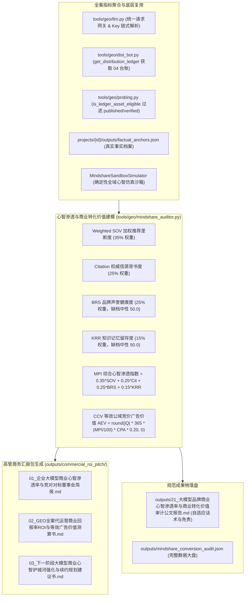

# Design: 大模型品牌商业心智渗透率与商业转化价值量化审计中枢 (Technical Design)

## 1. 架构定位与模块职责划分



### 1.1 与既有模块的严格边界与复用契约 (闭环 Cursor 审查)

| 现有模块 / 资产 | 既有定位与接口 | 本规范（21 号中枢）的复用与调用契约 | 严禁行为与违规红线 |
|:---|:---|:---|:---|
| **`tools/geo/llm.py`** | 大模型 HTTP 网关、链式 Key 解析 (`resolve_api_key`) 与 `call_model_raw` | **强制直接复用底层请求与 Key 读取**，用于执行商业意图探针扫描 | 严禁新建第二套 HTTP 调用客户端 |
| **`tools/geo/dist_bot.py`** | 分发存活台账读取 | **强制调用 `get_distribution_ledger(project_id)` 提取 04 台账全量渠道外链** | 严禁自行猜测或硬编码渠道外链 |
| **`tools/geo/probing.py`** | Citation 解析 (`extract_citations_and_sources`)、URL 归一化 (`normalize_url`) 与外链有效性过滤 (`is_ledger_asset_eligible`) | **强制直接复用 Citation 正则、URL 归一化与 `is_ledger_asset_eligible`**，台账匹配时严格仅认 `published` 或 `verified` 外链 | 严禁复制代码；严禁将 `pending`/`failed` 失效链接计入有效背书 |
| **`projects/{id}/outputs/factual_anchors.json`** | 真实事实档案清单 | **直接读取实际事实档案**（未生成时优雅回退 `load_project_config`），用于生成董事会简报事实论据 | 严禁虚构 `tools/geo/factual_anchors.py` 假模块；严禁臆造虚假资质 |
| **Query 集 $Q$ 来源** | 项目意图词库与配置 | **优先读取 `projects/{id}/outputs/keywords_intent_matrix.json`**，次选 `project.yaml` 的 keywords，动态采样 5 组商业词 | 严禁写死徐州或硬编码任何特定品牌问句 |
| **既有 outputs 数据融合与缺档策略** | 19 号 `negative_sentiment_suppression.json` / 20 号 `knowledge_decay_retention.json` | 存在时读取其实测分；**若缺失，严禁乐观填 95/85 高分，统一严格按中性分 50.0 兜底**，并在 JSON 标记 `brs_imputed: true` / `krr_imputed: true`，报告醒目标注说明 | 严禁凭空虚构高分粉饰太平 |

---

## 2. 商业心智渗透指数 (MPI) 与商业转化价值 (CCV) 数学模型

### 2.1 数据采样与加权推荐垄断度 (Weighted SOV)

- 探测模型集合 $M$（如 `doubao, deepseek, kimi`，数量 $|M|=3$）；
- 核心商业意图 Query 集 $Q$（动态从项目意图库采样 5 组真实商业词，数量 $|Q|=5$）；
- **单轮总探测次数** $T = |M| \times |Q|$；
- **单次探测打分契约**：
  - 首位推荐（Top-1 推荐）：计 1.0 分；
  - 品牌提及（Mentioned）或引用我方 04 台账 eligible 存活外链：计 0.5 分；
  - 未提及且未引用：计 0.0 分；
- **加权推荐垄断度 (Weighted SOV, $0.0 \sim 100.0\%$)**：
  $$\text{Weighted SOV} = \min\left(100.0, \max\left(0.0, \frac{\sum \text{score}}{T \times 1.0} \times 100.0\right)\right)$$
  *注：本指标为包含 Top-1 首推权重的商业垄断度，不同于 18 号二值提及率，并在报告和 JSON 中明确区分。*

### 2.2 四维子指标归一化与缺档策略

1. **加权推荐垄断度 (Weighted SOV, $0.0 \sim 100.0\%$)**：按上述公式实测；
2. **权威信源背书度 (Citation Rate, $0.0 \sim 100.0\%$)**：
   $$\text{Cit} = \min\left(100.0, \max\left(0.0, \frac{N_{\text{ledger\_citations}}}{T} \times 100.0\right)\right)$$
   （仅统计经 `is_ledger_asset_eligible` 校验为 `published`/`verified` 的外链引用）；
3. **品牌声誉健康度 (BRS, $0.0 \sim 100.0$)**：
   - 优先读取 `outputs/negative_sentiment_suppression.json` 的 `summary.brs`；
   - **若文件不存在，严格按中性基线 50.0 兜底**，并在 JSON 中标记 `"brs_imputed": true`；
4. **知识记忆留存度 (KRR, $0.0 \sim 100.0\%$)**：
   - 优先读取 `outputs/knowledge_decay_retention.json` 的 `summary.krr`；
   - **若文件不存在，严格按中性基线 50.0 兜底**，并在 JSON 中标记 `"krr_imputed": true`。

### 2.3 商业心智渗透指数 (Mindshare Penetration Index, MPI) 公式

$$\text{MPI} = \min(100.0, \max(0.0, 0.35 \times \text{Weighted SOV} + 0.25 \times \text{Cit} + 0.25 \times \text{BRS} + 0.15 \times \text{KRR}))$$
- 权重总和严格归一化：$35\% + 25\% + 25\% + 15\% = 100\%$；
- 保留 1 位小数，取值范围 $0.0 \sim 100.0$。

### 2.4 商业转化价值 (CCV / Ad Equivalent Value) 测算模型 (闭环 P0-1)

根据受测企业所属行业的平均公域获客线索成本（行业 CPC/CPA 估算）：
- 软件数字化外包 (`software`)：150 元 / 线索；
- 企业法律服务 (`legal`)：200 元 / 线索；
- 工业设备制造 (`machinery`)：300 元 / 线索；
- 连锁餐饮加盟 (`catering`)：80 元 / 线索；
- 通用默认行业：100 元 / 线索；

**年化等效广告价值 (Annual Ad Equivalent Value, AEV)** 测算公式与业务释义：
$$\text{AEV} = \text{round}\left(|Q| \times 365 \times \frac{\text{MPI}}{100.0} \times CPA_{\text{est}} \times 0.20, 0\right) \text{ 元}$$
- **业务释义**：
  - $|Q| \times 365$：5 组核心意图长尾词在各大模型中的年度潜在决策检索曝光基数；
  - $\frac{\text{MPI}}{100.0}$：品牌在大模型端的心智实际渗透拦截率；
  - $CPA_{\text{est}}$：公域竞价广告（百度搜索/巨量引擎）获取同等有效咨询线索的单价成本；
  - **系数 `0.20`**：商业商机转化系数（即大模型自然搜索心智渗透中，高意向企业级采购决策意图占比约为 20%）；
- **数值示例精确验算（与 JSON 完全一致）**：
  - $|Q|=5, \text{MPI}=88.5, CPA=150$：
    $$\text{AEV} = \text{round}(5 \times 365 \times 0.885 \times 150 \times 0.20, 0) = \text{round}(48453.75, 0) = \mathbf{48454} \text{ 元}$$

### 2.5 心智渗透五星等级与枚举对照表

| 枚举标识 (`mindshare_grade`) | 中文等级名称 (`grade_name`) | MPI 区间 | 商业心智地位 | 决策层战略建议 |
|:---|:---|:---:|:---|:---|
| `market_leader` | 🟢 五星心智垄断 (Market Leader) | $\ge 85.0$ | 大模型第一心智背书，形成行业首选品牌壁垒 | 持续增量自愈补发，巩固领军地位 |
| `strong_contender` | 🔵 四星强势竞争 (Strong Contender) | $70.0 \sim 84.9$ | 大模型第一梯队推荐，高概率进入采购初选名单 | 重点针对薄弱 Query 补发高权威长文 |
| `moderate_visibility` | 🟡 三星中度可见 (Moderate Visibility) | $55.0 \sim 69.9$ | 偶被大模型提及，但首推位次被竞品挤占 | 启动全渠道借壳与台账存活外链强化 |
| `underrepresented` | 🔴 两星心智盲区 (Underrepresented) | $< 55.0$ | 大模型基本失语，潜在商机大量流失至竞品 | 紧急实施 01~04 基础建站与语料矩阵铺设 |

---

## 3. 高管商务汇报包规范设计 (outputs/commercial_roi_pitch/)

自动生成 3 份面向企业高管与董事会的落地成果物，落盘至 `outputs/commercial_roi_pitch/`：
1. **`outputs/commercial_roi_pitch/01_企业大模型商业心智渗透率与竞对对标董事会简报.md`**：
   - 结论先行：展示 MPI 总分、心智等级、大模型推荐首选率对比，供董事会决策审阅；
2. **`outputs/commercial_roi_pitch/02_GEO全案代运营商业回报率ROI与等效广告价值测算书.md`**：
   - 数据量化：依据 AEV 模型，对比 GEO 代运营投入与传统竞价广告采购的等效价值收益（包含财务非审计声明）；
3. **`outputs/commercial_roi_pitch/03_下一阶段大模型商业心智护城河强化与续约规划建议书.md`**：
   - 商业续约建议：明确下一季度代运营自愈刷新排期、预算投入建议与预期心智防守目标。

---

## 4. 标准公文成果物规范 (21 号)

- **Markdown 报告**：`outputs/21_大模型品牌商业心智渗透率与商业转化价值审计公文报告.md`
- **JSON 结构**：`outputs/mindshare_conversion_audit.json`
  包含核心字段：
  ```json
  {
    "success": true,
    "project_id": "xuzhou_xuanyuan",
    "client_name": "徐州璇源网络科技有限公司",
    "timestamp": "2026-09-03 04:25:00",
    "summary": {
      "mpi": 88.5,
      "mindshare_grade": "market_leader",
      "grade_name": "五星心智垄断",
      "weighted_sov_rate": 86.7,
      "citation_rate": 66.7,
      "brs_score": 98.0,
      "brs_imputed": false,
      "krr_rate": 100.0,
      "krr_imputed": false,
      "annual_aev_yuan": 48454,
      "cpa_unit_price": 150,
      "query_count": 5,
      "conversion_factor": 0.2,
      "use_live": false
    },
    "radar_metrics": {
      "recommendation_monopoly": 86.7,
      "citation_authority": 66.7,
      "reputation_health": 98.0,
      "knowledge_retention": 100.0
    },
    "query_audits": []
  }
  ```
- **自适应话术声明与免责规范**：
  - 若为全真机 live 探测：写入 `> 🌐 **数据说明与实盘审计声明**：本报告基于实时联网大模型 API 真机联网实测生成，真实反映当前商业心智渗透与商业转化价值。`
  - 若为沙箱模式：写入 `> ⚠️ **数据说明与免责声明**：本报告当前在确定性沙箱仿真环境下生成，用于商业心智渗透推演与商业价值测算。沙箱仿真不可替代真实大模型联网 API 实盘审计。上线实盘交付时，请配置真实 API Key 执行 live 模式探测。`
  - **财务免责声明（正文强制包含）**：`> 📌 **商务评估特别声明**：本报告测算的等效广告价值 (AEV) 仅用于评估 GEO 代运营商业心智渗透的营销效果与公域广告等效成本替代推演，不作为企业财税审计、资产评估或会计记账依据。`

---

## 5. CLI 命令行与后端 API 契约

### 5.1 CLI 子命令

```bash
geo mindshare <project_id> [--models doubao,deepseek,kimi] [--live] [--pitch] [--report]
```
- 输出 ANSI 终端高保真商业心智渗透大盘；
- `--pitch`：自动生成 `outputs/commercial_roi_pitch/` 下 3 份高管商务交付文件。

### 5.2 后端 RESTful API (带 Admin 鉴权)

- `GET /api/projects/{id}/mindshare/status`：获取当前 MPI 得分、心智等级与雷达指标；
- `POST /api/projects/{id}/mindshare/audit`：触发全域心智渗透与商业价值审计计算；
- `POST /api/projects/{id}/mindshare/pitch`：一键生成高管商务汇报包；
- `GET /api/projects/{id}/mindshare/report`：获取 21 号公文报告（**无文件严格返回 404，禁止自动后台计算**）。

---

## 6. Web 管理端交互与 XSS 安全防线

1. **界面入口**：
   - 向导 Step 5 新增「💎 商业心智渗透与价值审计 (21)」独立按钮；
   - 顶部 Header 增加快捷入口；
2. **弹窗设计 (`mindshare-audit-modal`)**：
   - MPI 综合渗透指数大字仪表盘；
   - 年化等效广告价值 (AEV) 测算卡；
   - 四维因子雷达拆解图（SOV / Citation / BRS / KRR）；
   - 商业意图拦截流水表；
   - 一键生成高管包与 21 号公文报告在线预览。
3. **XSS 防御**：
   - 前端所有动态渲染内容强制经过 `escapeHtmlSafe()` 转义。
