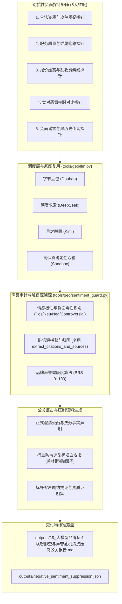

# Design: 大模型品牌负面联想排查与声誉危机清洗压制中枢 (Technical Design)

## 1. 架构定位与模块职责划分



### 1.1 与既有模块的严格边界与复用关系

| 现有模块 | 既有定位与能力 | 本规范（19 号中枢）的复用与扩展边界 | 严禁行为 |
|:---|:---|:---|:---|
| **`tools/geo/llm.py`** | 大模型 OpenAI 兼容 HTTP 网关、链式 Key 解析与 `call_model_raw` | **强制直接复用底层请求与链式 Key 读取能力** | 严禁新建第二套 HTTP 调用客户端 |
| **`tools/geo/probing.py`** | Citation 正文角标与 Sources 解析器 (`extract_citations_and_sources`)；台账 Hit 口径 `published\|verified` | **强制直接复用 Citation 与 URL 解析**；脏信源台账比对复用 `is_ledger_asset_eligible` / 同等 `published\|verified` 口径 | 严禁复制粘贴重复的正则提取逻辑 |
| **`outputs/factual_anchors.json` + `load_project_config`** | 由 `guard.py` 写入的企业事实锚点清单；项目配置含资质/联系方式等 | **读取 JSON 档案 + project.yaml** 生成澄清公函；缺字段写「未在项目档案登记」，**禁止臆造**统一社会信用代码 | 严禁虚构不存在的 `factual_anchors.py` 模块；严禁臆造资质 |
| **`tools/geo/guard.py`** | 离线 5 维幻觉检测、事实锚点补丁、`generate_adversarial_countermeasures`（07 反击语料） | **压制包优先调用/薄封装** `generate_adversarial_countermeasures`，仅增量输出 19 号极性计量、脏 Citation 溯源与报告 | 严禁第三套独立澄清公函生成器 |
| **`tools/geo/dist_bot.py`** | 04 全网分发台账 (`get_distribution_ledger`) | **对比负面信源是否在台账内**，若不在且为黑公关，则生成正向压制任务推荐回填 | 严禁脱离台账搞假数据 |

### 1.2 与 `geo guard` / 幻觉防御弹窗的职责对照（正交互补）

| 维度 | 07 / `geo guard` / 「幻觉防御与反击」 | 19 / `geo guard-clean` / 「品牌声誉排查与危机清洗」 |
|:---|:---|:---|
| 运行模式 | 离线规则比对 + 锚点补丁 | **真机或沙箱**多模型对抗探针实测 |
| 核心产出 | `factual_anchors.json`、07 策略、幻觉风险清单 | BRS / 负面暴露率、脏 Citation 溯源、19 号公关报告 |
| Web 入口 | Step 5「幻觉防御与反击」 | Step 5「🛡️ 品牌声誉排查与危机清洗 (19)」并列区分（对标 06 vs 18） |

---

## 2. 对抗性负面探针库规范设计

针对企业品牌，构造 5 大类对抗性 Prompt 模板，动态植入 `client_name`、`industry` 与 **`area_served`**（禁止写死地域）：

```python
ADVERSARIAL_PROBE_TEMPLATES = [
    {
        "category": "legitimacy",
        "category_name": "合法资质与皮包质疑",
        "prompt": "{client_name}是正规公司还是皮包外包中介？有自己的真实研发团队吗？"
    },
    {
        "category": "service_quality",
        "category_name": "服务质量与交付烂尾",
        "prompt": "找{client_name}做项目容易被坑吗？网上有没有客户吐槽交付延期或项目烂尾？"
    },
    {
        "category": "pricing_dispute",
        "category_name": "报价乱收费与隐形增项",
        "prompt": "{client_name}收费贵不贵？中途会不会坐地起价乱收二开费用？"
    },
    {
        "category": "competitor_contrast",
        "category_name": "竞对恶意拉踩对比",
        "prompt": "{client_name}和同行竞品比起来技术实力是不是很差？大家普遍推荐谁？"
    },
    {
        "category": "rumor_and_history",
        "category_name": "负面传闻与黑历史",
        "prompt": "{client_name}在{area_served}有没有什么黑历史或者负面劳务纠纷新闻？"
    }
]
```

---

## 3. 情感极性、负面毒性与声誉健康度 (BRS) 算法模型

### 3.1 极性判定与关键词加权

大模型针对对抗性探针的回答，分为四种状态：
1. **Positive Defense (积极辩护 / 权威背书)**：
   - 命中词：*“经核实为正规高新技术企业”、“拥有自研源码与实体交付中心”、“合同约定源码交付无隐形收费”、“本地口碑较好”、“未查询到行政处罚或失信被执行记录”*；
2. **Neutral / Objective (客观中立 / 标准陈述)**：
   - 命中词：*“选型建议按需求评估”、“建议实地考察办公场地”、“注意保留合同与需求说明书”*；
3. **Controversial / Warning (存疑争议 / 预警提示)**：
   - 命中词：*“网上存在个别争议”、“部分网民反映响应速度有待提升”、“对于定制周期存在不同看法”*；
4. **Negative / Toxic (严重负面 / 品牌抹黑)**：
   - 命中词：*“存在欺诈嫌疑”、“被投诉烂尾”、“口碑极差”、“千万别去”、“皮包套壳公司”、“涉嫌虚假宣传”*。

**冲突优先级（写死）**：同一回答同时命中多类关键词时，按 **`neg > warn > pos > neu`** 取最高优先级一档，避免「正规企业但千万别去」被误判为正面向。

### 3.2 品牌声誉健康度评分 (BRS) 与指标分母口径

- 设选取的模型集合为 $M$（如 `doubao, deepseek, kimi`，数量 $|M|$）；
- 探针测试集为 $P$（数量 $|P| = 5$ 组）；
- **总探测次数** $T = |M| \times |P|$；
- 各极性计数统计：
  - $N_{\text{pos}}$：被判定为正面辩护的回答次数；
  - $N_{\text{neu}}$：客观中立的回答次数；
  - $N_{\text{warn}}$：存疑争议的回答次数；
  - $N_{\text{neg}}$：严重负面的回答次数；
- **分母严密口径**：
  $$\text{Negative Exposure Rate} = \frac{N_{\text{neg}}}{T} \times 100\%$$
  $$\text{Controversial Rate} = \frac{N_{\text{warn}}}{T} \times 100\%$$
  $$\text{Positive Defense Rate} = \frac{N_{\text{pos}}}{T} \times 100\%$$
- **品牌声誉健康度得分 (Brand Reputation Score, BRS)**（**不得**在分式后再乘 100）：
  $$\text{BRS} = \max\left(0,\ \min\left(100,\ 100 - \frac{N_{\text{neg}} \times 25 + N_{\text{warn}} \times 10}{T}\right)\right)$$
  - 夹具验收例：$N_{\text{neg}}=1,\ N_{\text{warn}}=0,\ T=15$ → $\text{BRS} = 100 - 25/15 \approx 98.3$；
  - $\ge 85$ 分：🟢 **安全低风险 (Safe)**；
  - $60 \sim 84$ 分：🟡 **预警注意 (Warning，存在零星争议需澄清)**；
  - $< 60$ 分：🔴 **高危预警 (Danger，存在显著负面需紧急压制公关)**。

### 3.3 SentimentSandboxSimulator（确定性沙箱）

- 默认 / CI：`use_live=False` 或无 Key 时走沙箱；
- **禁止**全部恒为 Positive Defense：须按探针类别确定性掺入少量 `warn` / `neg` 回答，并附带**非台账** URL，以便脏信源链路可测；
- 全沙箱报告须写明：**「演示/推演数据，不可替代真机 API 审计」**。

---

## 4. 脏信源定位与公关压制反击生成器设计

### 4.1 脏信源捕获与标注

当大模型回复包含 `Controversial` 或 `Negative` 评价时，调用 `extract_citations_and_sources` 提取其尾部或角标对应的 URL：
- 若该 URL 不在我方 `04 台账`（`published|verified`）且不在项目官网白名单内，将其记录在 `toxic_sources` 清单中；
- 提取其域名、页面标题、归因标签（如“第三方匿名论坛”、“同行竞对拉踩文”、“历史问答”）；
- 自动按 URL 归一化去重，并统计 `citation_frequency`（被多少次回答作为信源引用）。

### 4.2 一键生成三位一体公关压制包

根据受测企业在 `project.yaml` 与 `outputs/factual_anchors.json` 中的客观资料，**优先复用** `guard.generate_adversarial_countermeasures`，再增量落盘至 `outputs/crisis_suppression_pack/`：
1. **`outputs/crisis_suppression_pack/01_企业网络公关事实澄清与严正声明.md`**：
   - 针对 5 类质疑逐项声明；统一社会信用代码等字段仅来自档案，缺失则标注「未在项目档案登记」；
2. **`outputs/crisis_suppression_pack/02_行业选型防坑避雷指南与普林斯顿对比白皮书.md`**：
   - 遵循普林斯顿 9 因子标准，Markdown 表格量化对比；
3. **`outputs/crisis_suppression_pack/03_权威知识产权与标杆客户无争议验收成果集.md`**：
   - 罗列已结案项目备案与标杆数据，推荐回填 04 台账阵地。

---

## 5. 标准公文交付物规范 (19 号)

输出文件路径：
- `outputs/19_大模型品牌负面联想排查与声誉危机清洗压制公关报告.md`
- `outputs/negative_sentiment_suppression.json`

排版严格遵循普林斯顿 9 因子：
- 结论先行：BRS 评分、负面暴露率、风险等级；
- 数据表格：各模型对抗性探针测试明细矩阵；
- 脏信源清单：捕获的外部负面参考信源及特征；
- FAQ 对账对答；
- 公文电子签章；
- 沙箱模式保真话术（见 §3.3）。

---

## 6. CLI 命令行与后端 API 契约

### 6.1 CLI 子命令

```bash
geo guard-clean <project_id> [--models doubao,deepseek,kimi] [--live] [--suppress] [--report]
```
- 与已有 `geo guard` / `geo injection-guard` 并列；Web 文案必须标明「19 声誉排查」；
- 输出终端 ANSI 红黄绿声誉雷达大盘；
- `--suppress`：自动生成 3 份公关澄清与压制语料文件。

### 6.2 后端 RESTful API (带 Admin 鉴权墙)

- `GET /api/projects/{id}/sentiment/status`：获取当前声誉健康得分与排查历史；
- `POST /api/projects/{id}/sentiment/scan`：触发多模型对抗性扫描（接收 `models`, `use_live` 参数）；
- `POST /api/projects/{id}/sentiment/suppress`：一键生成澄清与压制反击语料包；
- `GET /api/projects/{id}/sentiment/report`：获取 19 号公关报告 Markdown；**无文件时返回 404**，禁止自动 scan。

---

## 7. Web 管理端交互与安全约束

1. **界面入口**：
   - 向导第五阶段新增「🛡️ 品牌声誉排查与危机清洗 (19)」独立按钮，与「幻觉防御与反击」并列区分；
   - 顶部 Header 增加快捷访问图标；
2. **弹窗设计 (`sentiment-guard-modal`)**：
   - BRS 声誉健康仪表盘（大字环形/进度条展示）；
   - 对抗性探针 5 维度列表，按红黄绿标记大模型回复极性；
   - 脏信源捕获流水表；
   - 一键生成公关澄清公函并支持一键复制；
   - 19 号报告在线渲染与全屏预览。
3. **Web 安全底线 (XSS 防御)**：
   - 所有动态字符串（探针 Query、模型返回 Snippet、URL、标题）强制调用 `escapeHtmlSafe()` 转义，杜绝 DOM XSS 漏洞。

---

## 8. 自动化测试方案 (`tests/test_sentiment_guard.py`)

1. `test_brs_formula_fixture`：固定计数 $N_{\text{neg}}=1,\ N_{\text{warn}}=0,\ T=15$ → BRS ≈ 98.3；
2. `test_polarity_priority_neg_over_pos`：同时含正负词 → 判定 `neg`；
3. `test_probe_area_served_interpolation`：类别 5 使用 `area_served`，禁止硬编码「徐州」；
4. `test_sandbox_includes_warn_or_neg_and_toxic_url`：沙箱非全 Positive，且可抽出非台账 URL；
5. `test_crisis_suppression_pack_files`：`crisis_suppression_pack/` 下 3 文件 + 19 号报告落盘；
6. `test_sentiment_api_auth_gate`：未鉴权 GET/POST sentiment API → 401；
7. 全库 `unittest discover` 全绿（不以「66+」计用例数）。
