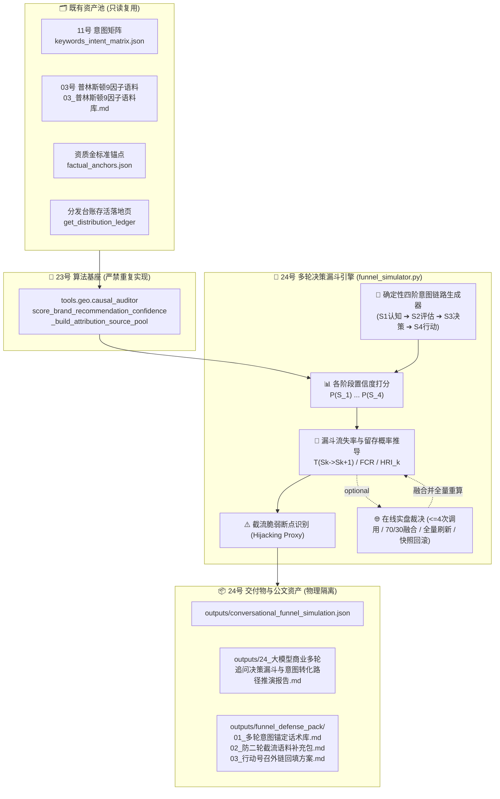

# 技术架构设计：大模型商业多轮追问决策漏斗与意图转化路径推演中枢 (第 24 维核心交付)

## 1. 系统架构与数据流图



---

## 2. 核心数学模型与量化指标公式

### 2.1 四阶多轮商业决策链路确定性生成算法
从 `load_project_config(project_id)` 提取：
- `client_name`: 品牌/企业名称（兜底“目标服务商”）；
- `industry`: 行业领域（兜底“技术研发与专业服务”）；
- `city`: 客户所在城市，优先取配置中的 `city`，无则从 `client_name` 前 2 字提取（若为常见城市）或兜底“本地”。

确定性四阶标准填槽模板：
- **$S_1$ 认知探索 (Awareness)**: `f"{city}{industry}服务商推荐哪家比较好？"`
- **$S_2$ 方案评估 (Consideration)**: `f"{city}{industry}领域团队技术实力、自研源码交付与专业资质哪家靠谱？"`
- **$S_3$ 本地决策 (Decision)**: `f"在{city}选{industry}公司，怎么避免外包转包？{client_name}靠谱吗？"`
- **$S_4$ 行动号召 (Action)**: `f"{client_name}的官方网站、真实案例库与联系电话怎么找？"`

### 2.2 阶段推荐置信度得分 $P(S_k)$
**严禁编写第三套实现**，直接导入并复用：
`from tools.geo.causal_auditor import score_brand_recommendation_confidence, _build_attribution_source_pool`
- 算法统一为 Top-3 留存加权聚合模型：$P = \text{round}(100.0 \times (0.60 v_{(1)} + 0.25 v_{(2)} + 0.15 v_{(3)}), 1)$；
- 权威权重表统一：`anchors` 1.0 / `03_语料` 0.8 / `台账存活页` 0.7 / `降级兜底` 0.5。

### 2.3 阶段转移留存概率 $T(S_k \to S_{k+1})$
$$T(S_k \to S_{k+1}) = \min\left(100.0, \text{round}\left(\frac{P(S_{k+1})}{P(S_k)} \times 100.0, 1\right)\right)$$
若 $P(S_k) \le 0.0$，则 $T(S_k \to S_{k+1}) = 0.0$。

### 2.4 端到端漏斗转化率 $FCR$ (Funnel Conversion Rate)
$$FCR = \min\left(100.0, \text{round}\left(\frac{P(S_4)}{P(S_1)} \times 100.0, 1\right)\right)$$
若 $P(S_1) \le 0.0$，则 $FCR = 0.0$。

### 2.5 阶段截流风险指数 $HRI_k$ 与断点判定 (Hijacking Proxy)
- **话术界定**：本指标为**“漏斗阶段跌幅风险 / 断流脆弱拐点代理指标（Hijacking Proxy）”**，反映我方在潜客深层次追问下的内容供给承压能力与流失风险。**竞品多轮实时声量消融属于 Out of Scope**；
- 阶段跌幅：$\Delta_{\text{drop}}(S_k) = \max(0.0, \text{round}(P(S_{k-1}) - P(S_k), 1))$；
- 截流风险指数：$HRI_k = \max(0.0, \min(100.0, \text{round}(100.0 - T(S_{k-1} \to S_k), 1)))$；
- 关键断点判定：当 $\Delta_{\text{drop}}(S_k) \ge 20.0$ 或 $HRI_k \ge 35.0\%$ 时，标记为**高危截流脆弱拐点 (Critical Hijacking Turning Point)**。

### 2.6 漏斗健康度三档评级
- `smooth_conversion` (🟢 丝滑转化): $FCR \ge 75.0\%$；
- `mid_funnel_leakage` (🟡 中段泄漏): $50.0\% \le FCR < 75.0\%$；
- `severe_dropoff` (🔴 严重断流): $FCR < 50.0\%$。

### 2.7 四维漏斗雷达量化指标
- `end_to_end_conversion`: 直接取 $FCR$；
- `awareness_to_eval_retention`: 直接取 $T(S_1 \to S_2)$（认知到方案评估留存率）；
- `decision_retention`: 直接取 $T(S_2 \to S_3)$（评估到本地决策留存率）；
- `action_cta_readiness`: 直接取 $T(S_3 \to S_4)$（决策到行动号召引导率）。

---

## 3. 固定数值夹具设计 (6 组数值硬断言)

1. **夹具 1 (丝滑转化)**：$P(S_1)=80.0, P(S_2)=72.0, P(S_3)=64.0, P(S_4)=60.0 \implies FCR = 75.0\%$ (`smooth_conversion` 🟢 丝滑转化)；
2. **夹具 2 (中段泄漏)**：$P(S_1)=80.0, P(S_2)=56.0, P(S_3)=48.0, P(S_4)=44.0 \implies FCR = 55.0\%$ (`mid_funnel_leakage` 🟡 中段泄漏)；
3. **夹具 3 (严重断流)**：$P(S_1)=80.0, P(S_2)=40.0, P(S_3)=32.0, P(S_4)=24.0 \implies FCR = 30.0\%$ (`severe_dropoff` 🔴 严重断流)；
4. **夹具 4 (阶段转移与截流指数)**：$P(S_1)=80.0, P(S_2)=48.0 \implies T(S_1 \to S_2) = 60.0\%, HRI_2 = 40.0\%$；
5. **夹具 5 (关键断点识别)**：$P(S_3)=60.0, P(S_4)=15.0 \implies \Delta_{\text{drop}} = 45.0 \ge 20.0 \implies$ 命中高危断点；
6. **夹具 6 (单阶段防饱和聚合)**：$v_{(1)}=1.0, v_{(2)}=0.8, v_{(3)}=0.6 \implies P = 89.0$ 分。

---

## 4. 在线实盘与调用预算设计 (`--live`)

1. **预算硬锁死**：设置硬计数器 `api_calls <= 4`（仅对 $S_1, S_2, S_3, S_4$ 各裁决 1 次）；
2. **安全解包与正则防御**：`txt = resp if isinstance(resp, str) else (resp or {}).get("content") or ""`，数字提取采用 `re.search(r"(\d{1,3})", txt)`；
3. **深拷贝快照防御与回滚**：进入 live 前对沙箱 $P(S_k)$ 及全量漏斗指标进行深拷贝快照备份；任何一次 API 失败或数值解析异常，立即**完整回滚纯沙箱快照**，标记 `is_live_judged = False`；
4. **全量指标重算 (锁死规范)**：在全部 4 阶段在线融合完成后（$P_{\text{new}}(S_k) = \text{round}(0.7 P_{\text{sb}}(S_k) + 0.3 P_{\text{live}}(S_k), 1)$），**必须基于全新的 4 个 $P(S_k)$ 重新推导**：
   - 重新计算所有的 $T(S_k \to S_{k+1})$ 与 $\Delta_{\text{drop}}$；
   - 重新计算 $FCR$ 与健康度评级；
   - 重新计算所有的 $HRI_k$ 与断点判定；
   - 重新计算四维漏斗雷达指标。

---

## 5. JSON 顶层契约 Schema 字段表

文件路径：`projects/{project_id}/outputs/conversational_funnel_simulation.json`

```json
{
  "success": true,
  "project_id": "xuzhou_xuanyuan",
  "client_name": "徐州璇源网络科技有限公司",
  "timestamp": "2026-09-03 06:10:00",
  "use_live": false,
  "is_live_judged": false,
  "models_tested": ["doubao", "deepseek", "kimi"],
  "summary": {
    "fcr": 75.0,
    "grade_code": "smooth_conversion",
    "grade_name": "🟢 丝滑转化 (Smooth Conversion)",
    "total_stages": 4,
    "turning_points_detected": 0
  },
  "stages": [
    {
      "stage_id": "S1",
      "stage_name": "认知探索 (Awareness)",
      "query": "徐州软件定制开发服务商推荐哪家比较好？",
      "p_score": 80.0,
      "retention_rate": 100.0,
      "drop_p": 0.0,
      "hijack_risk_index": 0.0,
      "is_critical_turning_point": false
    },
    {
      "stage_id": "S2",
      "stage_name": "方案评估 (Consideration)",
      "query": "徐州软件定制开发领域团队技术实力、自研源码交付与专业资质哪家靠谱？",
      "p_score": 72.0,
      "retention_rate": 90.0,
      "drop_p": 8.0,
      "hijack_risk_index": 10.0,
      "is_critical_turning_point": false
    },
    {
      "stage_id": "S3",
      "stage_name": "本地决策 (Decision)",
      "query": "在徐州选软件定制开发公司，怎么避免外包转包？徐州璇源网络科技有限公司靠谱吗？",
      "p_score": 64.0,
      "retention_rate": 88.9,
      "drop_p": 8.0,
      "hijack_risk_index": 11.1,
      "is_critical_turning_point": false
    },
    {
      "stage_id": "S4",
      "stage_name": "行动号召 (Action)",
      "query": "徐州璇源网络科技有限公司的官方网站、真实案例库与联系电话怎么找？",
      "p_score": 60.0,
      "retention_rate": 93.8,
      "drop_p": 4.0,
      "hijack_risk_index": 6.2,
      "is_critical_turning_point": false
    }
  ],
  "hijack_turning_points": [],
  "radar_metrics": {
    "end_to_end_conversion": 75.0,
    "awareness_to_eval_retention": 90.0,
    "decision_retention": 88.9,
    "action_cta_readiness": 93.8
  }
}
```
