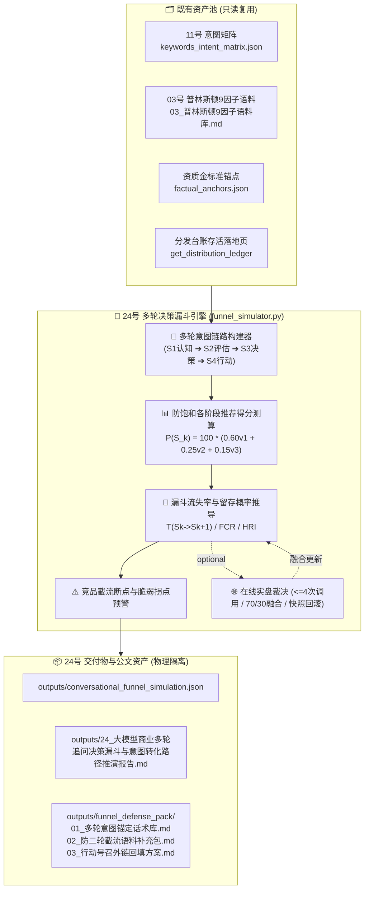

# 技术架构设计：大模型商业多轮追问决策漏斗与意图转化路径推演中枢 (第 24 维核心交付)

## 1. 系统架构与数据流图

---

## 2. 核心数学模型与量化指标公式

### 2.1 四阶多轮商业决策链路
1. **$S_1$ 认知探索 (Awareness)**：行业通用宽泛需求（如“徐州软件定制开发服务商有哪些推荐？”）；
2. **$S_2$ 方案评估 (Consideration)**：技术自研、源码交付与直营团队资质对比；
3. **$S_3$ 决策落地 (Decision)**：本地化风险保障、杜绝外包转包与二道贩子；
4. **$S_4$ 行动号召 (Action)**：官网直达、企业官方存证、案例与联系电话。

### 2.2 阶段推荐置信度得分 $P(S_k)$
复用防饱和 Top-3 留存加权聚合模型：
$$P(S_k) = \text{round}\left(100.0 \times \big(0.60 \cdot v_{(1)} + 0.25 \cdot v_{(2)} + 0.15 \cdot v_{(3)}\big), 1\right)$$
其中 $v = \text{Relevance} \times \text{AuthBonus} \in [0, 1]$，Relevance 复用 `score_dense_similarity`，AuthBonus 统一以路径点名为准（anchors 1.0 / 03 语料 0.8 / 台账存活落地页 0.7 / 保底配置 0.5）。

### 2.3 阶段转移留存概率 $T(S_k \to S_{k+1})$
$$T(S_k \to S_{k+1}) = \min\left(100.0, \text{round}\left(\frac{P(S_{k+1})}{P(S_k)} \times 100.0, 1\right)\right)$$
若 $P(S_k) \le 0.0$，则规定 $T(S_k \to S_{k+1}) = 0.0$。

### 2.4 端到端漏斗转化率 $FCR$ (Funnel Conversion Rate)
$$FCR = \min\left(100.0, \text{round}\left(\frac{P(S_4)}{P(S_1)} \times 100.0, 1\right)\right)$$
若 $P(S_1) \le 0.0$，则 $FCR = 0.0$。

### 2.5 阶段截流风险指数 $HRI_k$ 与断点判定
- 阶段跌幅：$\Delta_{\text{drop}}(S_k) = \max(0.0, \text{round}(P(S_{k-1}) - P(S_k), 1))$；
- 截流风险指数：$HRI_k = \max(0.0, \min(100.0, \text{round}(100.0 - T(S_{k-1} \to S_k), 1)))$；
- 关键断点判定：当 $\Delta_{\text{drop}}(S_k) \ge 20.0$ 或 $HRI_k \ge 35.0\%$ 时，标记为**高危截流脆弱拐点 (Critical Hijacking Turning Point)**。

### 2.6 漏斗健康度三档评级
- `smooth_conversion` (🟢 丝滑转化): $FCR \ge 75.0\%$；
- `mid_funnel_leakage` (🟡 中段泄漏): $50.0\% \le FCR < 75.0\%$；
- `severe_dropoff` (🔴 严重断流): $FCR < 50.0\%$。

### 2.7 四维漏斗雷达量化指标
- `end_to_end_conversion`: 直接取 $FCR$；
- `mid_funnel_resilience`: 直接取 $T(S_1 \to S_2)$；
- `decision_retention`: 直接取 $T(S_2 \to S_3)$；
- `action_cta_readiness`: 直接取 $T(S_3 \to S_4)$。

---

## 3. 固定数值夹具设计 (6 组数值硬断言)

1. **夹具 1 (丝滑转化)**：$P(S_1)=80.0, P(S_2)=72.0, P(S_3)=64.0, P(S_4)=60.0 \implies FCR = 75.0\%$ (`smooth_conversion` 🟢 丝滑转化)；
2. **夹具 2 (中段泄漏)**：$P(S_1)=80.0, P(S_2)=56.0, P(S_3)=48.0, P(S_4)=44.0 \implies FCR = 55.0\%$ (`mid_funnel_leakage` 🟡 中段泄漏)；
3. **夹具 3 (严重断流)**：$P(S_1)=80.0, P(S_2)=40.0, P(S_3)=32.0, P(S_4)=24.0 \implies FCR = 30.0\%$ (`severe_dropoff` 🔴 严重断流)；
4. **夹具 4 (阶段转移与截流指数)**：$P(S_1)=80.0, P(S_2)=48.0 \implies T(S_1 \to S_2) = 60.0\%, HRI_2 = 40.0\%$；
5. **夹具 5 (关键断点识别)**：$P(S_3)=60.0, P(S_4)=15.0 \implies \Delta_{\text{drop}} = 45.0 \ge 20.0 \implies$ 命中高危断点；
6. **夹具 6 (单阶段防饱和聚合)**：$v_{(1)}=1.0, v_{(2)}=0.8, v_{(3)}=0.6 \implies P = 89.0$ 分。

---

## 4. 在线实盘与调用预算设计 (`--live`)

1. **预算硬锁死**：至多 **4 次** API 调用（仅对 1 条典型的 4 轮决策链路：$S_1, S_2, S_3, S_4$ 各裁决 1 次）；
2. **生产字典安全解包**：`txt = resp if isinstance(resp, str) else (resp or {}).get("content") or ""`；
3. **数字提取正则防御**：`re.search(r"(\d{1,3})", txt)`（避免 `\b` 在中文字符紧邻数字时失效）；
4. **沙箱深拷贝快照与回滚**：进入 live 前对沙箱 $P(S_k)$ 与漏斗数据进行深拷贝快照；任何调用超时或解析异常立即**完整回滚恢复快照**，确保污染分 0 扩散。

---

## 5. 文件与接口设计

### 5.1 核心文件结构
- `tools/geo/funnel_simulator.py`：核心引擎
- `tools/geo/cli.py`：注册 `geo funnel <project_id> [--models M] [--live] [--defend] [--report]`
- `tools/geo/server.py`：
  - `GET /api/projects/{id}/funnel/status`
  - `POST /api/projects/{id}/funnel/simulate`
  - `POST /api/projects/{id}/funnel/defend`
  - `GET /api/projects/{id}/funnel/report`（无文件严格 404）
- `web/index.html`：Header 与 Step 5 增加 24 号入口；开发模态 `funnel-sim-modal`，全量 `escapeHtmlSafe()` 防御 XSS。
- `tests/test_funnel_simulator.py`：覆盖 6 组数值夹具、雷达指标、优化三件套物理存在、live 预算硬限制与快照回滚、API 401/404 语义。
