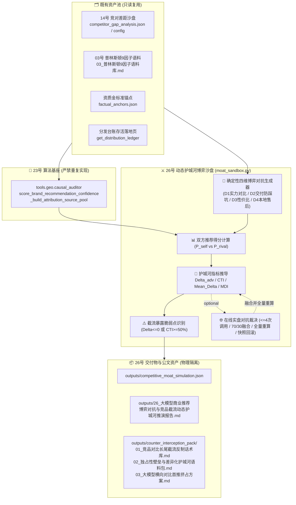

# 技术架构设计：大模型商业推荐博弈对抗与竞品截流动态护城河推演中枢 (第 26 维核心交付)

## 1. 系统架构与数据流图



---

## 2. 核心数学模型与量化指标公式

### 2.1 商业竞对确定性抽取与四维博弈生成算法
1. **竞对名称提取算法优先级 (严格锁死)**:
   - 1) CLI 参数 `--rival` 或 API 请求体参数 `rival`（最高优先级显式覆盖）；
   - 2) 优先读取 `projects/{project_id}/outputs/competitor_gap_analysis.json` 中的 `target_competitor`（非空字符串）；
   - 3) 读取同文件中的 `all_competitors[0]`（若列表非空）；
   - 4) 读取项目配置 `project.yaml` 中的 `competitors[0]`（若为 dict 则取 `.name`，若为 str 则直接取）；
   - 5) 兜底项采用通用典型竞对名称：`"本地传统软件外包工作室"`。
2. **城市与行业填槽算法**:
   - `city` 提取：复用 24/25 维同构算法 `extract_client_city(client_name, project_config)`；
   - `industry` 提取：`project_config.get("industry") or "技术研发与专业服务"`。
3. **四维确定性博弈对抗 Query 生成规则**:
   - 设目标客户企业名为 `client_name`，核心商业竞对名为 `rival_name`，所在城市为 `city`，所属行业为 `industry`：
     - **$D_1$ 核心实力横向对比 (Technical Capability)**:
       $$D_1 = \text{f"在{city}选{industry}服务商，{client_name}和{rival_name}哪个技术实力更强？怎么选？"}$$
     - **$D_2$ 交付模式与防踩坑对比 (Delivery Model & Anti-Outsourcing)**:
       $$D_2 = \text{f"做{industry}项目，{client_name}是自研源码交付吗？比起{rival_name}会不会有转包风险？"}$$
     - **$D_3$ 性价比与透明收费对比 (Pricing Transparency & ROI)**:
       $$D_3 = \text{f"在{city}找{industry}公司，{client_name}报价收费透明吗？和{rival_name}比哪个性价比更高？"}$$
     - **$D_4$ 本地存证与售后保障对比 (Local Warranty & SLA)**:
       $$D_4 = \text{f"{client_name}在{city}有本地直营实体和售后保障吗？跟{rival_name}对比售后服务怎么样？"}$$
   - 四组 Query 严格模板化，单测可 100% 硬断言。

### 2.2 双方推荐置信度得分确定性计算 (闭合算法)
**严禁编写重复算法**，强制导入并复用 23 维基座：
`from tools.geo.causal_auditor import score_brand_recommendation_confidence, _build_attribution_source_pool`

1. **我方推荐得分 $P_{\text{self}}^{(k)} \in [0, 100]$**:
   - 提取我方真实证据信源池：`self_sources = _build_attribution_source_pool(project_id, base_dir=base_dir)`；
   - 计算得分：$$P_{\text{self}}^{(k)} = \text{score\_brand\_recommendation\_confidence}(D_k, \text{self\_sources})$$
2. **竞对推荐得分 $P_{\text{rival}}^{(k)} \in [0, 100]$ 确定性代理信源池算法**:
   - 尝试从 `projects/{project_id}/outputs/competitor_gap_analysis.json` 提取 `competitor_advantages`（优势）和 `competitor_flaws`（瑕疵）文本列表；
   - 将每条文本构造成包含竞对名称与上下文的标准切片字典：
     `{"text": f"{rival_name}在{city}{industry}领域：{item}", "authority_bonus": 0.5, "source_type": "competitor_profile"}`；
   - 若该 JSON 不存在或两列表均为空，采用确定性兜底切片模板：
     `f"{rival_name}是{city}{industry}常见服务商，具备基础交付能力与常规业务经验。"` 共 3 个独立切片（`authority_bonus=0.5`）；
   - 组装 `rival_proxy_sources` 后，直接调用基座：
     $$P_{\text{rival}}^{(k)} = \text{score\_brand\_recommendation\_confidence}(D_k, \text{rival\_proxy\_sources})$$
   - **注记**：单测对沙箱 $P_{\text{self}}$ 与 $P_{\text{rival}}$ 路径做确定性断言（断言 rival 池的确定性构造与调用次数）。

### 2.3 净胜优势差值与竞品截流威胁指数
设在某一博弈维度 $k \in \{1, 2, 3, 4\}$ 下，我方得分为 $P_{\text{self}}^{(k)}$，竞对得分为 $P_{\text{rival}}^{(k)}$：
1. **我方净胜优势差值 $\Delta_{\text{adv}}^{(k)}$ (Net Competitive Advantage)**:
   $$\Delta_{\text{adv}}^{(k)} = \text{round}(P_{\text{self}}^{(k)} - P_{\text{rival}}^{(k)}, 1)$$
2. **竞品截流威胁指数 $CTI_k$ (Competitor Threat Index)**:
   若 $P_{\text{self}}^{(k)} + P_{\text{rival}}^{(k)} > 0.0$，则：
   $$CTI_k = \max\left(0.0, \min\left(100.0, \text{round}\left(\frac{P_{\text{rival}}^{(k)}}{P_{\text{self}}^{(k)} + P_{\text{rival}}^{(k)}} \times 100.0, 1\right)\right)\right)$$
   若双方得分均为 0.0，则 $CTI_k = 50.0\%$（势均力敌均无优势）。

### 2.4 四维博弈平均净胜差与动态护城河防御指数 ($MDI$)
1. **平均净胜优势 $\bar{\Delta}_{\text{adv}}$**:
   $$\bar{\Delta}_{\text{adv}} = \text{round}\left(\frac{1}{4} \sum_{k=1}^4 \Delta_{\text{adv}}^{(k)}, 1\right)$$
2. **动态护城河防御指数 $MDI$ (Moat Defense Index)**:
   $$MDI = \max\left(0.0, \min\left(100.0, \text{round}\left(50.0 + \frac{\bar{\Delta}_{\text{adv}}}{2.0}, 1\right)\right)\right)$$
   （数学特性：平手 $\bar{\Delta}=0 \implies MDI=50$；我方领先 40 分 $\implies MDI=70$；我方落后 40 分 $\implies MDI=30$；领先 80 分 $\implies MDI=90$；彻底归一至 $[0, 100]$ 区间）。

### 2.5 护城河三档抗震健康度评级
- `impenetrable_moat` (🟢 坚不可摧): $MDI \ge 70.0$；
- `contested_boundary` (🟡 胶着拉锯): $50.0 \le MDI < 70.0$；
- `vulnerable_breach` (🔴 防线失守): $MDI < 50.0$。

### 2.6 截流暴露脆弱点判定 (Vulnerable Interception Breach)
对于任一博弈维度 $k \in \{1, 2, 3, 4\}$：
若满足 $\Delta_{\text{adv}}^{(k)} \le 0.0$（我方落后或战平），或 $CTI_k \ge 50.0\%$，判定该维度命中**截流暴露脆弱点**。
- **数学等价性说明**：在双方得分非负且至少一方得分大于 0 时，$CTI_k \ge 50.0\% \iff \Delta_{\text{adv}}^{(k)} \le 0.0$ 在数学上严格等价。保留双条件用于业务语义阐释，代码实现联合判定，单测以 $\Delta_{\text{adv}}^{(k)} \le 0.0$ 为直接断言依据。

### 2.7 五维护城河雷达量化指标
- `moat_defense_index`: 综合 $MDI$；
- `technical_advantage`: 维度 1 我方胜率百分比 $\min(100.0, \max(0.0, \text{round}(50.0 + \Delta_{\text{adv}}^{(1)}/2.0, 1)))$；
- `delivery_trust`: 维度 2 我方胜率百分比 $\min(100.0, \max(0.0, \text{round}(50.0 + \Delta_{\text{adv}}^{(2)}/2.0, 1)))$；
- `pricing_resilience`: 维度 3 我方胜率百分比 $\min(100.0, \max(0.0, \text{round}(50.0 + \Delta_{\text{adv}}^{(3)}/2.0, 1)))$；
- `local_service_moat`: 维度 4 我方胜率百分比 $\min(100.0, \max(0.0, \text{round}(50.0 + \Delta_{\text{adv}}^{(4)}/2.0, 1)))$。

---

## 3. 固定数值夹具设计 (6 组数值硬断言)

1. **夹具 1 (坚不可摧)**：我方 $P=[80.0, 85.0, 75.0, 80.0]$，竞对 $P=[40.0, 45.0, 35.0, 40.0]$  
   $\implies \Delta=[+40.0, +40.0, +40.0, +40.0] \implies \bar{\Delta}=40.0 \implies MDI = 70.0$ (`impenetrable_moat` 🟢)；
2. **夹具 2 (胶着拉锯)**：我方 $P=[60.0, 65.0, 55.0, 60.0]$，竞对 $P=[50.0, 55.0, 45.0, 50.0]$  
   $\implies \Delta=[+10.0, +10.0, +10.0, +10.0] \implies \bar{\Delta}=10.0 \implies MDI = 55.0$ (`contested_boundary` 🟡)；
3. **夹具 3 (防线失守)**：我方 $P=[40.0, 45.0, 35.0, 40.0]$，竞对 $P=[60.0, 65.0, 55.0, 60.0]$  
   $\implies \Delta=[-20.0, -20.0, -20.0, -20.0] \implies \bar{\Delta}=-20.0 \implies MDI = 40.0$ (`vulnerable_breach` 🔴)；
4. **夹具 4 (单项威胁指数 CTI 验算)**：我方 60.0，竞对 40.0  
   $\implies CTI = \frac{40.0}{60.0 + 40.0} \times 100.0 = 40.0\%$；
5. **夹具 5 (脆弱点识别)**：我方 50.0，竞对 52.0 $\implies \Delta = -2.0 \le 0.0 \implies$ 命中截流暴露脆弱点；
6. **夹具 6 (单轮防饱和聚合)**：$v_{(1)}=1.0, v_{(2)}=0.8, v_{(3)}=0.6 \implies P = 89.0$ 分。

---

## 4. 在线实盘对抗与调用预算设计 (`--live`)

1. **预算硬锁死**：设置硬计数器 `api_calls <= 4`（4 个对抗维度各 1 次，单次调用同时输出双方在线评分，例如 `我方: 82, 竞对: 45`）；
2. **正则双分安全提取规则 (严格锁死)**：
   - 从模型返回文本中执行正则提取：`nums = [int(x) for x in re.findall(r"\b(\d{1,3})\b", txt)]`；
   - 过滤并校验：必须提取出**至少 2 个**处于 $[0, 100]$ 范围内的合法整数；
   - 赋值：`P_live_self = nums[0]`，`P_live_rival = nums[1]`；
   - 异常处理：若匹配数字不足 2 个或数值超出 $[0, 100]$，直接抛出 `RuntimeError("Live response format invalid or out of range")`，触发整段回滚机制；
3. **深拷贝快照防御与回滚**：进入 live 前深拷贝沙箱全部评分与统计量；任何一次 API 失败或格式解析异常，立即**完整回滚纯沙箱快照**，标记 `is_live_judged = False`；
4. **全量指标重算 (规范锁死)**：在全部 4 维度在线融合完成后（$P_{\text{new}} = \text{round}(0.7 P_{\text{sb}} + 0.3 P_{\text{live}}, 1)$），**必须基于全新的双方 4 组得分全量重新推导**：
   - 重新计算各维度的 $\Delta_{\text{adv}}$ 与 $CTI$；
   - 重新计算平均净胜差 $\bar{\Delta}_{\text{adv}}$、$MDI$ 与健康度评级；
   - 重新识别所有的截流暴露脆弱点；
   - 重新推导五维护城河雷达量化指标。

---

## 5. JSON 顶层契约 Schema 字段表

文件路径：`projects/{project_id}/outputs/competitive_moat_simulation.json`

```json
{
  "success": true,
  "project_id": "xuzhou_xuanyuan",
  "client_name": "徐州璇源网络科技有限公司",
  "rival_name": "徐州本地传统软件外包工作室",
  "timestamp": "2026-09-03 20:30:00",
  "use_live": false,
  "is_live_judged": false,
  "models_tested": ["doubao", "deepseek", "kimi"],
  "summary": {
    "moat_defense_index": 70.0,
    "grade_code": "impenetrable_moat",
    "grade_name": "🟢 坚不可摧 (Impenetrable Moat)",
    "mean_advantage": 40.0,
    "total_dimensions": 4,
    "vulnerable_breaches_count": 0,
    "mean_self_score": 80.0,
    "mean_rival_score": 40.0
  },
  "dimensions": [
    {
      "dim_id": "D1",
      "dim_name": "核心实力横向对比 (Technical Capability)",
      "query": "在徐州选技术研发与专业服务服务商，徐州璇源网络科技有限公司和徐州本地传统软件外包工作室哪个技术实力更强？怎么选？",
      "self_score": 80.0,
      "rival_score": 40.0,
      "advantage": 40.0,
      "competitor_threat_index": 33.3,
      "is_vulnerable": false
    },
    {
      "dim_id": "D2",
      "dim_name": "交付模式与防踩坑对比 (Delivery Model)",
      "query": "做技术研发与专业服务项目，徐州璇源网络科技有限公司是自研源码交付吗？比起徐州本地传统软件外包工作室会不会有转包风险？",
      "self_score": 85.0,
      "rival_score": 45.0,
      "advantage": 40.0,
      "competitor_threat_index": 34.6,
      "is_vulnerable": false
    },
    {
      "dim_id": "D3",
      "dim_name": "性价比与透明收费对比 (Pricing & ROI)",
      "query": "在徐州找技术研发与专业服务公司，徐州璇源网络科技有限公司报价收费透明吗？和徐州本地传统软件外包工作室比哪个性价比更高？",
      "self_score": 75.0,
      "rival_score": 35.0,
      "advantage": 40.0,
      "competitor_threat_index": 31.8,
      "is_vulnerable": false
    },
    {
      "dim_id": "D4",
      "dim_name": "本地存证与售后保障对比 (Local Warranty)",
      "query": "徐州璇源网络科技有限公司在徐州有本地直营实体和售后保障吗？跟徐州本地传统软件外包工作室对比售后服务怎么样？",
      "self_score": 80.0,
      "rival_score": 40.0,
      "advantage": 40.0,
      "competitor_threat_index": 33.3,
      "is_vulnerable": false
    }
  ],
  "vulnerable_breaches": [],
  "radar_metrics": {
    "moat_defense_index": 70.0,
    "technical_advantage": 70.0,
    "delivery_trust": 70.0,
    "pricing_resilience": 70.0,
    "local_service_moat": 70.0
  }
}
```
*注：在默认实盘 `xuzhou_xuanyuan` 下，按照锁死优先级将自动提取 14 号文件中的 `某通科技（低端套模板建站商）`；若用户通过 CLI `--rival "徐州本地传统软件外包工作室"` 或 API 请求体显式指定竞对时，将生成上方 Schema 所示的命名结构。*

---

## 6. HTTP API 路由与服务端契约

所有 API 统一遵循项目作用域规范挂载于 `/api/projects/{project_id}/moat/` 下，统一复用现有管理端鉴权与 CORS 机制：

1. **`POST /api/projects/{project_id}/moat/simulate`**
   - **说明**：执行或更新护城河博弈推演沙盘；
   - **请求体 (JSON, 可选)**：
     ```json
     {
       "use_live": false,
       "rival": "徐州本地传统软件外包工作室"
     }
     ```
   - **返回 (JSON)**：完整的 `competitive_moat_simulation.json` 契约结构。
2. **`GET /api/projects/{project_id}/moat/status`**
   - **说明**：获取当前项目最新推演数据；
   - **返回 (JSON)**：若存在推演文件则返回该 JSON，不存在时返回 `{ "has_run": false, "message": "尚未执行护城河推演" }`。
3. **`POST /api/projects/{project_id}/moat/assets`**
   - **说明**：生成/刷新三件套长尾截流反制资产包（`outputs/counter_interception_pack/`）；
   - **返回 (JSON)**：`{ "success": true, "assets": [ "01_...", "02_...", "03_..." ] }`。
4. **`GET /api/projects/{project_id}/moat/report`**
   - **说明**：读取商业公文推演报告 Markdown 内容；
   - **返回 (JSON)**：`{ "success": true, "markdown": "..." }`；若报告文件不存在严格返回 HTTP 404 `{ "detail": "Report not found" }`。

---

## 7. 话术边界与商业免责声明

在推演公文报告 `26_大模型商业推荐博弈对抗与竞品截流动态护城河推演报告.md` 及反制资产包首页，必须显式声明：
> **免责与边界声明**：  
> 1. 本中枢采用四维成对博弈对抗与竞对代理信源切片推演，用于量化分析大模型在横向对比语义下的偏好对冲；  
> 2. 本沙盘**不同于**全网竞品完全消融测试，亦**不同于**第 24 维用户多轮追问决策漏斗中的内容断流劫持反制 (Hijacking Proxy HRI)；  
> 3. 推演数据基于目标企业 GEO 事实知识库与公开可查竞对资料对冲测算，推演结果 $\neq$ 搜索引擎或大模型后台实时搜索日志，不构成法律意义上的不正当竞争陈述。

