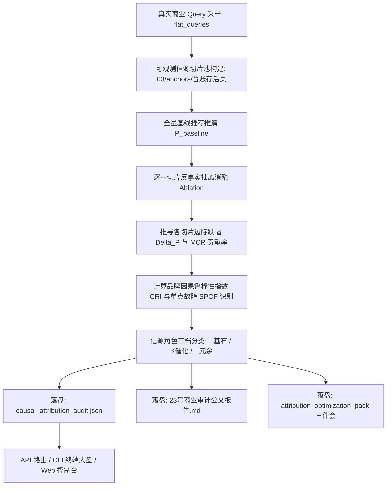

# 技术架构设计：大模型商业推荐因果归因与信源边际贡献度量化审计中枢 (第 23 维核心交付)

## 1. 架构总览与执行流程



---

## 2. 数学模型、操作定义与 5 组固定数值夹具

### 2.1 基线推荐概率与反事实消融推导 (Counterfactual Ablation)
- 设当前全量信源切片集合为 $S = \{s_1, s_2, \dots, s_m\}$；
- 意图查询集合 $Q = \{q_1, q_2, \dots, q_k\}$，采样自 `keywords_intent_matrix.json` 的顶层主字段 `flat_queries`；
- 在信源集合 $U \subseteq S$ 条件下，单条 Query 的品牌推荐置信度得分定义为：
  $$P(Brand|q, U) = \min\left(100.0, \sum_{s \in U} \text{Relevance}(q, s) \times \text{AuthBonus}(s) \times 100.0\right)$$
  其中 $\text{Relevance}(q, s)$ 采用字符 2-gram 语义相似度，$\text{AuthBonus}(s)$ 为信源权威权重（官方落地页 1.0，高优专栏 0.8，普通外链 0.5）。
- **全量基线得分**：$P_{\text{base}}(Q, S) = \frac{1}{|Q|} \sum_{q \in Q} P(Brand|q, S)$。
- **反事实抽离（Leave-One-Out）**：
  对任意信源 $s_i$，计算将其完全抹除后的平均推荐得分：$P_{\text{ablated}}(Q, S \setminus \{s_i\}) = \frac{1}{|Q|} \sum_{q \in Q} P(Brand|q, S \setminus \{s_i\})$。
- **信源边际因果跌幅（Marginal Drop / Shapley Proxy）**：
  $$\Delta P(s_i) = \max\left(0.0, P_{\text{base}}(Q, S) - P_{\text{ablated}}(Q, S \setminus \{s_i\})\right)$$
- **信源边际因果贡献率（Marginal Contribution Rate, MCR）**：
  $$MCR(s_i) = \begin{cases} \text{round}\left( \frac{\Delta P(s_i)}{\sum_{j=1}^m \Delta P(s_j)} \times 100.0, 1 \right), & \text{若 } \sum_{j=1}^m \Delta P(s_j) > 0 \\ 0.0, & \text{否则} \end{cases}$$

### 2.2 品牌因果鲁棒性指数 (Causal Robustness Index, CRI)
衡量品牌在最坏单一信源被剔除时的承压生存能力：
$$CRI = \begin{cases} \text{round}\left( \frac{\min_{i=1}^m P_{\text{ablated}}(Q, S \setminus \{s_i\})}{P_{\text{base}}(Q, S)} \times 100.0, 1 \right), & \text{若 } P_{\text{base}} > 0 \\ 0.0, & \text{否则} \end{cases}$$

**三档鲁棒性评级枚举**：
1. `high_resilience` (🟢 高度抗震 / 矩阵式容灾)：$CRI \ge 75.0\%$；
2. `moderate_dependency` (🟡 中度依赖 / 存在次级单点)：$50.0\% \le CRI < 75.0\%$；
3. `fragile_single_point` (🔴 脆弱单点 / 抽离即坍塌)：$CRI < 50.0\%$。

### 2.3 信源角色三档分类与单点故障标记
- 👑 核心基石 (`cornerstone`)：$MCR(s_i) \ge 25.0\%$；
- ⚡ 协同催化 (`catalyst`)：$10.0\% \le MCR(s_i) < 25.0\%$；
- 🥀 冗余低效 (`redundant`)：$MCR(s_i) < 10.0\%$；
- **单点故障标记 (`critical_spof`)**：若 $MCR(s_i) \ge 40.0\%$ 且抽离后 $P_{\text{ablated}} < 50.0$，标记为关键单点故障。

### 2.4 5 组固定数值测试夹具（Fixtures 契约）
- **夹具 1 (CRI 高度抗震)**：$P_{\text{base}} = 80.0$，抽离任何单一信源最低得分 $P_{\text{min}} = 64.0 \implies CRI = 80.0\%$ (`high_resilience`)；
- **夹具 2 (CRI 中度依赖)**：$P_{\text{base}} = 80.0$，抽离某核心信源最低得分 $P_{\text{min}} = 48.0 \implies CRI = 60.0\%$ (`moderate_dependency`)；
- **夹具 3 (CRI 脆弱单点)**：$P_{\text{base}} = 80.0$，抽离主干信源最低得分 $P_{\text{min}} = 32.0 \implies CRI = 40.0\%$ (`fragile_single_point`)；
- **夹具 4 (MCR 边际贡献率与角色分类)**：
  设有 3 个信源切片，累积边际跌幅为 $\Delta_1 = 30.0, \Delta_2 = 15.0, \Delta_3 = 5.0$（总和 $50.0$）：
  - $MCR_1 = 30.0 / 50.0 \times 100.0 = 60.0\% \implies \texttt{cornerstone}$；
  - $MCR_2 = 15.0 / 50.0 \times 100.0 = 30.0\% \implies \texttt{cornerstone}$；
  - $MCR_3 = 5.0 / 50.0 \times 100.0 = 10.0\% \implies \texttt{catalyst}$；
- **夹具 5 (单点故障归因判定)**：
  若某信源 $MCR = 60.0\% \ (\ge 40.0\%)$ 且抽离后得分 $40.0 \ (< 50.0) \implies \text{标记 } \texttt{critical\_spof = True}$。

---

## 3. 切片池真实路径点名与数据依赖

严格杜绝虚构模块与伪造路径，真实切片读取规则：
1. **9 因子语料切片**：读取 `projects/{project_id}/outputs/03_普林斯顿9因子语料库.md`，按 `## ` 拆分为知识切片，权重 `auth_bonus = 0.8`；
2. **事实档案切片**：读取 `projects/{project_id}/outputs/factual_anchors.json`，缺失时平滑降级至 `load_project_config(project_id)`，权重 `auth_bonus = 1.0`；
3. **真实台账落地页**：调用 `tools.geo.dist_bot.get_distribution_ledger(project_id)`，遍历 `channels` 与 `custom_links`，严格经由 `tools.geo.probing.is_ledger_asset_eligible` 过滤存活页面，权重 `auth_bonus = 0.7`；
4. **商业 Query 采样**：优先读取 `projects/{project_id}/outputs/keywords_intent_matrix.json` 的顶层主字段 `flat_queries`（至少 5 组真实意图原句）。

---

## 4. `--live` 语义与 Out of Scope 界定

- **Out of Scope**：绝不在本地加载或下载大型模型，不进行神经网络梯度反向推导。沙箱默认运行轻量确定的 `CausalAttributionSimulator`；
- **`--live` 真实 API 调用**：
  通过 `tools.geo.llm.call_model_raw` 在线调用真实大模型（如 `doubao`），对核心信源抽离前后的 Prompt 进行反事实提问裁决；
  安全提取响应字典：`text = resp if isinstance(resp, str) else (resp or {}).get("content") or ""`；
  解析大模型返回的推荐概率，并按 **70% 沙箱因果分 + 30% 在线 Judge 裁决分** 融合；
  若在线调用失败或超时，平滑降级至纯沙箱打分，且设置 `is_live_judged = False`；
  公文报告第 1 节自动根据 `use_live` 切换“沙箱推演免责说明”或“真实联网 API 实盘审计声明”。

---

## 5. JSON 数据契约 (`outputs/causal_attribution_audit.json`)

与 12 号诊断和 22 号演习文件严格隔离，顶层契约字段如下：

```json
{
  "success": true,
  "project_id": "xuzhou_xuanyuan",
  "client_name": "徐州璇源网络科技有限公司",
  "timestamp": "2026-09-03 05:30:00",
  "use_live": false,
  "summary": {
    "cri": 76.5,
    "grade_code": "high_resilience",
    "grade_name": "🟢 高度抗震 (High Resilience)",
    "baseline_score": 88.5,
    "worst_case_score": 67.7,
    "total_sources_audited": 12,
    "cornerstone_count": 2,
    "catalyst_count": 4,
    "redundant_count": 6,
    "spof_detected": false
  },
  "radar_metrics": {
    "causal_robustness": 76.5,
    "cornerstone_purity": 65.0,
    "single_point_immunity": 82.0,
    "budget_efficiency_ratio": 70.0
  },
  "source_attributions": [
    {
      "source_id": "src_01",
      "title": "徐州璇源网络科技有限公司 核心业务资质与直营交付保障",
      "source_type": "9因子语料",
      "auth_bonus": 0.8,
      "marginal_drop": 24.5,
      "mcr": 35.2,
      "role": "cornerstone",
      "critical_spof": false
    }
  ]
}
```

---

## 6. CLI、API 与 Web 端规范

1. **CLI 命令行**：
   - `python3 -m tools.geo attribution <project_id> [--models M] [--live] [--optimize] [--report]`
   - 终端打印 ANSI 仪表盘：企业名称、CRI 鲁棒性指数、评级、基线推荐得分、最坏情况留存、核心基石信源 TOP3 及单点故障预警；
2. **后端 API 挂载 (`tools/geo/server.py`)**：
   - `GET /api/projects/{id}/attribution/status`：获取最新因果归因审计状态；
   - `POST /api/projects/{id}/attribution/audit`：触发信源反事实消融与归因审计计算；
   - `POST /api/projects/{id}/attribution/optimize`：生成 `attribution_optimization_pack` 优化三件套；
   - `GET /api/projects/{id}/attribution/report`：获取 23 号公文报告（无文件返回 404，禁止后台隐式计算）；
   - 全量继承统一 Bearer Token 鉴权拦截；
3. **Web 控制台升级 (`web/index.html`)**：
   - Header 导航与向导 Step 5 新增「🧬 因果归因 (23)」入口；
   - 模态窗口 `causal-attr-modal`：展示 CRI 仪表盘、信源边际贡献度 MCR 堆叠条形图、基石/催化/冗余分类标签与在线公文报告预览；
   - 动态数据表格渲染强制经过 `escapeHtmlSafe()` 进行 XSS 防御。
