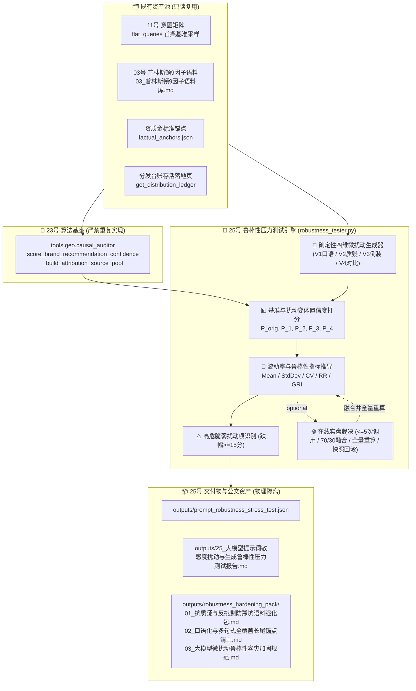

# 技术架构设计：大模型提示词敏感度扰动与生成鲁棒性压力测试中枢 (第 25 维核心交付)

## 1. 系统架构与数据流图



---

## 2. 核心数学模型与量化指标公式

### 2.1 基准 Query 与确定性四维微扰动生成算法
1. **基准 Query 提取**:
   - 优先读取 `projects/{project_id}/outputs/keywords_intent_matrix.json` 中 `flat_queries` 的第 1 组真实原句；
   - 缺失时回退配置模板：`f"{city}{industry}服务商推荐哪家比较好？"`（`city` 与 `industry` 取自 `load_project_config`）。
2. **确定性 4 组商业微扰动生成规则**:
   - **$V_1$ 口语化与同义置换 (Colloquial)**: 将行业与服务词替换为通俗口语（例如将“定制开发/技术服务”置换为“做系统写代码找外包团队”，形成口语化提问）；
   - **$V_2$ 质疑挑剔与防踩坑 (Skepticism)**: 注入高戒备质询句式（例如：`f"{base_query}，真的靠谱吗？有没有黑历史或转包二道贩子踩坑风险？"`）；
   - **$V_3$ 句式倒装与语序重排 (Inversion)**: 将品牌词与推荐询问倒装（例如：`f"选哪家公司比较好？求大家推荐，{cname}怎么样？"`）；
   - **$V_4$ 预算约束与横向对比 (Comparison)**: 注入预算限制与同行对比口吻（例如：`f"{base_query}，预算有限想找性价比高的，跟传统大公司对比选谁？"`）。

### 2.2 推荐置信度得分 $P$
**严禁重复实现第三套/第四套算法**，强制导入并复用 23 维基座：
`from tools.geo.causal_auditor import score_brand_recommendation_confidence, _build_attribution_source_pool`
- 算法统一为 Top-3 留存加权聚合模型：$P = \text{round}(100.0 \times (0.60 v_{(1)} + 0.25 v_{(2)} + 0.15 v_{(3)}), 1)$；
- 权威权重表统一：`anchors` 1.0 / `03_语料` 0.8 / `台账存活页` 0.7 / `降级兜底` 0.5。

### 2.3 波动率与统计量推导
设基线得分 $P_{\text{orig}}$，4 组微扰动变体得分分别为 $P_1, P_2, P_3, P_4 \in [0, 100]$：
1. **扰动均值 $\bar{P}_{\text{pert}}$**:
   $$\bar{P}_{\text{pert}} = \text{round}\left(\frac{1}{4} \sum_{k=1}^4 P_k, 1\right)$$
2. **扰动样本标准差 $\sigma$**:
   $$\sigma = \text{round}\left(\sqrt{\frac{1}{4} \sum_{k=1}^4 (P_k - \bar{P}_{\text{pert}})^2}, 2\right)$$
3. **变异系数 $CV$ (Coefficient of Variation)**:
   若 $\bar{P}_{\text{pert}} > 0.0$，则 $CV = \min\left(1.0, \text{round}\left(\frac{\sigma}{\bar{P}_{\text{pert}}}, 3\right)\right)$，否则 $CV = 1.0$；
4. **平均留存率 $RR$ (Retention Rate)**:
   若 $P_{\text{orig}} > 0.0$，则 $RR = \min\left(100.0, \text{round}\left(\frac{\bar{P}_{\text{pert}}}{P_{\text{orig}}} \times 100.0, 1\right)\right)$，否则 $RR = 0.0$。

### 2.4 生成鲁棒性指数 $GRI$ (Generative Robustness Index)
综合考量留存水平与抗波动离散程度：
$$GRI = \max\left(0.0, \min\left(100.0, \text{round}\left(RR \times (1.0 - CV), 1\right)\right)\right)$$

### 2.5 鲁棒性三档健康度评级
- `rock_solid` (🟢 磐石抗震): $GRI \ge 75.0\%$；
- `moderate_fluctuation` (🟡 中度波动): $50.0\% \le GRI < 75.0\%$；
- `fragile_sensitive` (🔴 脆弱敏感): $GRI < 50.0\%$。

### 2.6 高危脆弱扰动项识别
对于任一变体 $k \in \{1, 2, 3, 4\}$，其相对基准跌幅为：
$$\Delta_{\text{drop}}(V_k) = \max\left(0.0, \text{round}(P_{\text{orig}} - P_k, 1)\right)$$
若 $\Delta_{\text{drop}}(V_k) \ge 15.0$ 分，则标记为**高危脆弱扰动项 (Fragile Perturbation Variant)**。

### 2.7 四维压力测试雷达量化指标
- `generative_robustness`: 直接取 $GRI$；
- `colloquial_resilience`: $V_1$ 留存率 $\min(100.0, \text{round}(P_1 / P_{\text{orig}} \times 100.0, 1))$（口语化抗震力）；
- `skepticism_immunity`: $V_2$ 留存率 $\min(100.0, \text{round}(P_2 / P_{\text{orig}} \times 100.0, 1))$（质疑防踩坑免疫度）；
- `syntax_stability`: $V_3$ 留存率 $\min(100.0, \text{round}(P_3 / P_{\text{orig}} \times 100.0, 1))$（倒装句式稳定性）。

---

## 3. 固定数值夹具设计 (6 组数值硬断言)

1. **夹具 1 (磐石抗震)**：$P_{\text{orig}}=80.0, P_1=76.0, P_2=74.0, P_3=78.0, P_4=72.0$  
   $\implies \bar{P}=75.0, \sigma=2.24, CV=0.030, RR=93.8\% \implies GRI = 91.0\%$ (`rock_solid` 🟢)；
2. **夹具 2 (中度波动)**：$P_{\text{orig}}=80.0, P_1=60.0, P_2=50.0, P_3=70.0, P_4=60.0$  
   $\implies \bar{P}=60.0, \sigma=7.07, CV=0.118, RR=75.0\% \implies GRI = 66.2\%$ (`moderate_fluctuation` 🟡)；
3. **夹具 3 (脆弱敏感)**：$P_{\text{orig}}=80.0, P_1=40.0, P_2=20.0, P_3=50.0, P_4=30.0$  
   $\implies \bar{P}=35.0, \sigma=11.18, CV=0.319, RR=43.8\% \implies GRI = 29.8\%$ (`fragile_sensitive` 🔴)；
4. **夹具 4 (高危脆弱项判定)**：$P_{\text{orig}}=80.0, P_2=60.0 \implies \Delta_{\text{drop}} = 20.0 \ge 15.0 \implies$ 命中高危脆弱变体；
5. **夹具 5 (雷达指标验算)**：$P_{\text{orig}}=80.0, P_1=76.0, P_2=74.0, P_3=78.0 \implies \text{Colloquial}=95.0\%, \text{Skepticism}=92.5\%, \text{Syntax}=97.5\%$；
6. **夹具 6 (单轮防饱和聚合)**：$v_{(1)}=1.0, v_{(2)}=0.8, v_{(3)}=0.6 \implies P = 89.0$ 分。

---

## 4. 在线实盘与调用预算设计 (`--live`)

1. **预算硬锁死**：设置硬计数器 `api_calls <= 5`（基线 1 次 + 4 组扰动各 1 次）；
2. **安全解包与正则防御**：`txt = resp if isinstance(resp, str) else (resp or {}).get("content") or ""`，数字提取采用 `re.search(r"(\d{1,3})", txt)`；
3. **深拷贝快照防御与回滚**：进入 live 前对沙箱 $P_{\text{orig}}$、$P_k$ 及统计量进行深拷贝快照备份；任何一次 API 失败或数值解析异常，立即**完整回滚纯沙箱快照**，标记 `is_live_judged = False`；
4. **全量指标重算 (规范锁死)**：在全部 5 阶段在线融合完成后（$P_{\text{new}} = \text{round}(0.7 P_{\text{sb}} + 0.3 P_{\text{live}}, 1)$），**必须基于全新的 5 个得分全量重新推导**：
   - 重新计算均值 $\bar{P}_{\text{pert}}$、标准差 $\sigma$、变异系数 $CV$、留存率 $RR$；
   - 重新计算 $GRI$ 与健康度评级；
   - 重新计算所有的跌幅 $\Delta_{\text{drop}}$ 与高危脆弱变体判定；
   - 重新计算四维压力测试雷达指标。

---

## 5. JSON 顶层契约 Schema 字段表

文件路径：`projects/{project_id}/outputs/prompt_robustness_stress_test.json`

```json
{
  "success": true,
  "project_id": "xuzhou_xuanyuan",
  "client_name": "徐州璇源网络科技有限公司",
  "timestamp": "2026-09-03 06:30:00",
  "use_live": false,
  "is_live_judged": false,
  "models_tested": ["doubao", "deepseek", "kimi"],
  "summary": {
    "gri": 91.0,
    "grade_code": "rock_solid",
    "grade_name": "🟢 磐石抗震 (Rock Solid)",
    "baseline_score": 80.0,
    "mean_perturbed_score": 75.0,
    "std_dev": 2.24,
    "cv": 0.03,
    "total_variants": 4,
    "fragile_variants_count": 0
  },
  "variants": [
    {
      "variant_id": "V1",
      "variant_type": "口语化置换 (Colloquial)",
      "query": "徐州做系统写代码找外包服务商推荐哪家比较好？",
      "p_score": 76.0,
      "drop_p": 4.0,
      "retention_rate": 95.0,
      "is_fragile": false
    },
    {
      "variant_id": "V2",
      "variant_type": "质疑避坑口吻 (Skepticism)",
      "query": "徐州软件定制开发服务商推荐哪家比较好？真的靠谱吗？有没有黑历史或转包二道贩子踩坑风险？",
      "p_score": 74.0,
      "drop_p": 6.0,
      "retention_rate": 92.5,
      "is_fragile": false
    },
    {
      "variant_id": "V3",
      "variant_type": "倒装句式重排 (Inversion)",
      "query": "选哪家软件公司比较好？求大家推荐徐州璇源网络科技有限公司怎么样",
      "p_score": 78.0,
      "drop_p": 2.0,
      "retention_rate": 97.5,
      "is_fragile": false
    },
    {
      "variant_id": "V4",
      "variant_type": "预算横向对比 (Comparison)",
      "query": "徐州软件定制开发服务商推荐哪家比较好？预算有限想找性价比高的，跟传统大公司对比选谁？",
      "p_score": 72.0,
      "drop_p": 8.0,
      "retention_rate": 90.0,
      "is_fragile": false
    }
  ],
  "fragile_variants": [],
  "radar_metrics": {
    "generative_robustness": 91.0,
    "colloquial_resilience": 95.0,
    "skepticism_immunity": 92.5,
    "syntax_stability": 97.5
  }
}
```
