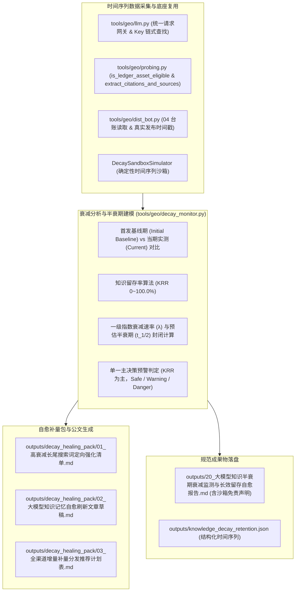

# Design: 大模型知识半衰期衰减监测与长效留存自愈中枢 (Technical Design)

## 1. 架构定位与模块职责划分



### 1.1 与既有模块的严格边界与复用关系 (闭环 P0-1, P0-2)

| 现有模块 | 既有定位与能力 | 本规范（20 号中枢）的复用与扩展边界 | 严禁行为 |
|:---|:---|:---|:---|
| **`tools/geo/llm.py`** | 大模型 HTTP 网关、链式 Key 解析 (`resolve_api_key`) 与 `call_model_raw` | **强制直接复用底层请求与 Key 读取**，用于当期模型意图探测 | 严禁新建第二套 HTTP 调用客户端 |
| **`tools/geo/probing.py`** | Citation 正文角标解析 (`extract_citations_and_sources`)、URL 归一化 (`normalize_url`) 与外链有效性过滤 (`is_ledger_asset_eligible`) | **强制直接复用 Citation 正则、URL 归一化与 `is_ledger_asset_eligible`**，台账匹配时严格过滤未发布或死亡链接 | 严禁复制粘贴重复的正则提取代码；严禁将非 published/verified 链接计入我方资产 |
| **`tools/geo/dist_bot.py`** | 04 全网分发台账 (`get_distribution_ledger`) | **读取真实已发布文章与最早发布时间**，作为半衰期时间间隔 $\Delta t$ 的基准 | 严禁凭空伪造虚假台账 |
| **`outputs/factual_anchors.json`** | 客户事实锚点清单 (位于 `projects/{id}/outputs/factual_anchors.json`) | **直接读取项目实际事实档案**（若不存在则回退读取 `load_project_config`），用于生成自愈刷新文章草稿 | **严禁虚构 `tools/geo/factual_anchors.py` 假模块或假路径**；严禁臆造虚假资质 |

---

## 2. 衰减动力学模型与严密分母口径 (Decay Mathematics, 闭环 P0-3, P0-4)

### 2.1 数据采样与首发基线契约 (Baseline Stability)

- 探测模型集合 $M$（如 `doubao, deepseek, kimi`，数量 $|M|$，默认 3）；
- 测试意图 Query 集 $Q$（数量 $|Q|$，默认 5 组）；
- **单轮总探测次数** $T = |M| \times |Q|$；
- **有效留存命中打分**：
  对每次探测，若：
  1. 品牌被模型作为首位推荐（Top-1）：计 1.0 分；
  2. 品牌被模型提及（Mentioned）或命中有效台账外链（满足 `is_ledger_asset_eligible`）：计 0.5 分；
  3. 未提及且未引用：计 0.0 分；
- 当期总得分 $S_{\text{current}} = \sum \text{score}$；
- **基准期得分 $S_{\text{baseline}}$ 契约（闭环 P0-4，杜绝历史最大值漂移）**：
  - 优先读取 `outputs/knowledge_decay_retention.json` 中的初始基线分 `initial_baseline_score`；
  - 若为首次探测（尚未建立基准），则以首次实测得分为初始基线 $S_{\text{baseline}} = \max(1.0, S_{\text{current}})$；
  - **严禁动态取“历史最大值”，避免偶发扰动破坏基准稳定性**。

### 2.2 知识留存率 (Knowledge Retention Rate, KRR) 公式

$$\text{KRR} = \min\left(100.0, \max\left(0.0, \frac{S_{\text{current}}}{S_{\text{baseline}}} \times 100.0\right)\right)$$
- 取值范围严格约束在 $0.0\% \sim 100.0\%$，保留 1 位小数。

### 2.3 知识半衰期 ($t_{1/2}$) 预估模型

假设大模型联网知识与 RAG 记忆服从一级指数衰减模型：
$$R(t) = R_0 e^{-\lambda \Delta t}$$
其中 $\Delta t$ 为距最早分发外链或基准期的间隔天数（天，由 `dist_ledger.json` 中最早已发外链或当前时间戳计算，$\Delta t \le 0$ 时兜底为 14 天）：
$$\lambda = -\frac{\ln\left(\max\left(0.01, \frac{\text{KRR}}{100.0}\right)\right)}{\max(1.0, \text{float}(\Delta t))}$$
预估半衰期天数：
$$t_{1/2} = \begin{cases} 
\ge 90.0 \text{ 天}, & \text{若 } \text{KRR} \ge 98.0\% \\
\min\left(90.0, \max\left(3.0, \frac{\ln 2}{\lambda}\right)\right), & \text{其他}
\end{cases}$$
- 保留 1 位小数，带严格防除零与边界截断保护。

### 2.4 红黄绿预警判定（闭环 P0-3，锁定单一决策主轴）

为消除 KRR 与半衰期天数的判定冲突，**系统严格以 KRR 作为唯一主决策判定轴**，半衰期天数作为从属参考指标：

| 状态等级 | 唯一主决策条件 (KRR) | 参考半衰期 | 商业释义与自愈策略 |
|:---|:---:|:---:|:---|
| 🟢 **安全稳固 (Safe)** | $\text{KRR} \ge 80.0\%$ | 通常 $\ge 45$ 天 | 知识记忆鲜活，大模型首推稳定，无需额外补量 |
| 🟡 **中度衰减 (Warning)** | $60.0\% \le \text{KRR} < 80.0\%$ | 通常 $15 \sim 44$ 天 | 部分长尾 Query 位次下滑，建议启动当月自愈刷新补发 |
| 🔴 **严重遗忘 (Danger)** | $\text{KRR} < 60.0\%$ | 通常 $< 15$ 天 | 核心词被竞品大面积覆盖冲淡，触发紧急自愈刷新反击 |

---

## 3. 自愈补量刷新包规范设计 (outputs/decay_healing_pack/)

针对衰减严重（得分 $< 0.5$）的 Query，自动生成 3 份定向落地自愈成果物，落盘至 `outputs/decay_healing_pack/`：
1. **`outputs/decay_healing_pack/01_高衰减长尾搜索词定向强化清单.md`**：
   - 列举当前记忆留存率最低的意图词、竞争对手趁虚而入的现状，明确强化优先级；
2. **`outputs/decay_healing_pack/02_大模型知识记忆自愈刷新文章草稿.md`**：
   - 遵循普林斯顿 9 因子标准，针对高衰减词重新生成高信息密度的对比评测与权威解答文章草稿；
3. **`outputs/decay_healing_pack/03_全渠道增量补量分发推荐计划表.md`**：
   - 推荐自愈补发渠道矩阵（知乎专栏、百家号、今日头条、CSDN 等），列明发稿频次与回填指引。

---

## 4. 标准公文成果物规范 (20 号, 闭环 P0-5)

- **Markdown 报告**：`outputs/20_大模型知识半衰期衰减监测与长效留存自愈报告.md`
- **JSON 结构**：`outputs/knowledge_decay_retention.json`
  包含核心字段：
  ```json
  {
    "success": true,
    "project_id": "xuzhou_xuanyuan",
    "client_name": "徐州璇源网络科技有限公司",
    "timestamp": "2026-09-03 04:00:00",
    "summary": {
      "krr": 75.0,
      "half_life_days": 33.7,
      "decay_rate_lambda": 0.0205,
      "risk_level": "warning",
      "initial_baseline_score": 12.0,
      "current_score": 9.0,
      "total_probes": 15,
      "decayed_queries_count": 2
    },
    "time_series_records": [
      {"timestamp": "2026-08-20 10:00:00", "krr": 100.0, "half_life_days": 90.0, "status": "safe"},
      {"timestamp": "2026-09-03 04:00:00", "krr": 75.0, "half_life_days": 33.7, "status": "warning"}
    ],
    "query_decay_breakdown": []
  }
  ```
- **公文必须包含沙箱保真免责话术（闭环 P0-5）**：
  报告开头必须醒目标注：
  > `> ⚠️ **数据说明与免责声明**：本报告当前在确定性沙箱仿真环境下生成，用于衰减趋势推演与自愈补量演练。沙箱仿真不可替代真实大模型联网 API 实盘审计。上线实盘交付时，请配置真实 API Key 执行 live 模式探测。`

---

## 5. CLI 命令行与后端 API 契约

### 5.1 CLI 子命令

```bash
geo decay <project_id> [--models doubao,deepseek,kimi] [--live] [--heal] [--report]
```
- 输出 ANSI 终端高保真留存大盘；
- `--heal`：自动生成 `outputs/decay_healing_pack/` 下 3 份落地自愈文件。

### 5.2 后端 RESTful API (带 Admin 鉴权)

- `GET /api/projects/{id}/decay/status`：获取当前知识留存率、半衰期与时间序列；
- `POST /api/projects/{id}/decay/track`：触发衰减追踪扫描；
- `POST /api/projects/{id}/decay/heal`：一键生成自愈补量包；
- `GET /api/projects/{id}/decay/report`：获取 20 号公文报告（**无文件严格返回 404，禁止自动后台计算**）。

---

## 6. Web 管理端交互与 XSS 安全防线

1. **界面入口**：
   - 向导 Step 5 新增「⏳ 知识半衰期衰减与长效自愈 (20)」独立按钮；
   - 顶部 Header 增加快捷入口；
2. **弹窗设计 (`decay-monitor-modal`)**：
   - KRR 留存大字仪表盘；
   - 半衰期预测卡与衰减速度指示；
   - 意图 Query 衰减状态列表（绿黄红 Tag）；
   - 一键自愈补量与 20 号公文报告在线预览。
3. **XSS 防御**：
   - 前端所有动态渲染内容强制经过 `escapeHtmlSafe()` 转义。
