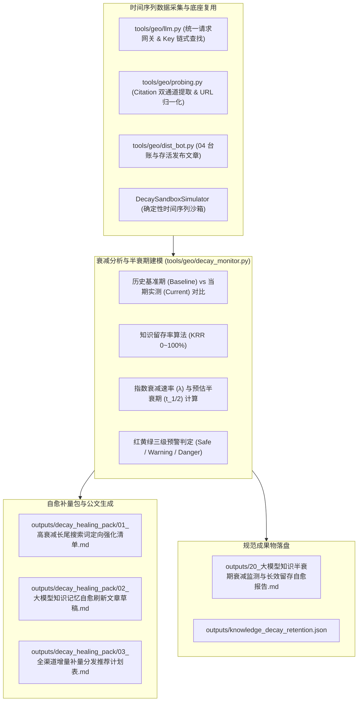

# Design: 大模型知识半衰期衰减监测与长效留存自愈中枢 (Technical Design)

## 1. 架构定位与模块职责划分



### 1.1 与既有模块的严格边界与复用关系

| 现有模块 | 既有定位与能力 | 本规范（20 号中枢）的复用与扩展边界 | 严禁行为 |
|:---|:---|:---|:---|
| **`tools/geo/llm.py`** | 大模型 HTTP 网关、链式 Key 解析 (`resolve_api_key`) 与 `call_model_raw` | **强制直接复用底层请求与 Key 读取**，用于当期模型意图探测 | 严禁新建第二套 HTTP 调用客户端 |
| **`tools/geo/probing.py`** | Citation 正文角标解析 (`extract_citations_and_sources`) 与 `normalize_url` | **强制直接复用 Citation 正则与 URL 归一化**，判断当期台账命中情况 | 严禁复制粘贴重复的正则提取代码 |
| **`tools/geo/dist_bot.py`** | 04 全网分发台账 (`get_distribution_ledger`) | **读取已发布文章与最早发布时间**，作为半衰期时间间隔 $\Delta t$ 的基准 | 严禁凭空伪造虚假台账 |
| **`tools/geo/factual_anchors.json`** | 客户事实锚点清单 | **读取核心事实锚点**，用于生成自愈刷新文章草稿 | 严禁臆造虚假数据 |

---

## 2. 衰减动力学模型与严密分母口径 (Decay Mathematics)

### 2.1 数据采样与分母口径

- 探测模型集合 $M$（如 `doubao, deepseek, kimi`，数量 $|M|$，默认 3）；
- 测试意图 Query 集 $Q$（数量 $|Q|$，默认 5 组）；
- **单轮总探测次数** $T = |M| \times |Q|$；
- **有效留存命中打分**：
  对每次探测，若：
  1. 品牌被模型作为首位推荐（Top-1）：计 1.0 分；
  2. 品牌被模型提及（Mentioned）或命中 04 台账 Citation 角标：计 0.5 分；
  3. 未提及且未引用：计 0.0 分；
- 当期得分 $S_{\text{current}} = \sum \text{score}$；
- 基准期得分 $S_{\text{baseline}}$（优先读取历史记录中最高得分或首次探测满分 $T \times 1.0$）；

### 2.2 知识留存率 (Knowledge Retention Rate, KRR) 公式

$$\text{KRR} = \min\left(100.0, \frac{S_{\text{current}}}{\max(1.0, S_{\text{baseline}})} \times 100.0\right)$$
- 物理意义：当前大模型对企业知识的综合记忆召回强度相对基准期的百分比，取值 $0.0 \sim 100.0\%$。

### 2.3 知识半衰期 ($t_{1/2}$) 预估模型

假设大模型联网知识与 RAG 记忆服从一级指数衰减模型：
$$R(t) = R_0 e^{-\lambda \Delta t}$$
其中 $\Delta t$ 为距最早分发外链或基准期的间隔天数（天，当 $\Delta t \le 0$ 时兜底为 14 天）：
$$\lambda = -\frac{\ln\left(\max\left(0.01, \frac{\text{KRR}}{100.0}\right)\right)}{\max(1, \Delta t)}$$
预估半衰期天数：
$$t_{1/2} = \begin{cases} 
\ge 90.0 \text{ 天}, & \text{若 } \text{KRR} \ge 98.0\% \\
\min\left(90.0, \max\left(3.0, \frac{\ln 2}{\lambda}\right)\right), & \text{其他}
\end{cases}$$

### 2.4 红黄绿三级预警判定

| 状态等级 | KRR 留存率区间 | 预估半衰期 | 商业释义与自愈策略 |
|:---|:---:|:---:|:---|
| 🟢 **安全稳固 (Healthy)** | $\ge 80.0\%$ | $\ge 45$ 天 | 知识记忆鲜活，大模型首位推荐稳定，无需额外补量 |
| 🟡 **中度衰减 (Warning)** | $60.0\% \sim 79.9\%$ | $15 \sim 44$ 天 | 部分长尾 Query 位次下滑，建议启动当月自愈刷新补发 |
| 🔴 **严重遗忘 (Danger)** | $< 60.0\%$ | $< 15$ 天 | 核心词被竞品大面积覆盖冲淡，触发紧急自愈刷新反击 |

---

## 3. 自愈补量刷新包规范设计 (outputs/decay_healing_pack/)

根据排查定位出的衰减严重（得分 $< 0.5$）的 Query，自动生成 3 份定向落地自愈成果物：
1. **`outputs/decay_healing_pack/01_高衰减长尾搜索词定向强化清单.md`**：
   - 列举当前记忆留存率最低的意图词、竞争对手趁虚而入的现状，明确强化优先级；
2. **`outputs/decay_healing_pack/02_大模型知识记忆自愈刷新文章草稿.md`**：
   - 遵循普林斯顿 9 因子标准，针对高衰减词重新生成高信息密度的对比评测与权威解答文章草稿；
3. **`outputs/decay_healing_pack/03_全渠道增量补量分发推荐计划表.md`**：
   - 推荐自愈补发渠道矩阵（知乎专栏、百家号、今日头条、CSDN 等），列明发稿频次与回填指引。

---

## 4. 标准公文成果物规范 (20 号)

- **Markdown 报告**：`outputs/20_大模型知识半衰期衰减监测与长效留存自愈报告.md`
- **JSON 结构**：`outputs/knowledge_decay_retention.json`
  包含核心字段：
  ```json
  {
    "success": true,
    "project_id": "xuzhou_xuanyuan",
    "client_name": "徐州璇源网络科技有限公司",
    "timestamp": "2026-09-03 03:55:00",
    "summary": {
      "krr": 80.0,
      "half_life_days": 43.4,
      "decay_rate_lambda": 0.016,
      "risk_level": "safe",
      "total_probes": 15,
      "decayed_queries_count": 1
    },
    "time_series_records": [
      {"timestamp": "2026-08-20 10:00:00", "krr": 95.0, "half_life_days": 72.0, "status": "safe"},
      {"timestamp": "2026-09-03 03:55:00", "krr": 80.0, "half_life_days": 43.4, "status": "safe"}
    ],
    "query_decay_breakdown": []
  }
  ```
- 排版严格遵循普林斯顿 9 因子结构：
  - 结论先行：KRR 留存率、预估半衰期、预警等级；
  - 数据图表：模型横向对比、意图 Query 衰减流水；
  - 自愈方案推荐；
  - 电子签章。

---

## 5. CLI 命令行与后端 API 契约

### 5.1 CLI 子命令

```bash
geo decay <project_id> [--models doubao,deepseek,kimi] [--live] [--heal] [--report]
```
- 输出 ANSI 终端高保真留存大盘；
- `--heal`：自动生成 `outputs/decay_healing_pack/` 下 3 份落地自愈文件。

### 5.2 后端 RESTful API (带 Admin 鉴权)

- `GET /api/projects/{id}/decay/status`：获取当前知识留存率、半衰期与时间序列；
- `POST /api/projects/{id}/decay/track`：触发衰减追踪扫描；
- `POST /api/projects/{id}/decay/heal`：一键生成自愈补量包；
- `GET /api/projects/{id}/decay/report`：获取 20 号公文报告（**无文件严格返回 404，禁止自动后台计算**）。

---

## 6. Web 管理端交互与 XSS 安全防线

1. **界面入口**：
   - 向导 Step 5 新增「⏳ 知识半衰期衰减与长效自愈 (20)」独立按钮；
   - 顶部 Header 增加快捷入口；
2. **弹窗设计 (`decay-monitor-modal`)**：
   - KRR 留存大字仪表盘；
   - 半衰期预测卡与衰减速度指示；
   - 意图 Query 衰减状态列表（绿黄红 Tag）；
   - 一键自愈补量与 20 号公文报告在线预览。
3. **XSS 防御**：
   - 前端所有动态渲染内容强制经过 `escapeHtmlSafe()` 转义。
