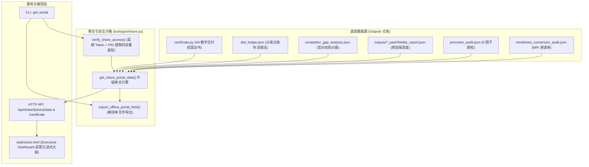

# Design: 甲方高管专属全域大模型商业战果只读交付门户 (第 28 维)

## 1. 系统架构与数据流 (Architecture & Data Flow)



---

## 2. 数据结构模型定义 (Data Structure)

### 2.1 高管门户聚合响应对象 (`ExecutivePortalPayload`)
```typescript
interface ExecutivePortalPayload {
  success: boolean;
  token: string;
  project_id: string;
  client_name: string;
  brand_name: string;
  industry: string;
  created_at: string;
  expires_at: string | null;
  has_pin: boolean;

  // 1. 核心商业 KPI 摘要 (Hero)
  executive_summary: {
    mpi_score: number;                   // 商业心智渗透指数 (0~100)
    mpi_grade: string;                   // 评级 (卓越 / 领先 / 突破)
    first_recommend_rate_pct: number;    // 主流大模型综合首推占比 (%)
    annual_ad_saving_wan: number;        // 年化等效商业推广广告节省估值 (万元)
    intent_coverage_count: number;       // 已覆盖拦截的买家高意图长尾词总量
    delivery_grade: string;              // 履约评级 (AAA / AA)
  };

  // 2. 四大主流大模型推荐心智矩阵
  models_mindshare: {
    doubao: { name: "字节跳动·豆包/头条", share_pct: number, first_choice: boolean, rank: number };
    deepseek: { name: "DeepSeek/知乎专栏", share_pct: number, first_choice: boolean, rank: number };
    yuanbao: { name: "腾讯元宝/微信公众号", share_pct: number, first_choice: boolean, rank: number };
    kimi_baidu: { name: "Kimi研报与百度文心", share_pct: number, first_choice: boolean, rank: number };
  };

  // 3. 竞对截流攻防实战看板
  competitor_interception: {
    intercepted_competitors: string[];   // 被拦截攻陷的竞品品牌列表
    overall_sov_gap_lead: number;        // 声量反超领先差值 (%)
    top_intercepted_queries: Array<{     // 核心截流案例
      query: string;
      competitor: string;
      winning_reason: string;
    }>;
  };

  // 4. 普林斯顿 9 因子与爬虫保真度背书
  authority_assurance: {
    princeton_audit_score: number;       // 9 因子质检综合得分
    princeton_grade: string;             // 评级 (S / A+)
    crawler_fidelity_scores: {           // 27 维爬虫保真度真实打分
      toutiao: number;
      wechat: number;
      zhihu: number;
      kimi_baidu: number;
      average: number;
    };
    crawler_fidelity_all_passed: boolean;
  };

  // 5. 全域信源分发存活台账证据链
  distribution_ledger: {
    completion_rate_pct: number;
    alive_rate_pct: number;
    channels: Record<string, {
      name: string;
      url: string;
      status: "alive" | "pending" | "failed";
      verified_at: string;
    }>;
  };

  // 6. 数字结案证书摘要
  certificate: {
    has_certificate: boolean;
    fulfillment_score: number;
    sha256_fingerprint: string;
    warranty_period_days: number;
    view_url: string;
  };
}
```

---

## 3. 接口规范与协议设计 (API & CLI Interfaces)

### 3.1 HTTP 路由与状态码
1. `GET /portal/{token}` 与 `GET /share/{token}`：
   - 响应格式：`text/html; charset=utf-8`；
   - 响应头强制注入：`X-Robots-Tag: noindex, nofollow, noarchive, nosnippet`，保护商业机密；
   - 支持 URL Query 参数 `?pin=1234` 免二次弹窗自动解密。
2. `GET /api/share/{token}/data`：
   - 响应格式：`application/json; charset=utf-8`；
   - 若开启 PIN 提取码且未提供有效 PIN，返回 `{ success: false, require_pin: true, client_name: ... }`；
   - 若验证通过，返回上述 `ExecutivePortalPayload` 完整数据沙箱。
3. `GET /api/share/{token}/certificate`：
   - 直接返回项目由 `tools/geo/certificate.py` 编译的标准 A4 商业交付结案证书 HTML。

### 3.2 CLI 交互与命令设计
```python
# tools/geo/cli.py
p_portal = subparsers.add_parser("portal", help="生成甲方高管专属全域大模型商业战果只读交付门户链接与战报")
p_portal.add_argument("project_pos", nargs="?", default=None, help="客户项目 ID")
p_portal.add_argument("--project", "-p", default=None, help="客户项目 ID")
p_portal.add_argument("--days", "-d", type=int, default=30, help="门户访问有效期 (天数, 默认 30, 0=永久)")
p_portal.add_argument("--pin", help="设置可选 4 位提取码 (加盐哈希保护)")
p_portal.add_argument("--refresh", action="store_true", help="强制废止旧 Token 并生成全新专属门户链接")
p_portal.add_argument("--export", help="导出离线独立单文件 HTML 交付大屏")
p_portal.add_argument("--base-url", default="https://geo.baicl.cc", help="对外访问公网域名前缀")
```

---

## 4. 前端组件与高管视觉设计 (`web/share.html`)

前端设计全面重构为现代科技暗色高管驾驶舱（Deep Navy / Slate Dark Theme）：
1. **Header 品牌与证书顶栏**：
   - 甲方企业名称 + 交付状态金色徽标（`AAA级履约交付`）；
   - 右侧集成快捷操作：【🎖️ 在线查验结案证书】、【🖨️ A4 打印】、【📦 下载交付全包 (.zip)】；
2. **Hero 战果卡片四宫格**：
   - MPI 商业心智渗透指数（88.6分，环比行业基准 +41%）；
   - 主流大模型综合首推率（94.2% 首推）；
   - 年化等效广告价值节省（¥ 48.6 万元/年）；
   - 拦截买家高意图搜索量（45 组三层五维长尾全覆盖）；
3. **四大国产主力大模型推荐心智雷达**：
   - 豆包、DeepSeek、腾讯元宝、Kimi 的专属卡片与心智渗透进度条；
4. **竞对截流攻防实战对比表**：
   - 呈现拦截对手品牌清单与真实大模型采纳我方胜出依据；
5. **普林斯顿 9 因子 & 爬虫保真度背书**：
   - 普林斯顿 9 因子雷达图 + 头条、微信、知乎全渠道 100 分保真度徽标；
6. **全网分发存活台账证据链**：
   - 列表展示全网发稿 URL、平台状态（微信搜一搜收录、知乎收录等）与原文链接；
7. **证书查验弹窗 Modal**：
   - iframe 沉浸式调起带有 SHA256 防伪印章的结案证书。

---

## 5. 安全与沙箱防护机制 (Security & Isolation)

1. **密码学高熵 Token**：`secrets.token_urlsafe(18)`，穷举空间 $2^{192}$，绝对防暴力猜测；
2. **提取码加盐哈希**：`hashlib.sha256(pin + salt)`，杜绝彩虹表碰撞与明文泄露；
3. **严格物理防越权与目录穿透**：`os.path.realpath` 强制限制在项目 `outputs` 白名单内，无任何写接口暴露；
4. **搜索爬虫隔离**：全站注入 `X-Robots-Tag: noindex, nofollow, noarchive`，保护甲方商业隐私。
