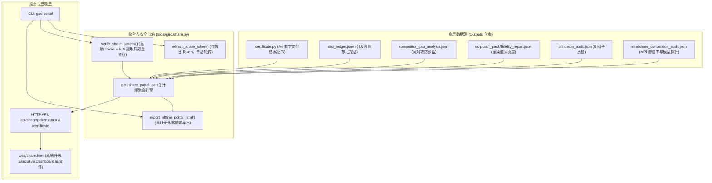

# Design: 甲方高管专属全域大模型商业战果只读交付门户 (第 28 维·修订版)

## 1. 系统架构与数据流 (Architecture & Data Flow)



---

## 2. 真实字段映射表与降级策略 (Field Mapping Specification)

为杜绝任何脱离实际数据源的虚构打分（严格对齐【铁律 1】），高管看板所呈现的所有指标必须具备 100% 真实的落盘数据来源：

| 高管看板字段 (Portal Field) | 物理数据源与提取路径 | 单位 / 衍生计算逻辑 | 缺失/未生成时的优雅降级策略 |
|:---|:---|:---|:---|
| **`executive_summary.mpi_score`** | `mindshare_conversion_audit.json` ➔ `summary.mpi` | 数值 (0~100) | 若文件不存在，返回 `null`，前端展示「待生成」徽标 |
| **`executive_summary.mpi_grade`** | `mindshare_conversion_audit.json` ➔ `summary.grade_name` | 字符串 (如 `🔵 四星强势竞争`) | 缺省显示「评估未就绪」 |
| **`executive_summary.annual_ad_saving_wan`** | `mindshare_conversion_audit.json` ➔ `summary.annual_aev_yuan` | `round(annual_aev_yuan / 10000, 1)`（元换算为万元） | 缺省显示 `0.0` |
| **`executive_summary.annual_aev_yuan`** | `mindshare_conversion_audit.json` ➔ `summary.annual_aev_yuan` | 整数 (人民币元) | 缺省显示 `0` |
| **`executive_summary.first_recommend_rate_pct`** | `mindshare_conversion_audit.json` ➔ `probe_records` | 真实统计：`round(len([p for p in probe_records if p.get('is_top1')]) / max(1, len(probe_records)) * 100, 1)` | 缺省回退至 `summary.weighted_sov_rate`，若均无则 `null` |
| **`executive_summary.intent_coverage_count`** | `mindshare_conversion_audit.json` ➔ `summary.query_count` | 整数 (高意图词数量) | 缺省显示 `0` |
| **`executive_summary.delivery_grade`** | `09_GEO全案商业交付结案与数字资产移交证书.html` 或 `acceptance.json` | 履约评级（如 `AAA`、`AA`） | 缺省显示 `待验收` |
| **`models_mindshare` (实测探针)** | `mindshare_conversion_audit.json` ➔ `probe_records` 按 `model` 聚合 | 统计 `doubao`、`deepseek`、`kimi` 三大实测模型的首推率、提及率与均分 | **仅展示有真实探针的 3 个模型**；禁止臆造元宝探针打分 |
| **`wechat_yuanbao_proxy`** | `dist_ledger.json` ➔ `channels.wechat` | 渠道覆盖代理：展示分发就绪状态（微信搜一搜独占生态） | 明确标注「渠道覆盖代理·非实时 API 探针」 |
| **`competitor_interception.intercepted_competitors`** | `competitor_gap_analysis.json` ➔ `all_competitors` | 数组 (竞对品牌名列表) | 缺省显示 `["竞对行业基准"]` |
| **`competitor_interception.overall_gap_lead`** | `competitor_gap_analysis.json` ➔ `radar_comparison.overall_gap_lead` | 数值 (领先差值 %) | 缺省显示 `0.0` |
| **`competitor_interception.advantage_breakdown`** | `competitor_gap_analysis.json` ➔ `competitor_advantages` | 数组 (提取 `dimension`, `threat_level`, `neutralize_action`) | 缺省为空数组 |
| **`authority_assurance.princeton_score`** | `princeton_audit.json` ➔ `avg_princeton_score` | 数值 (0~100) | 缺省显示 `null` |
| **`authority_assurance.princeton_grade`** | `princeton_audit.json` ➔ `rating_grade` | 评级字符串 (如 `S 级 (行业垄断级)`) | 缺省显示 `未质检` |
| **`authority_assurance.crawler_fidelities`** | `outputs/*_pack/fidelity_report.json` | 分渠道读取：`toutiao`、`wechat`、`deepseek`、`kimi_baidu` 真实保真度 | 缺省渠道保真度显示为 `null`；知乎优先读取 `deepseek_pack` 内记录或独立报告 |
| **`distribution_ledger.channels`** | `dist_ledger.json` ➔ `channels` | 状态推导：<br>• `url` 且 `http_status == 200`: `alive` (🟢 已收录·探活正常)<br>• `url` 且 `http_status is None`: `pending_audit` (🟡 已填报·待探活)<br>• `url` 且 `http_status != 200`: `dead` (🔴 探活异常)<br>• `url` 为空: `unfilled` (⚪️ 待分发填报) | 严格如实展示，绝不虚构存活率 |
| **`certificate.has_certificate`** | 检查 `outputs/09_GEO全案商业交付结案与数字资产移交证书.html` | 布尔值 (`True` / `False`) | 存在则提供在线查验链接 |

---

## 3. 数据模型定义 (ExecutivePortalPayload)

```typescript
interface ExecutivePortalPayload {
  // 基础身份与安全
  success: boolean;
  token: string;
  project_id: string;
  client_name: string;
  brand_name: string;
  industry: string;
  created_at: string;
  expires_at: string | null;
  has_pin: boolean;

  // 1. 核心商业 KPI 摘要 (Hero)
  executive_summary: {
    mpi_score: number | null;
    mpi_grade: string;
    first_recommend_rate_pct: number | null;
    annual_ad_saving_wan: number;
    annual_aev_yuan: number;
    intent_coverage_count: number;
    delivery_grade: string;
  };

  // 2. 主流大模型实测心智矩阵 (严格基于 probe_records 实测)
  models_mindshare: {
    doubao?: { name: "字节跳动·豆包 (头条生态)", top1_rate_pct: number, mention_rate_pct: number, avg_score: number, probe_count: number };
    deepseek?: { name: "DeepSeek (技术决策池)", top1_rate_pct: number, mention_rate_pct: number, avg_score: number, probe_count: number };
    kimi?: { name: "月之暗面·Kimi (研报分析池)", top1_rate_pct: number, mention_rate_pct: number, avg_score: number, probe_count: number };
  };
  wechat_yuanbao_channel: {
    name: "腾讯元宝 (微信搜一搜独占)";
    status_desc: string; // "渠道分发覆盖已就绪 (权重 10%) · 非实时 API 探针"
    url: string;
  };

  // 3. 竞对截流攻防实战看板
  competitor_interception: {
    intercepted_competitors: string[];
    overall_gap_lead: number;
    advantage_breakdown: Array<{
      dimension: string;
      threat_level: string;
      neutralize_action: string;
    }>;
  };

  // 4. 普林斯顿 9 因子与爬虫保真度背书
  authority_assurance: {
    princeton_score: number | null;
    princeton_grade: string;
    crawler_fidelities: Record<string, {
      score: number;
      passed: boolean;
      verified_at?: string;
    }>;
    average_fidelity_score: number | null;
  };

  // 5. 全域信源分发存活台账证据链
  distribution_ledger: {
    completion_rate_pct: number;
    alive_rate_pct: number;
    channels: Record<string, {
      name: string;
      url: string;
      display_status: "alive" | "pending_audit" | "dead" | "unfilled";
      status_label: string;
      verified_at: string | null;
    }>;
  };

  // 6. 商业结案证书
  certificate: {
    has_certificate: boolean;
    fulfillment_score: number;
    sha256_fingerprint: string;
    view_url: string;
  };

  // 向后兼容保留字段 (确保既有前端与 API 客户端无缝运行)
  deliverables?: Record<string, string>;
  metrics?: any;
  roi?: any;
  acceptance?: any;
}
```

---

## 4. 前端大屏单文件重构规范 (`web/share.html`)

### 4.1 单文件收敛策略
- 坚决不创建 `web/portal.html`，**原地升级 `web/share.html`**；
- `server.py` 内部保持：
  ```python
  if path.startswith("/share/") or path.startswith("/portal/"):
      # 统一返回 web/share.html
  ```
  保证历史分享链接与新版高管门户链接 UI 100% 统一，绝无版本割裂。

### 4.2 视觉规范 (Executive Deep Navy Theme)
- 主体背景采用深邃商务蓝黑：`bg-slate-950 text-slate-100`；
- 强调色：采用高贵金色与翡翠绿：`text-amber-400 border-amber-500/30`（代表 AAA 商业履约）与 `text-emerald-400`（代表高首推率与 100 分爬虫保真度）；
- 响应式设计：移动端微信（垂直单列流动卡片）与 iPad/桌面全屏投影（多列仪表盘）完美适配。

---

## 5. 离线单文件导出架构 (`export_offline_portal_html`)

针对甲方客户内网归档或离线投影需求：
- 实现 `export_offline_portal_html(project_id: str, target_filepath: str) -> bool`；
- **消除外部 CDN 运行时依赖**：
  1. 将核心 CSS（精简 Tailwind 布局样式与高管深色卡片样式）以 `<style>` 标签直接内联注入头部；
  2. 将本项目的聚合 JSON 数据作为 `window.__INITIAL_PORTAL_DATA__ = {...}` 直接内嵌到 HTML 源码；
  3. 剔除一切运行时网络请求，用户在断网环境（airplane mode / 内网物理隔离）下双击本地 `.html` 文件即可秒级完整呈现，**单测严格断言导出文件中无 `cdn.tailwindcss.com` 或 `unpkg.com` 阻塞调用**。

---

## 6. 安全鉴权与生命周期管理

1. **Token 单活刷新 (`refresh_share_token`)**：
   - 运行 `./geo portal <id> --refresh` 时：
     - 检索 `data/shares.json` 中属于该项目且 `is_active: true` 的所有记录；
     - 将其全部更新为 `is_active: false`、`revoked_at: now`；
     - 生成全新的 Token 记录并保存，返回新旧对比日志；
2. **PIN 提取码防碰撞**：
   - 加盐哈希保护：`sha256(client_pin + salt)`；
   - 错误 PIN 码严格不递增 `view_count`；
3. **既有路由与防爬虫头复用**：
   - 复用既有 `/api/share/{token}/certificate` 与 `/download-zip`；
   - 统一在 HTTP 响应头打上 `X-Robots-Tag: noindex, nofollow, noarchive, nosnippet`。
