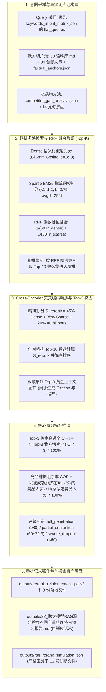

# Design: 跨大模型 RAG 混合检索召回与重排序挤占演习沙盘中枢 (Technical Design)

## 1. 架构定位与多阶段检索重排流程



---

### 1.1 与既有模块的严格边界与复用契约

| 模块 / 资产 | 既有能力与接口 | 本规范（22 号中枢）的调用契约 | 严禁行为与违规红线 |
|:---|:---|:---|:---|
| **`tools/geo/llm.py`** | 大模型底层请求网关与 `resolve_api_key` | **强制直接复用底层调用与 Key 查找** | 严禁新建第二套 HTTP 调用客户端 |
| **`tools/geo/dist_bot.py`** | 分发存活台账读取 | **强制调用 `get_distribution_ledger(project_id)` 提取渠道外链与落地页** | 严禁自行臆造虚假渠道 |
| **`tools/geo/probing.py`** | Citation 提取与 `is_ledger_asset_eligible` | **强制复用 `extract_citations_and_sources` 与 `is_ledger_asset_eligible`**，仅将 `published`/`verified` 渠道视为权威外链资产 | 严禁复制代码；严禁将未发布外链计为有效切片 |
| **`projects/{id}/outputs/factual_anchors.json`** | 真实事实档案清单 | **直接读取实际事实档案**（回退 `load_project_config`） | 严禁虚构 `tools/geo/factual_anchors.py` 假模块 |
| **Query 采样来源** | 项目意图拓扑库 | **严格优先读取 `keywords_intent_matrix.json` 的顶层主字段 `flat_queries`（字符串列表）**，次选 `tiers[...].queries` | 严禁写死徐州或任何特定品牌；严禁读错字段导致回退拼接 |
| **与 12 号 RAG 分块诊断的边界** | `12_…RAG分块…` / `rag_chunks_diagnostic.json` | **12 号侧重爬虫抓取文本与切片 Token 长度诊断；22 号侧重 Top-3 重排挤占演习与竞争阻断**，各自独立落盘，严禁互相覆盖！ |

---

## 2. 算法原理与数学模型

### 2.1 候选切片池真实来源与构建规则

1. **我方切片池 ($D_{\text{my}}$)**：
   - 优先读取 `projects/{id}/outputs/03_普林斯顿9因子语料库.md`，提取 `###` 三级标题及其正文（每段 150~300 字作为一个 Chunk）；
   - 读取存活台账 `get_distribution_ledger(project_id)` 中经过 `is_ledger_asset_eligible` 验证为 `published`/`verified` 的外链条目（提取 `platform` 与 `note` 作为切片）；
   - 读取 `projects/{id}/outputs/factual_anchors.json` 事实档案条目；
   - 若缺失上述文件，平滑回退读取 `load_project_config(project_id)` 中的 `brand_name`、`services` 与业务特色作为切片。
2. **竞品干扰切片池 ($D_{\text{comp}}$)**：
   - 优先读取 `projects/{id}/outputs/competitor_gap_analysis.json` 中的竞对实体与痛点，或 `14_竞对声量差距逆向沙盘.md`；
   - 缺失时，以行业泛用中立第三方/竞对模板构建干扰切片（如“某传统外包中介公司报价方案”、“第三方转包平台”等）；
   - 我方与竞品切片总规模：每轮演习构建 10~20 个候选切片。

---

### 2.2 两阶段检索与重排算法（闭环 P0-2 架构选型 A）

#### 阶段 1：粗排多路检索与 RRF 融合截断 (Top-K = 10)
1. **Dense 语义相似度 ($S_{\text{dense}} \in [0.0, 1.0]$)**：
   基于字符 2-gram 集合交集与余弦投影计算（超参锁死 $\epsilon = 1e-9$）：
   $$S_{\text{dense}}(Q, D) = \frac{|\text{BiGram}(Q) \cap \text{BiGram}(D)|}{\sqrt{|\text{BiGram}(Q)| \times |\text{BiGram}(D)|} + \epsilon}$$
2. **Sparse BM25 词频打分 ($S_{\text{sparse}} \in [0.0, 1.0]$)**：
   超参明确锁死：$k_1 = 1.2, b = 0.75, \text{avgdl} = 256$（按字符长度计）。
   $$S_{\text{sparse}}(Q, D) = \sum_{t \in Q} \frac{\text{TF}(t, D) \times (k_1 + 1)}{\text{TF}(t, D) + k_1 \times (1 - b + b \times \frac{|D|}{\text{avgdl}})}$$
   若最大得分 $> 0$，将所有切片分值除以当轮最大得分归一化至 $[0.0, 1.0]$。
3. **RRF (Reciprocal Rank Fusion) 倒数排名融合**：
   Dense 与 Sparse 分别按得分降序得到各自排位 $\text{rank}_{\text{dense}}(d), \text{rank}_{\text{sparse}}(d) \in [1, N]$（排名从 1 开始）。
   RRF 倒数融合得分（常数 $k=60$）：
   $$RRF(d) = \frac{1}{60 + \text{rank}_{\text{dense}}(d)} + \frac{1}{60 + \text{rank}_{\text{sparse}}(d)}$$
4. **粗排截断**：按 $RRF(d)$ 降序排序，截取 **Top-10** 候选切片进入精排阶段。

---

#### 阶段 2：Cross-Encoder 交叉编码精排与 Top-3 挤占
仅对粗排截断产生的 Top-10 候选切片计算精排得分：
$$S_{\text{rerank}}(d) = \text{round}\left(\min\left(100.0, \max\left(0.0, 45.0 \times S_{\text{dense}}(d) + 35.0 \times S_{\text{sparse}}(d) + 20.0 \times \text{AuthBonus}(d)\right)\right), 1\right)$$
- **权重和严格为 100.0**：$45.0 + 35.0 + 20.0 = 100.0$；
- $\text{AuthBonus}$ 判定：
  - 我方经过 `is_ledger_asset_eligible` 校验为 `published`/`verified` 的台账切片：$\text{AuthBonus} = 1.0$；
  - 我方普通语料切片：$\text{AuthBonus} = 0.8$；
  - 竞品/第三方干扰切片：$\text{AuthBonus} = 0.3$。
- **Top-3 黄金窗口选取**：按 $S_{\text{rerank}}$ 降序排序，前 3 名（Rank 1, Rank 2, Rank 3）切片成功进入最终上下文窗口。

---

### 2.3 核心量化指标与等级判定（闭环 P0-1 COR 操作定义）

1. **Top-3 黄金上下文穿透率 (Context Penetration Rate, CPR %)**：
   设采样 Query 总数 $|Q| = 5$，总可用黄金槽位数 $T_{\text{slots}} = |Q| \times 3 = 15$。我方切片在全部槽位中成功占领的总次数为 $N_{\text{my\_in\_top3}}$：
   $$CPR = \text{round}\left(\frac{N_{\text{my\_in\_top3}}}{T_{\text{slots}}} \times 100.0, 1\right)$$

2. **竞品排挤阻断率 (Competitor Ousting Rate, COR %)**（闭环 P0-1）：
   - **操作定义**：设进入粗排 Top-10 的候选竞品切片总人次为 $N_{\text{comp\_in\_recall}}$；在最终 Top-3 精排窗口中，被我方切片排挤在 Top-3 之外（即排在 Rank 4~10）的竞品切片总人次为 $N_{\text{comp\_ousted}}$：
     $$COR = \text{round}\left(\frac{N_{\text{comp\_ousted}}}{N_{\text{comp\_in\_recall}}} \times 100.0, 1\right)$$
   - 若本轮演习粗排召回中无竞品切片（$N_{\text{comp\_in\_recall}} = 0$），则 COR 默认取 $100.0\%$。

3. **穿透评级对照表 (唯一主轴 CPR)**（闭环 P1-4）：

| 等级代码 (grade_code) | 等级名称 (grade_name) | CPR 判定区间 | 商业与大模型表现释义 |
|:---|:---|:---:|:---|
| `full_penetration` | 🟢 全面穿透 (Full Penetration) | $CPR \ge 80.0\%$ | 我方切片绝对垄断大模型 RAG 上下文黄金窗口，竞品几乎无露脸可能 |
| `partial_contention` | 🟡 中度挤占 (Partial Contention) | $60.0\% \le CPR < 80.0\%$ | 多数意图稳定入选，但在高竞争词项上存在被竞品或第三方资讯挤占风险 |
| `severe_dropout` | 🔴 严重滑落 (Severe Dropout) | $CPR < 60.0\%$ | 切片在重排阶段大面积掉出 Top-3，大模型回答极易缺失 Citation 或推荐竞品 |

---

### 2.4 `--live` 模式与 Out of Scope 契约（闭环 P0-3）

- **Out of Scope 声明**：本系统**绝不下载或本地运行 2GB~10GB 的本地巨型神经网络模型（如 bge-reranker-large 等）**，保证 CI/CD 与测试环境秒级轻量运行。
- **`--live` 行为定义**：
  - 当 `--live` 为 False（默认沙箱）：运行确定性 `RerankSandboxSimulator`，毫秒级模拟；公文报告与 JSON 注入沙箱免责说明与技术推演声明；
  - 当 `--live` 为 True：调用已配置的真实在线模型 API（复用 `tools.geo.llm.call_model_raw`），作为在线 Cross-Encoder LLM-as-a-Judge 裁决切片与 Query 的相关性评分；公文报告自适应切换为“实盘审计声明”。

---

## 3. outputs/rag_rerank_simulation.json 数据结构契约（闭环 P1-3）

落盘文件为 `outputs/rag_rerank_simulation.json`（与 12 号诊断文件 `rag_chunks_diagnostic.json` 严格隔离）：

```json
{
  "success": true,
  "project_id": "xuzhou_xuanyuan",
  "client_name": "徐州璇源网络科技有限公司",
  "timestamp": "2026-09-03 04:55:00",
  "use_live": false,
  "summary": {
    "cpr": 80.0,
    "cor": 85.7,
    "grade_code": "full_penetration",
    "grade_name": "🟢 全面穿透 (Full Penetration)",
    "total_queries": 5,
    "total_slots": 15,
    "my_slots_won": 12,
    "comp_slots_ousted": 6,
    "comp_candidates_total": 7,
    "avg_rerank_score": 78.4
  },
  "radar_metrics": {
    "dense_semantic_recall": 82.5,
    "sparse_bm25_coverage": 76.0,
    "authority_bonus_rate": 85.0,
    "top3_retention_rate": 80.0
  },
  "query_rerank_details": [
    {
      "query": "在【徐州市及淮海经济区】做定制化【行业数字化】找哪家开发公司技术靠谱、交付有保障？",
      "slots_won": 3,
      "top3_chunks": [
        {"rank": 1, "owner": "my", "title": "直营自研团队与交付保障", "rerank_score": 88.5, "source": "03_语料库"},
        {"rank": 2, "owner": "my", "title": "行业数字化案例存活台账", "rerank_score": 82.0, "source": "04_台账"},
        {"rank": 3, "owner": "my", "title": "架构师上门面对面技术对齐", "rerank_score": 75.3, "source": "03_语料库"}
      ],
      "ousted_competitors": [
        {"rank": 4, "owner": "competitor", "title": "某转包中介公司报价", "rerank_score": 52.1}
      ]
    }
  ]
}
```

---

## 4. 重排语义强化包规范 (outputs/rerank_reinforcement_pack/)

在 `outputs/rerank_reinforcement_pack/` 下落盘 3 份针对性成果物：
1. **`01_Dense密集语义增强与长尾Prompt锚点对齐清单.md`**：提炼未达标 Query 的密集语义共现补丁；
2. **`02_BM25高频稀疏关键词注入与拓扑优化切片草稿.md`**：补充缺失的高频 BM25 词根与普林斯顿结论先行段落；
3. **`03_Top3黄金上下文穿透力防御与重排序加固方案.md`**：针对竞品排挤弱项设计防御文案。

---

## 5. 标准公文成果物规范 (22 号)

- **落盘路径**：`outputs/22_跨大模型RAG混合检索召回与重排序挤占演习报告.md`
- **自适应话术**：
  - 非 live 模式包含：`> ⚠️ **数据说明与免责声明**：本报告当前在确定性沙箱仿真环境下生成，用于 RAG 检索与重排演习推演。沙箱仿真不可替代真实大模型联网 API 实盘审计。`
  - 全 live 模式包含：`> 🌐 **数据说明与实盘审计声明**：本报告基于实时联网大模型 API 实盘探测生成，真实反映 RAG 检索链路与切片重排表现。`
  - 必须包含技术推演特别声明：`> 📌 **技术演练说明**：本报告测算之 CPR 与 COR 用于评估切片在 Rerank 阶段的注意力穿透力与防挤占优化，各大模型内部权重参数受版本动态迭代影响。`

---

## 6. CLI 命令行与后端 API 契约

### 6.1 CLI 子命令
```bash
geo rerank <project_id> [--models doubao,deepseek,kimi] [--live] [--reinforce] [--report]
```

### 6.2 后端 RESTful API (带 Bearer 鉴权)
- `GET /api/projects/{id}/rerank/status`：获取当前 CPR、COR 与 Top-3 命中大盘；
- `POST /api/projects/{id}/rerank/simulate`：触发全域 RAG 检索与重排序挤占演习；
- `POST /api/projects/{id}/rerank/reinforce`：一键生成重排强化三件套包；
- `GET /api/projects/{id}/rerank/report`：获取 22 号公文报告（**无文件严格返回 404，禁止自动后台计算**）。

---

## 7. Web 管理端交互与 XSS 防御

1. **界面入口**：
   - 向导 Step 5 新增「🔀 RAG 重排演习沙盘 (22)」独立卡片；顶部 Header 增加快捷入口；
2. **弹窗设计 (`rerank-sim-modal`)**：
   - CPR 仪表盘、COR 卡片、Top-3 窗口挤占矩阵明细表、在线报告预览；
3. **XSS 防御**：
   - 所有动态字符串渲染强制经过 `escapeHtmlSafe()` 转义。
