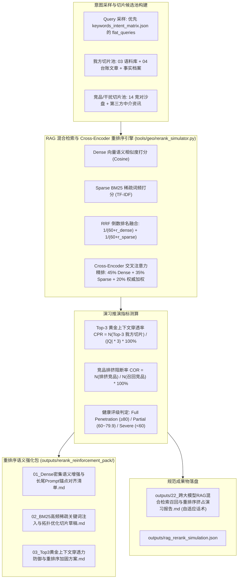

# Design: 跨大模型 RAG 混合检索召回与重排序挤占演习沙盘中枢 (Technical Design)

## 1. 架构定位与多阶段检索重排流程



### 1.1 与既有模块的严格边界与复用契约

| 模块 / 资产 | 既有能力与接口 | 本规范（22 号中枢）的调用契约 | 严禁行为与违规红线 |
|:---|:---|:---|:---|
| **`tools/geo/llm.py`** | 大模型底层请求网关与 `resolve_api_key` | **强制直接复用底层调用与 Key 查找** | 严禁新建第二套 HTTP 调用客户端 |
| **`tools/geo/dist_bot.py`** | 分发存活台账读取 | **强制调用 `get_distribution_ledger(project_id)` 提取渠道外链与落地页** | 严禁自行臆造虚假渠道 |
| **`tools/geo/probing.py`** | Citation 提取与 `is_ledger_asset_eligible` | **强制复用 `extract_citations_and_sources` 与 `is_ledger_asset_eligible`**，仅将 `published`/`verified` 渠道视为权威外链资产 | 严禁复制代码；严禁将未发布外链计为有效切片 |
| **`projects/{id}/outputs/factual_anchors.json`** | 真实事实档案清单 | **直接读取实际事实档案**（回退 `load_project_config`） | 严禁虚构 `tools/geo/factual_anchors.py` 假模块 |
| **Query 采样来源** | 项目意图拓扑库 | **严格优先读取 `keywords_intent_matrix.json` 的顶层主字段 `flat_queries`（字符串列表）**，次选 `tiers[...].queries` | 严禁写死徐州或任何特定品牌；严禁读错字段导致回退拼接 |

---

## 2. 算法原理与数学模型

### 2.1 候选切片池构建与分母口径

- 采样商业意图词集 $Q$（$|Q|=5$，严格优先读取 `flat_queries`）；
- 候选切片池包含：
  - 我方专属切片 $D_{\text{my}}$：从 03 普林斯顿语料、04 台账文章与事实档案中提取真实段落；
  - 竞品干扰切片 $D_{\text{comp}}$：从 14 竞对沙盘与第三方泛资讯中提取干扰段落；
- 单轮演习总测试上下文槽位：$T_{\text{slots}} = |Q| \times 3$（大模型黄金 Top-3 上下文窗口）。

### 2.2 混合检索与重排序算法模型

1. **Dense 语义相似度 ($S_{\text{dense}} \in [0.0, 1.0]$)**：
   基于字符 2-gram 词元集合重叠度与归一化余弦相似度测算：
   $$S_{\text{dense}}(Q, D) = \frac{|\text{BiGram}(Q) \cap \text{BiGram}(D)|}{\sqrt{|\text{BiGram}(Q)| \times |\text{BiGram}(D)| + \epsilon}}$$
2. **Sparse BM25 词频评分 ($S_{\text{sparse}} \in [0.0, 1.0]$)**：
   $$S_{\text{sparse}}(Q, D) = \sum_{t \in Q} \frac{\text{TF}(t, D) \times (k_1 + 1)}{\text{TF}(t, D) + k_1 \times (1 - b + b \times \frac{|D|}{\text{avgdl}})}$$
   参数归一化至 $[0.0, 1.0]$ 区间；
3. **Cross-Encoder Reranker 精排加权评分 ($S_{\text{rerank}} \in [0.0, 100.0]$)**：
   $$S_{\text{rerank}} = \min\left(100.0, \max\left(0.0, 45.0 \times S_{\text{dense}} + 35.0 \times S_{\text{sparse}} + 20.0 \times \text{AuthBonus}\right)\right)$$
   - $\text{AuthBonus}$：经 `is_ledger_asset_eligible` 校验合规的我方存活台账切片取 1.0，普通第三方切片取 0.5，未验证竞品切片取 0.3；
   - 权重和严格归一化：$45\% + 35\% + 20\% = 100\%$。

### 2.3 核心指标定义与等级判定

1. **Top-3 黄金上下文穿透率 (Context Penetration Rate, CPR %)**：
   $$CPR = \min\left(100.0, \max\left(0.0, \frac{N_{\text{my\_chunks\_in\_top3}}}{|Q| \times 3} \times 100.0\right)\right)$$
2. **竞品排挤阻断率 (Competitor Ousting Rate, COR %)**：
   $$COR = \min\left(100.0, \max\left(0.0, \frac{N_{\text{competitor\_ousted}}}{N_{\text{total\_competitors\_in\_pool}}} \times 100.0\right)\right)$$
3. **等级判定标准 (唯一主判定轴：CPR)**：
   - 🟢 **全面穿透 (Full Penetration)**：$CPR \ge 80.0\%$
   - 🟡 **中度挤占 (Partial Contention)**：$60.0\% \le CPR < 80.0\%$
   - 🔴 **严重滑落 (Severe Dropout)**：$CPR < 60.0\%$

---

## 3. 重排语义强化包规范 (outputs/rerank_reinforcement_pack/)

自动生成 3 份针对性落地成果物：
1. **`01_Dense密集语义增强与长尾Prompt锚点对齐清单.md`**：
   - 梳理未进入 Top-3 的 Query，提炼密集向量语义词向量增强补丁；
2. **`02_BM25高频稀疏关键词注入与拓扑优化切片草稿.md`**：
   - 精确计算落选切片中缺失的高频 BM25 词根，重构关键词密度；
3. **`03_Top3黄金上下文穿透力防御与重排序加固方案.md`**：
   - 针对竞品挤占的高发意图，设计反制性结构化排版（普林斯顿结论先行 + 实体数据量化）。

---

## 4. 标准公文成果物规范 (22 号)

- **Markdown 报告**：`outputs/22_跨大模型RAG混合检索召回与重排序挤占演习报告.md`
- **JSON 结构**：`outputs/rag_rerank_simulation.json`
- **自适应话术声明与免责规范**：
  - 若为全真机 live 探测：写入 `> 🌐 **数据说明与实盘审计声明**：本报告基于实时联网大模型 API 实盘探测生成，真实反映 RAG 检索链路与切片重排表现。`
  - 若为沙箱模式：写入 `> ⚠️ **数据说明与免责声明**：本报告当前在确定性沙箱仿真环境下生成，用于 RAG 检索与重排演习推演。沙箱仿真不可替代真实大模型联网 API 实盘审计。上线实盘交付时，请配置真实 API Key 执行 live 模式探测。`
  - **技术推演特别声明**：`> 📌 **技术演练说明**：本报告测算之 CPR 与 COR 用于评估知识切片在 Rerank 阶段的注意力穿透力与防挤占优化，各大模型内部权重参数受版本动态迭代影响。`

---

## 5. CLI 命令行与后端 API 契约

### 5.1 CLI 子命令

```bash
geo rerank <project_id> [--models doubao,deepseek,kimi] [--live] [--reinforce] [--report]
```
- 输出 ANSI 终端高保真 RAG 重排演习大盘；
- `--reinforce`：自动生成 `outputs/rerank_reinforcement_pack/` 下 3 份强化文案。

### 5.2 后端 RESTful API (带 Admin 鉴权)

- `GET /api/projects/{id}/rerank/status`：获取当前 CPR、COR 与 Top-3 命中状态；
- `POST /api/projects/{id}/rerank/simulate`：触发全域 RAG 检索与重排序挤占演习；
- `POST /api/projects/{id}/rerank/reinforce`：一键生成重排强化三件套包；
- `GET /api/projects/{id}/rerank/report`：获取 22 号公文报告（**无文件严格返回 404，禁止自动后台计算**）。

---

## 6. Web 管理端交互与 XSS 安全防线

1. **界面入口**：
   - 向导 Step 5 新增「🔀 RAG 重排演习沙盘 (22)」独立按钮；
   - 顶部 Header 增加快捷入口；
2. **弹窗设计 (`rerank-sim-modal`)**：
   - CPR 黄金穿透率核心仪表盘；
   - COR 竞品排挤率卡片；
   - Top-3 窗口挤占矩阵明细表；
   - 一键强化包生成与 22 号公文报告在线预览。
3. **XSS 防御**：
   - 所有动态字符串渲染强制经过 `escapeHtmlSafe()` 转义。
