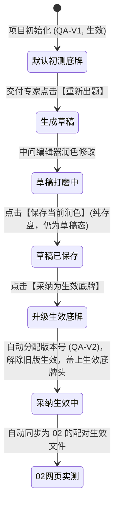

# Design: 出题草稿采纳流与动线操作白盒化

## 1. 架构对象模型与版本生命周期

针对阶段零出题打磨与版本升级，明确文件的全生命周期：



### 1.1 文件状态二元模型
在 `Step0App.vue` 中，每个文件的状态清晰划分：
- **`isActive === false`（草稿态）**：新生成的第 N 版题目、自定义上传的文件；左侧文件树显式标记 `[草稿]` 灰色徽章；
- **`isActive === true`（采纳生效态）**：当前阶段的基线底牌（每个 category 仅允许 1 个活跃底牌，单底牌互斥）；左侧文件树显式标记 `[已采纳 QA-V(N)]` 紫色高亮徽章。

---

## 2. 动线与操作无缝融合设计 (`StudioSop.vue` + `Step0App.vue`)

### 2.1 动线微步骤动作按钮化 (Action-Driven)
将右侧纯提示文字升级为具备直接触发能力的动作按钮，形成完整闭环：

#### 0.1 准备题目专属动线 (`STAGE0_SUB1_META`)
```javascript
const STAGE0_SUB1_META = {
  sopTitle: '0.1 准备题目动线',
  sopSteps: [
    {
      id: 'view_or_refresh',
      name: '1. AI 出题与查看',
      desc: '系统已根据客户定位预生成核心题清单。若需换一批，可点击下方重新出题。',
      extraAction: { label: '重新出题（生成新版）', icon: 'sparkles', type: 'refreshQuestions' },
      hideProceed: true
    },
    {
      id: 'edit_in_editor',
      name: '2. 中间区润色打磨',
      desc: '交付专家可在中间编辑器直接润色修改，从 60 分打磨至 80 分。修改后随时点击下方保存存盘。',
      action: { label: '保存当前润色修改', icon: 'save', type: 'saveCurrentFile' },
      hideProceed: true
    },
    {
      id: 'save_and_adopt',
      name: '3. 采纳为生效底牌',
      desc: '题目打磨满意后，点击下方转正为正式生效版本（自动生成 QA-V2），作为后续实测基线。',
      action: { label: '采纳为生效底牌 (转正为新版)', icon: 'check-circle-2', type: 'adoptCurrentFile' },
      hideProceed: true
    }
  ]
};
```

> **保持 0.2 动线独立稳定**：0.2 网页提问动线 `STAGE0_SUB2_META` 及其第 3 步的【完成阶段零并封版】按钮（`action.type === 'finishStage0'`）保持现状不动，禁止改动其数据结构或逻辑。

### 2.2 事件派发机制与接口契约
在 `StudioSop.vue` 的 `onActionClick` 中扩展分发，同时彻底清理已废弃悬空的 `proceed-to-next` 声明与发射点：
```javascript
// defineEmits 清理掉 proceed-to-next，新增动作事件
const emit = defineEmits([
  'proceed', 'gotoStep', 'extraAction', 'action', 'skip',
  'update:gate',
  'switch-step', 'refresh-questions', 'finish-stage0',
  'save-file', 'adopt-current-file'
]);

function onActionClick(type) {
  emit('action', type);
  if (type === 'finishStage0') emit('finish-stage0');
  if (type === 'saveCurrentFile') emit('save-file');
  if (type === 'adoptCurrentFile') emit('adopt-current-file');
}

// 清理 onProceedClick 中废弃的 proceed-to-next 发射
function onProceedClick(step, idx) {
  emit('proceed', step);
  if (idx === 1 && steps.value.length <= 2) {
    emit('finish-stage0');
  }
}
```
在 `Step0App.vue` 中绑定：
```html
<StudioSop
  :current-step="currentSubStep"
  :stage-meta="currentStageMeta"
  :expand-all="true"
  :is-ready="isReady"
  @switch-step="goToSubStep"
  @refresh-questions="handleRefreshQuestions"
  @save-file="handleSaveActiveFile"
  @adopt-current-file="() => handleAdoptFile(activeFileName)"
  @finish-stage0="handleFinishStage0"
/>
```

### 2.3 彻底阻断平铺模式下的误触跳页与崩溃
在 `StudioSop.vue` 的 `onGotoStep` 中增加防护，并将卡片头部的鼠标指针样式根据 `expandAll` 条件化：
```html
<!-- 模板：卡片头部根据 expandAll 条件化手型指针 -->
<div
  class="flex items-center justify-between gap-2 p-3 select-none"
  :class="expandAll ? 'cursor-default' : 'cursor-pointer'"
  @click="onGotoStep(idx + 1)"
>
```
```javascript
function onGotoStep(num) {
  // [2026-09-28] 平铺微动线模式下所有卡片已展开，禁止点击卡片头部意外派发 switch-step
  // 堵住：1) 点击卡片 2 触发 switch-step(2) 跨页跳往 0.2；
  //       2) 点击卡片 3 触发 switch-step(3) 导致 subMetaMap[3] 抛出 TypeError
  if (props.expandAll) return;
  emit('gotoStep', num);
  emit('switch-step', num);
}
```

---

## 3. 资源管理器（左栏）跨阶段共用与防御设计 (`StudioFileTree.vue`)

### 3.1 跨阶段共用边界防护（防污染原则）
`StudioFileTree.vue` 同时被 `Step0App`、`Step1App`、`Step2App`、`Step3App` 四个阶段共用。为杜绝阶段 1/2/3 文件被误标为 `[草稿]`：
1. 显式新增可选 prop：`showStatusBadge: { type: Boolean, default: false }`；
2. 仅在 `Step0App.vue` 显式传入 `:show-status-badge="true"`，阶段 1/2/3 保持默认 `false`，绝不展示状态徽章；
3. 容器宽度由 `lg:w-60`（240px）拓宽为 `lg:w-72`（288px），四阶段统一加宽，彻底改善多阶段长文件名展示体验。

### 3.2 徽章显隐与统一配色 (品牌主色紫)
徽章严格遵循系统色彩规范，生效底牌采用主色紫高亮，草稿采用冷灰：
```html
<!-- 仅在开启 showStatusBadge 时显示二元状态徽章 -->
<template v-if="showStatusBadge">
  <!-- 采纳生效底牌徽章 (系统主色紫) -->
  <span
    v-if="files[fn]?.isActive"
    class="text-[10px] px-1.5 py-0.5 rounded font-mono font-bold bg-[#7c5bf5]/15 text-[#7c5bf5] border border-[#7c5bf5]/30 flex items-center gap-1 shrink-0 shadow-2xs"
  >
    <i data-lucide="check" class="w-3 h-3 text-[#7c5bf5]"></i>
    <span>已采纳</span>
    <span>[{{ files[fn]?.versionTag || 'QA-V1' }}]</span>
  </span>

  <!-- 草稿未生效徽章 (中性灰) -->
  <span
    v-else
    class="text-[10px] px-1.5 py-0.5 rounded font-mono text-slate-400 bg-slate-100 border border-slate-200 shrink-0"
  >
    草稿
  </span>
</template>
```

---

## 4. 规范对齐与出处澄清

1. **文案「采纳为生效底牌」**：虽然白皮书 §3.5 倾向于纯粹的「提问清单与豆包答案」，但在阶段零实际交付中，“底牌/基线”已深入业务认知并由师弟选定，用于区分“打磨草稿”与“正式生效基线”，故此签署文案豁免，与代码（`Step0App.vue` 19 处）保持 SSOT 一致；
2. **验证机器口径与出处澄清**：遵循师弟于系统全局规则中确立的最高铁律（见系统全局提示词 `<RULE[user_global]>` 第 0.11 条：“本地笔记本绝对零编译，编译验证一律去 NE1 服务器”）。尽管仓库本地 `AGENTS.md` 尚遗留历史 §4.1/§5.4「本地端验证」字样，但全局协作规则为最高优先级。所有开发产物与真机验证以 NE1 服务器（8088 端口）为唯一真相源。

