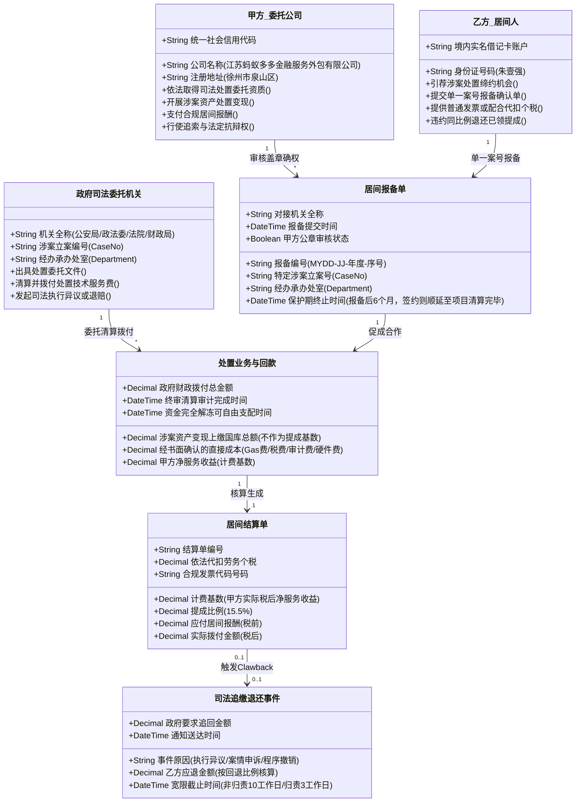
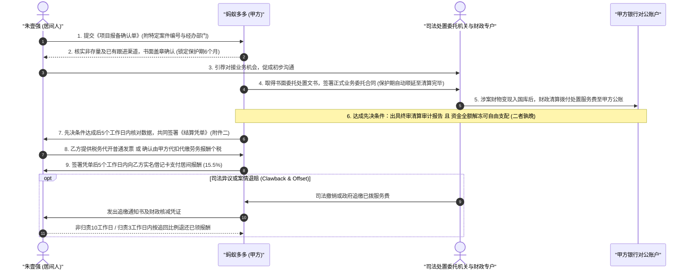

# Design: 居间合同对象架构与博弈决策树

## 一、核心业务对象模型 (Domain Objects)

### 计费基数与分润核算数学公式 (SSOT 唯一真源)

1. **甲方净服务收益（计费基数公式）**：
   $$\text{甲方净服务收益} = \max\Big(0, \ \text{政府实际拨付总额} - (\text{直接税费} + \text{链上Gas损耗} + \text{司法审计与评估费} + \text{经确认的技术直接成本})\Big)$$
   *规则*：若核算结果为零或负数，计费基数计为 0，当期居间报酬为 0，双方互不找补，乙方无需倒贴。

2. **税前应付居间报酬**：
   $$\text{本期应付居间报酬 (税前)} = \text{甲方净服务收益} \times 15.5\%$$

3. **实际支付路径（二选一）**：
   $$\text{实际打款金额} = \begin{cases} \text{本期应付居间报酬 (税前)}, & \text{乙方提供税务代开等额合规增值税普通发票} \\ \text{本期应付居间报酬} - \text{法定代扣劳务报酬个税}, & \text{甲方依法代扣代缴并出具完税凭证} \end{cases}$$

4. **异常追缴退还公式 (Clawback & Offset)**：
   $$\text{乙方应退居间报酬} = \text{乙方已领该项目报酬} \times \frac{\text{政府追回或核减的处置服务费金额}}{\text{政府原核定该项目处置服务费总额}}$$

5. **违约金费率与上限对等标准**：
   - **甲方逾期付款违约金**：10 个工作日免息宽限期后，每逾期一日按照**当期应付未付居间报酬**的 **0.01%（万分之一）**计付，累计上限不得超过**该期应付未付金额的 3%**。
   - **乙方归责逾期退赔违约金**：3 个工作日宽限期后，每逾期一日按照**当期应退未退金额**的 **0.05%（万分之五）**计付，累计上限不得超过**当期应退未退金额的 15%**。

---

## 二、9 大核心争议条款博弈与唯一防线矩阵 (SSOT)

| 序号 | 条款议题 | 原版条款 (乙方单方起草) | 修订版规范 (风控终审版) | 甲方底线 (不可让步) | 商务妥协筹码 (可谈空间) |
| :--- | :--- | :--- | :--- | :--- | :--- |
| **1** | **业务范围与排他性** | 限制甲方 1 年内不得在浙江省全境开展同类业务 | 客户书面报备制：仅保护乙方报备并经甲方公章盖章确认的特定项目（附件一） | 严禁封锁全省，甲方享有全国与全省自主展业权；严格单案号与经办部门物理隔离 | 报备审核通过后保护期 6 个月；若 6 个月内促成正式签约，顺延至清算回款完毕；期满未签自动失效 |
| **2** | **提成计费基数** | 按每日需处置资产总额提 15.5% | 按甲方实际收到的处置净收益/净服务费提 15.5% | 必须按终审清算审计且资金完全解冻入账自由支配后的净利润计算，严禁按资产面值提成 | 提成比例 15.5% 为默认基准，若重大专案可签署补充协议微调 |
| **3** | **付款时间与对账周期** | 当日收到资产，当日或次日中午12点前付清 | 终审审计报告出具且资金解冻入账（孰晚）后 5 个工作日内对账并签《结算单》，签单后 5 个工作日内支付 | 必须满足绝对背靠背，政府未拨付甲方零支付义务；政府核减则基数永久同额下调，严禁垫资 | 对账对单时间可协商缩短至 3 个工作日 |
| **4** | **结算通道与合规性** | 个人私账、外币、虚拟货币钱包（如 USDT） | 境内银行实名借记卡转账（人民币），走合规纳税闭环 | 严禁虚拟货币、境外外币与无票私账，彻底杜绝涉刑涉税风险 | 乙方税务代开发票与甲方代扣劳务个税二选一路径 |
| **5** | **争议管辖法院** | 乙方老家法院（福建省莆田市荔城区） | 协议管辖，由江苏省徐州市泉山区人民法院管辖；标的超限由徐州市中级人民法院管辖 | 坚决守住徐州司法主场，协议排除仲裁，不排除级别管辖 | 仅可在徐州泉山区法院与合同实际签署地法院二选一 |
| **6** | **违约金与维权费用** | 甲方逾期日万分之五（无上限），承担乙方全部费用 | 甲方享有 10 个工作日免息宽限期，逾期日万分之一，上限 3%；删除甲方单向承担乙方律师费 | 违约金必须对等且必须封顶；删除甲方单向承担全部维权费用的霸王条款 | 宽限期可商议为 5~10 个工作日 |
| **7** | **追索权与退款机制** | 甲方承诺放弃追索权；业务出事无退款规定 | 彻底删除放弃追索权；司法退赔或案件撤销按比例退还已发居间报酬 (Clawback & Offset) | 坚决保留终身追索权与直接冲抵权；客户/政府退费，乙方必须按比例退回提成 | 非归责退赔给予 10 个工作日宽限，归责退赔 3 个工作日并加收违约金 |
| **8** | **乙方义务与全额赔偿** | 对乙方行为零约束，乙方零违约赔偿责任 | 乙方虚假承诺、私收费用、违法犯罪造成甲方损失的承担全额赔偿责任（含诉讼费与律师费） | 乙方必须承担过错与侵权连带赔偿责任；甲方免于承担间接商业衍生损失 | 不可抗力导致项目依法终止互不追责 |
| **9** | **廉洁合规与反商业贿赂** | 完全空白（甚至诱导违规私账利益输送） | 明文严禁向国家机关工作人员利益输送；严禁直接或间接私收买家茶水费（反双向收费） | 严禁任何行贿受贿与洗钱；发现私收茶水费全额没收提成并移交司法追究刑事责任 | 零容忍、零妥协红线 |

---

## 三、资金与业务时序流程 (Sequence Diagram)

---

## 四、合规立足与法律依据陈述

```mermaid
flowchart TD
    subgraph 原始剧毒模式
        node1["自称协调政府机构处置虚拟币"] --> node2["不可撤销、见索即付承诺书"]
        node2 --> node3["放弃一切抗辩权与追索权"]
        node3 --> node4["处置完成 2 小时内私账垫资打款"]
        node4 --> node5["无需任何收款凭证与发票"]
        node5 -.-> 致命后果["涉嫌商业行贿、非法洗钱、虚开发票、职务侵占"]
    end

    subgraph 蚂蚁多多合规防御架构
        clean1["国家机关合法委托的涉案资产技术服务"] --> clean2["双务对等的民事居间中介合同"]
        clean2 --> clean3["严格保留追索权与法定抗辩权"]
        clean3 --> clean4["审计终审且资金解冻入账自由支配后结款"]
        clean4 --> clean5["境内银行借记卡转账 + 代开发票或代扣个税"]
        clean5 --> 成果["零刑事风险、零税务稽查风险、零垫资风险"]
    end
```

### 核心合规准则
1. **合同法律性质明确**：严格定性为《中华人民共和国民法典》第九百六十一条规定的“中介合同”。彻底废除“单方不可撤销承诺书”与“见索即付凭证”，完备保留全部法定抗辩权利与追索权利；
2. **业务合法性依据前置**：甲方承接业务必须以司法机关、纪检监察、行政执法等国家机关出具的真实合规的书面处置委托文件为前提。居间人的职责仅限于引荐合法缔约机会，严禁虚假包装与非法场外倒卖；
3. **资金安全绝对零垫资**：以司法/财政终审清算审计报告出具、资金解冻进入甲方自由支配账户为绝对准绳；政府未付或扣减，甲方免责顺延或永久同额核减；
4. **反双向收费与零私利**：严禁中介方私下向买方索要通道费或茶水费，一经发现没收报酬并追究刑责；
5. **财务税务合规铁律**：严禁地下钱庄式私账结算，坚决要求增值税合规发票或依法由甲方代扣代缴个人所得税，保障企业所得税税前扣除凭证完备。

---

## 五、终审交付物合同正文与附件体系（九大条款闭环）

### 核心条款架构与法定数值单一真相源 (SSOT)
- **第零条 合法性前置与合规陈述保证**：甲方取得国家机关合法书面委托为居间履行前提；双方保证不参与任何洗钱或非法金融活动；
- **第一条 居间事项与严格书面报备制**：以甲方公章盖章确认的附件一报备单为准，单案号与经办部门物理隔离，保护期 6 个月（签约顺延至清算完毕）；
- **第二条 居间报酬计费基数与“背靠背”付款前提**：实际净收益为基数提 15.5%，以终审审计报告出具且资金完全解冻入账（孰晚）为绝对前提，绝对零垫资；
- **第三条 廉洁合规、刑事责任自担与反双向收费**：严禁向公职人员利益输送，严禁私收买家茶水费，违者解除合同、追回提成并移交司法；
- **第四条 结算方式与税票合规**：境内银行实名借记卡转账，代开普通发票或依法代扣个税（二选一）后付款，坚决保留法定抗辩权与追索权；
- **第五条 费用自担、变故免责与司法翻案退还**：中介费用全自理；政策取消免责；按比例退还已发居间费（非归责10工作日宽限，归责3工作日加收逾期违约金）；
- **第六条 商业秘密与办案信息绝密保密**：永久保密，擅自泄露违约金为 20 万元或报酬总额 2 倍（以较高者为准），超额损失全额赔偿；
- **第七条 违约责任与不对等反转**：甲方享 10 个工作日免息宽限期，逾期日万分之一（0.01%），上限 3%；乙方过错全额赔偿甲方全部损失（含律师费）；
- **第八条 争议解决与司法主场**：双方协议管辖，由江苏省徐州市泉山区人民法院管辖；标的超限由徐州市中级人民法院管辖，协议排除仲裁；
- **第九条 附则与存量合同终止**：双方共同确认此前签署的历史协议自本合同签署之日起终止失效，此前已履行部分不予溯及；附件一与附件二具有同等效力。
