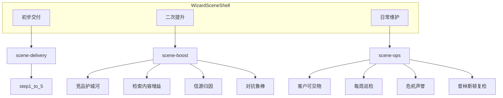

# Design: 工作台三场景信息架构重排

## Architecture (架构设计与对象关系)

### 1. 场景分层（对标小毛驴 SettingsPanel 三 Tab）

```text
小毛驴:  模型管理(仓库) | 套餐配置(货架) | 用量统计
GEO:     初步交付(主路径) | 二次提升(武器库) | 日常维护(运维台)
```

对象关系：

| 对象 | 职责 | 约束 |
|------|------|------|
| SceneShell | 顶层三 Tab 与三面板切换 | 同时只显示一个 scene |
| DeliveryWizard | 既有 5 步条 + step-panel-1..5 | 仅挂在 scene-delivery 下 |
| BoostRack | 4 个主题组卡片 | 只放入口按钮，不复制 Modal DOM |
| OpsDesk | 4 个运维区块 | 分享/报表/巡检/危机/复检 |
| ExistingModals | 全站既有弹层与业务函数 | 禁止删除；入口可多处引用但本次以迁入为准 |



### 2. 入口归属权威表（Implement 时严格按此搬家）

#### 场景一 Delivery — 每步主路径

| 步骤 | 留在页内 | 迁出目标 |
|------|----------|----------|
| 1 测算诊断 | 执行现状体检；报告预览 | 竞对沙盘、词库演进 → Boost；售前 Pitch → 仪表盘售前或 Boost 边缘；爬虫仿真 → 步骤折叠说明内次入口 |
| 2 站点底座 | 生成脚手架；站点预览；llms/schema/robots 标签 | 意图拓扑、知识图谱 → Boost；VPS Nginx → 折叠「上线说明」 |
| 3 母盘重构 | 增量/全量改写；钉住；刷新对照 | RAG 诊断、图谱、视觉 → Boost |
| 4 矩阵发稿 | 每渠道：生成包 + 复制主文；台账回填/探活 | 附属复制/SOP/后台/Clean MD → 卡内「更多」；合规/注入/幻觉/视觉顶栏按钮 → Boost |
| 5 首轮监测验收 | 执行声量监测；导出周报；结案验收单 | 06/18–26 等 → Boost 或 Ops（见下） |

#### 场景二 Boost — 四主题组

1. **竞品与护城河**：竞对差距沙盘、竞品反向包抄、护城河博弈(26)、宏观评测沙盘(06)  
2. **检索与内容增益**：意图拓扑、知识图谱、词库演进、RAG 诊断、RAG 重排(22)、视觉资产、渠道合规  
3. **信源与归因加深**：Citation 权威度矩阵、因果归因(23)、决策漏斗(24)、商业心智(21)  
4. **对抗与鲁棒**：幻觉防御、注入盾、压力测试(25)、测序沙箱、Clean MD 透视  

#### 场景三 Ops — 四区块

1. **给客户看的**：专属交付链接、美化周报、结案验收单、资产移交证书、归档 ZIP、一键打包导出  
2. **每周巡检**：实时声量监测、Citation 溯源对账(18)、全渠道台账探活、知识半衰期与自愈(20)  
3. **危机与声誉**：品牌声誉排查(19)  
4. **普林斯顿复检**：普林斯顿体检仪  

说明：声量监测 / 周报 / 验收单可同时在 Delivery 第 5 步（首轮）与 Ops（日常）出现入口，指向同一函数，避免运维再绕回第 5 步找按钮。

### 3. 第 4 步发稿卡结构

```text
渠道卡
├── 标题 + 保真度徽章
├── 一句策略说明
├── [生成 xx 发稿包]
├── [一键复制主文]          ← 唯一实心主 CTA
└── details/更多
    ├── 附属文案复制
    ├── Clean MD 透视
    ├── Markdown / SOP
    └── 直达后台
```

四色顶部摘要卡：仅展示状态 Tag + 点击 `scrollIntoView` 到对应渠道卡，禁止再写说明书段落。

---

## Interface (接口/API/前端组件设计)

### 前端（仅 `web/index.html`）

新增 JS（示意）：

```js
function switchScene(scene) {
  // scene: 'delivery' | 'boost' | 'ops'
  // 切换 #scene-* 显隐与 Tab 激活态
  // delivery 时显示既有步骤条；boost/ops 时隐藏步骤条
}

function togglePackMore(cardId) {
  // 发稿卡「更多」折叠
}
```

DOM 锚点：

- `#scene-tabs`：三场景 Tab  
- `#scene-delivery`：包裹既有步骤条 + `step-panel-*`  
- `#scene-boost`：四主题组网格  
- `#scene-ops`：四运维区块  

不新增 HTTP API。既有 `open*Modal` / `runSingleStep` / `copy*` / `build*Pack` 签名不变。

### 状态与默认

- 进入向导默认 `scene=delivery`、`step=1`  
- 可选：`localStorage.geo_wizard_scene` 记住上次场景（非必须，首版可不做）

---

## Database Schema / Data Structure (数据模型变更)

无数据库变更。无新持久化结构。仅前端 DOM / 显示状态。

---

## 视觉与合规约束

- 禁止在新增 UI 文案中使用 Emoji  
- 分组用 Tag（如「主路径」「进阶」「运维」）与字阶区分，不用彩色表情堆气氛  
- 本地验证端口锁定 `http://127.0.0.1:8088`；严禁本变更私自推生产  

---

## 风险与非目标

| 项 | 说明 |
|----|------|
| 风险 | 入口搬家遗漏导致「假丢失」→ 用归属表做 checklist 验收 |
| 非目标 | 不重写 Modal 内容、不改 5 步后端语义、不做响应式大重构、不拆 index.html 工程化 |
| 回滚 | Git 回退 `web/index.html` 即可完整回滚 |
