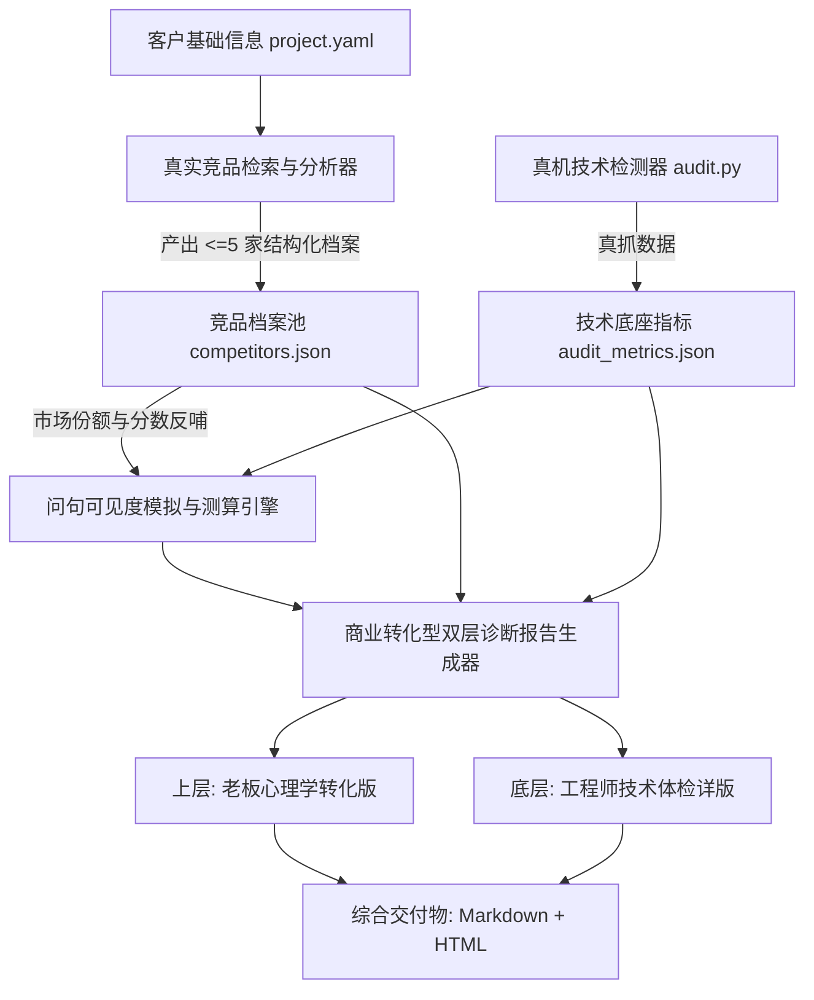

# Design: 商业转化型诊断报告与竞品反哺体系

> **本规范是改动的唯一技术真源。** 附带参考资料：  
> 1. `openspec/changes/2026-09-17-商业转化型诊断报告与竞品反哺体系/GEO诊断-竞品分析解决方案SOP.md`  
> 2. `openspec/changes/2026-09-17-商业转化型诊断报告与竞品反哺体系/GEO诊断报告-转化结构大纲.md`

---

## 零、设计总原则与铁律

1. **双层架构，不推倒重来**：
   - 保留原有的工程师技术体检（真抓技术明细、DNS/IPv6、SSR、robots.txt、代码密度）作为硬核技术底座；
   - 在其上方叠加严格对齐朋友落地文档的“老板心理学转化版”；
   - 不教别人怎么做，严格对齐朋友成熟的心理旅程（Hook → 速读 → 好消息 → 坏消息 → 破局路线 → 30天愿景 → CTA）。
2. **真实数据优先，虚拟必须标注（严格遵守 AGENTS.md 0 Emoji 红线）**：
   - 竞品分析接入真实检索增强（搜索词模板已落地；外网真抓可分步接入，未接入前字符串竞品允许哈希推演但必须 `source: "virtual"` + Tag「虚拟」）；
   - 真实数据（榜单、官网、市占率）优先；若数据不足由 AI 推理填补，必须显式标注 `source: "virtual"`，交付 Markdown/HTML 用文字 Tag **「虚拟」**；
   - **红线约束**：朋友文档中的 Emoji 在我方对客报告与交付物中，一律使用文字 Tag（如「虚拟 / 达标 / 偏弱 / 空白 / 领先 / 落后 / 持平」）或 CSS 徽章，坚决杜绝低幼玩具感。
   - **旧路径同步**：`render_competitor_gap_markdown`（雷达作战沙盘）与新结构化表一样禁止 Emoji，单测必须覆盖。
3. **竞品反哺闭环**：
   - 竞品不是单列的死表格，其 `marketShare` 与 `geoScore` 必须输入问句可见度模拟模型，影响对比类与推荐类问句的胜率打折。
4. **单步实施铁律（一个一个改）**：
   - 必须按任务单切分成独立原子步骤，单步编码、单步测试通过，严禁大杂烩一锅端。

---

## 一、架构设计与面向对象三问



### 1. 【对象是什么？】
- **`ConversionReport`（双层诊断报告对象）**：
  - 核心职责：统揽全案，上层驱动老板决策转化，底层提供技术信源审计依据。
- **`CompetitorProfile`（竞品结构化档案对象）**：
  - 核心职责：单家竞品的深度肖像（市场分级、份额、威胁度、优劣势、真实性标记）。
- **`CompetitorPool`（竞品池对象）**：
  - 核心职责：同赛道 ≤5 家竞品集合，计算行业集中度与反哺权重矩阵。
- **`VisibilityFeedbackEngine`（可见度反哺器）**：
  - 核心职责：根据竞品实力，动态打折客户在对比类/推荐类长问中的 AI 提及率与排名。

### 2. 【属性有哪些？】

#### 竞品单体 Schema（严格对齐朋友 SOP）
```json
{
  "name": "竞品公司或品牌名",
  "level": "头部 | 腰部 | 长尾",
  "category": "细分业务赛道",
  "geoScore": 85,
  "marketShare": 20.5,
  "threatLevel": "high | medium | low",
  "strengths": ["优势1", "优势2"],
  "weaknesses": ["劣势1", "劣势2"],
  "productFeatures": ["特点1", "特点2"],
  "description": "一句话业务简述",
  "website": "https://... 或 null",
  "source": "real | virtual"
}
```

#### 竞品分析输出 Schema (`outputs/competitor_analysis.json`)
```json
{
  "client_id": "nextgeo",
  "analyzed_at": "2026-09-17",
  "product_type": "企业级GEO优化服务",
  "competitors": [ /* <=5 个 CompetitorProfile */ ],
  "brandStrengths": ["优势1", "优势2"],
  "brandWeaknesses": ["劣势1", "劣势2"],
  "marketPosition": "长尾新兴品牌，细分赛道早期阶段",
  "source_summary": {
    "real_count": 3,
    "virtual_count": 2
  }
}
```

---

## 二、双层诊断报告内容骨架规范（严格对齐朋友大纲）

```markdown
# [Hook：一句处境反差]（如：你帮客户做企业数字化，但AI搜你却以为你是卖二手硬件的）

> **副标题｜《[客户名]》AI 可见度体检与商业诊断报告**
> 一句话定性：[能被读到，但没被说对/说全/说到官网]。

**综合健康评分：[XX] / 100（评级：[XX]）** ｜ 技术分由真抓生成，禁止改写

---

## ① 一页结论（老板速读版）—— 注意 + 痛点

### AI 可见度四维评分卡
| 维度 | 状态 | 真源依据 |
| :--- | :---: | :--- |
| 技术底座基建 | 达标 | SSR、/llms.txt、robots.txt 均已就绪 |
| 文本可引用性 | 偏弱 | 正文密度低于 15%，缺乏结构化答案块 |
| 品牌可见度 | 空白 | 5 条核心问句 4 条未提及，被竞品截流 |
| 竞品占位威胁 | 空白 | 头部竞品吃掉 80% 推荐位 |

> **综合探针**：[N] 条问句 · 品牌提及率 **[X%]** · 带出官网率 **[X%]** · 幻觉风险 **[X%]**。

### 三个状态卡
| [技术底座合格] | [可引用性偏薄] | [市场可见度空白] |
| :--- | :--- | :--- |
| 基础通道畅通，不用重做 | 缺乏标准答案问答对 | AI 搜不到，客户流失给同行 |

### 你正在流失的，是 3 类本该进你微信的询盘
1. **[品牌直问询盘]**：搜品牌名和官网，AI 没带出官网链接，客户中途流失。
2. **[信任词询盘]**：问“找某某团队靠谱吗”，AI 无证据库支持，给出中性或竞品替代。
3. **[品类词询盘]**：问“本地某行业哪家好”，AI 首推全是竞争对手，直接丢单。

### 三个必须正视的业务缺口
| 缺口 | 现状 | 商业含义 |
| :--- | :--- | :--- |
| 品牌词链路 | 未带官网 | 客户搜到也进不了私域 |
| 信任词承接 | 缺公开背书 | 大客户决策不敢选 |
| 品类词拦截 | 同行霸榜 | 最直接的获客流量被抢 |

---

## ② 好消息：你的资产其实很能打（不用推倒重来）—— 安抚情绪
- 体检明细摘要（SSR/robots/Schema 达标项展示）
- 关键问题（指出唯一硬伤，如正文文本密度低或 DNS 偶发抖动）
- 市场定位诊断一句话（有技术底座、无声量记忆的早期洼地）

---

## ③ 坏消息：AI 现在根本认不出你的品牌（这才是丢单的地方）—— 痛点放大
- N 条问句可见度对照表（问句 / 是否提及 / 官网URL / 立场 / 竞品谁在占位）
- 竞品占位透视（谁在吃你的入口 + 它凭什么占位 = 我们的缺口镜像）
- 认知风险一句话（最容易被 AI 误读成什么，如误读为主体不符或低端作坊）

---

## ④ 四步破局路线：从「能被读到」到「被推荐」—— 路径与希望
- **第一步：建立「品牌标准答案卡」（P0，官网内 7 天落地）**
- **第二步：把正文密度补到“可引用”（P0，补 15% 答案型正文）**
- **第三步：按问句逐条补证据链（P1，2~4 周针对性分发）**
- **第四步：固定复测，用声量指标替代感觉（P1，每 2 周一轮并扩展多平台）**

---

## ⑤ 30 天后，你能拿到什么 —— 愿景具象化
| 维度 | 现在（摸底现状） | 30 天后（目标） |
| :--- | :--- | :--- |
| **品牌直问提及率** | 0% | 100%（且稳定带出官网链接） |
| **行业选型对比** | 完全被竞品截流 | 进入 AI 前 3 推荐候选池 |
| **官网带出率** | 0% | ≥ 60% |
| **幻觉与误读风险** | 存在张冠李戴 | 实体与口径 100% 澄清纠偏 |

---

## ⑥ 下一步：把这份免费体检变成真实询盘 —— 立即行动（CTA）
- 软广说明（单次极简提权体验服务，不堆砌大词，明码标价）
- 主理人联系微信 / 咨询二维码占位

---

## 附录：技术底座与工程巡检详版（工程师审计依据 · 完整保留）
> 以下内容为后台爬虫与网络探测真抓数据，严禁人工修改：
- [完整保留原 Technical Audit 体检表、权重扣分明细]
- [完整保留原关键网络问题与双栈 IPv6 探测日志]
- [指标真源 audit_metrics.json 路径引用]
```

---

## 三、竞品反哺可见度模拟算法设计（差距三落地）

在 `tools/geo/answer_audit.py` 或可见度测算模块中引入竞品打折公式：

1. **判断问句意图**：
   - 属于对比类（“A 和 B 哪个好”）、推荐类（“XX 哪家好”、“服务商推荐”）。
2. **提取竞品池最高威胁等级与份额**：
   - 头部竞品（市占率 >15%）：强力压制，客户提及率基准打折 40%～60%；
   - 腰部竞品（市占率 5~15%）：中度压制，打折 20%～30%；
   - 长尾/蓝海（市占率 <5%）：无压制，保持基准。
3. **排名计算公式**：
   $$\text{Rank}_{\text{client}} = f(\text{GeoScore}_{\text{client}}, \text{GeoScore}_{\text{comp\_max}}, \text{MarketShare}_{\text{comp}})$$
   - 若竞品真实且 `geoScore` 高于客户 20 分以上，且客户缺少公开证据链，客户无法排入前 2。

---

## 四、方案 A：纯文本双 Tab 切换与双独立下载体系（定稿设计）

### 1. 双交付物对象与产物落盘
为避免在同一个 Markdown 中将面向不同受众的内容生硬混排，系统统一拆分为两份独立纯粹的报告，并在后台同时生成：
- **`01_企业AI可见度商业诊断报告.md`（老板商业转化版）**：
  - 纯粹的老板心理学 7 步法结构（Hook、一页速读/四维评分卡、3类流失询盘、好坏消息、四步破局、30天愿景、成交CTA）；
  - 全文 0 生涩技术代码、0 Emoji，专注于商业痛点与决策转化；
  - 专属 HTML：`01_企业AI可见度商业诊断报告.html`。
- **`01_企业底座技术体检审计报告.md`（工程师技术体检版）**：
  - 原汁原味保留 Technical Audit（真抓评分、SSR、/llms.txt、JSON-LD、代码密度、robots 规则、网络双栈探测）；
  - 供技术团队验证、交付留档与工程师深度排查；
  - 专属 HTML：`01_企业底座技术体检审计报告.html`。
- **兼容层**：继续写出旧名 `01_企业AI可见度现状体检与商业诊断报告.md`，**内容与老板商业转化版同步**（兼容别名，不是第三套独立叙事）；结案/验收脚本可认新旧文件名。
- **禁止**：再生成「上半老板 + 下半技术附录」的混排长文作为默认预览真源（历史混排若存在，仅只读兼容，新跑以双文件为准）。

### 2. 前端交互设计（两边都有价值 · 受众分流 · 4 步白盒对称 · 0 Emoji）

在 `web/index.html` 的【阶段一：测算诊断】面板中：
- **顶层 Tab 导航器（提升至阶段一最顶层）**：
  ```html
  <div class="flex border-b border-slate-200 gap-8 text-sm font-semibold mb-6">
    <button id="tab-audit-top-boss" onclick="switchAuditTopTab('boss')" class="pb-3 border-b-2 border-[#7c5bf5] text-[#7c5bf5] transition">老板商业转化版</button>
    <button id="tab-audit-top-tech" onclick="switchAuditTopTab('tech')" class="pb-3 border-b-2 border-transparent text-slate-500 hover:text-slate-700 transition">工程师技术体检版</button>
  </div>
  ```
  *严禁使用任何彩色 Emoji。*

- **核心业务边界（产品定稿：两边都有价值，写给谁不同）**：
  1. **老板商业转化版（对客）**：基于真抓现实**贩卖焦虑**——资产确权 → 3 类询盘流失账 →「竞品在吃入口、不做就晚了」→ 四步破局 / 30 天愿景 / CTA。语言是签约语言，不是施工手册。
  2. **工程师技术体检版（对内）**：客观缺陷 + **可执行技术改造方案**（SSR、/llms.txt、Schema、密度、robots）。不卖焦虑、不塞体验价。题头禁止出现「商业解读调用失败」等调试话。
  3. **分水岭**：不是「有没有方案」，而是「方案是商业焦虑转化，还是技术施工改造」。

- **两套页面 4 步白盒原子流水线对照表**：

| 步骤序号 | 工程师技术体检版（对内施工） | 老板商业转化版（对客焦虑转化） | 业务本质 |
| :--- | :--- | :--- | :--- |
| **步骤 ①** | `① 真抓网络与底座指标` ❓ | `① 真抓网络与底座指标` ❓ | **两边一致**：先真抓，拒绝胡编；老板版绝不能只剩「直出骨架」而无真抓入口。 |
| **步骤 ②** | `② 直出技术体检与改造方案初稿（程序生成 · 0 幻觉）` ❓ | `② 直出商业诊断与焦虑转化初稿（程序生成 · 0 幻觉）` ❓ | **受众分流**：工程师=问题清单+改造步骤；老板=流失账+不做就晚了+破局/30天（可选小毛驴反差话术）。 |
| **步骤 ③** | `③ 复制技术指标与改造方案初稿（给 IDE 再审）` ❓ | `③ 复制商业报告与转化初稿（给 IDE 润色）` ❓ | 工程师=架构师改造提示词；老板=商业顾问焦虑/签约话术润色。 |
| **步骤 ④** | `④ 追加豆包问答稿与提示词（给 IDE 参考）` ❓ | `④ 追加豆包问答稿与提示词（给 IDE 参考）` ❓ | 工程师偏抓取/索引排障；老板偏买家心智与竞品截流实锤。 |

- **交付物卡片右上角职责划分（彻底消灭重复按钮）**：
  * **流水线操作卡片内**：只放上述 4 个白盒步骤，**不放「导出 HTML / 复制全文」**（截图里老板④导出属阶段 8 残留，阶段 9 删除）；
  * **交付物右上角**：老板 `[客户报告链接]` `[下载老板商业报告 (HTML)]` `[复制全文]`；技术 `[下载技术体检报告 (HTML)]` `[复制全文]`。

### 3. 步骤 ③ 与步骤 ④ 给 IDE 的专属提示词体系规范

#### 步骤 ③：复制报告初稿给 IDE
- **工程师版提示词（系统架构师视角）**：
  ```text
  【GEO 阶段一 · 站点底座技术体检 · 工程师改造包】
  项目：{client_id} | 官网：{official_url}
  【IDE 工程师任务】：
  1. 以【系统架构师】身份核实扣分项是否客观；
  2. 针对 SSR、/llms.txt、Schema、文本密度缺口，给出可落地的改造步骤/补丁要点；
  3. 严禁写入营销推销与体验价 CTA；
  4. 写回：projects/{client_id}/outputs/01_企业底座技术体检审计报告.md
  ```
- **老板商业版提示词（商业交付顾问 · 焦虑转化）**：
  ```text
  【GEO 阶段一 · 老板商业转化诊断 · 焦虑转化润色包】
  项目：{client_id} | 企业：{client_name} | 官网：{official_url}
  【IDE 商业顾问任务】：
  1. 以【GEO 资深商业交付顾问】身份润色，五年级也能听懂；
  2. 强化现实焦虑：3 类流失询盘、竞品截流、「不做就晚了」；先安抚资产能打，再暴击丢单；
  3. 破局路线与 30 天愿景要可签约、可验收，禁止堆砌生涩技术名词；
  4. 写回：projects/{client_id}/outputs/01_企业AI可见度商业诊断报告.md
  ```

#### 步骤 ④：追加豆包问答稿与提示词给 IDE 参考
- **工程师版提示词（抓取与索引排障）**：
  ```text
  【IDE 抓取与收录排障参考】：
  这是阶段零买家真实长问下，豆包大模型的实际回答全文路径与基线数据。
  请从【网络爬虫抓取与 Clean Markdown 索引覆盖】角度排查：
  为什么豆包在回答这几组意向长问时没有抓取或引用客户官网？是否存在 robots 拦截、内链缺失或动态渲染阻断？
  ```
- **老板商业版提示词（买家决策心智与竞品截流）**：
  ```text
  【IDE 商业心智与竞品截流参考】：
  这是阶段零买家真实长问下，豆包大模型的实际回答全文路径与基线数据。
  请从【买家决策心智与竞品截流】角度排查：
  豆包把客流推荐给了哪几家竞品？买家最关心什么？把这些实锤补进「坏消息」与「流失询盘账本」，服务焦虑转化。
  ```

### 4. 阶段一 8 个操作按钮附属小问号备注提醒规范（0 Emoji）

两套页面共计 8 个主操作按钮，每个按钮旁严格配备 `<i data-lucide="help-circle"></i>` 小问号图标与直白 `title` 备注：

| 按钮名称（定稿） | 附属小问号提示内容（备注说明） | 前置依赖 | 产出成果 |
| :--- | :--- | :--- | :--- |
| **【① 真抓网络与底座指标】**（两边通用） | 必须真抓：探测 SSR、/llms.txt、Schema、robots、文本密度，落盘 audit_metrics.json，杜绝胡编。 | 需联网与官网可访问 | `audit_metrics.json` |
| **【② 直出商业诊断与焦虑转化初稿（程序生成 · 0 幻觉）】** | 程序算账：四维卡、流失询盘、「不做就晚了」与四步破局/30 天愿景；可选后再调小毛驴补反差话术。 | 需先点①真抓 | 老板版 MD 初稿 |
| **【③ 复制商业报告与转化初稿（给 IDE 润色）】** | 打包商业初稿 + 焦虑转化润色提示词，给 IDE 去水、加强签约说服力。 | 需先出商业初稿 | 剪贴板 |
| **【④ 追加豆包问答稿与提示词（给 IDE 参考）】**（老板版） | 豆包一手长问答路径 + 竞品截流分析提示，补流失实锤。 | 阶段零已存豆包答案 | 剪贴板 |
| **【② 直出技术体检与改造方案初稿（程序生成 · 0 幻觉）】** | 问题清单 + 对应改造步骤（给内部施工），不卖焦虑、不塞体验价。 | 需先点①真抓 | 技术版 MD 初稿 |
| **【③ 复制技术指标与改造方案初稿（给 IDE 再审）】** | 指标 JSON + 技术初稿 + 架构师改造提示词。 | 需先出技术初稿 | 剪贴板 |
| **【④ 追加豆包问答稿与提示词（给 IDE 参考）】**（技术版） | 豆包长答路径 + 爬虫/索引排障提示。 | 阶段零已存豆包答案 | 剪贴板 |

### 5. 后端 API 与报告内容约束
- `POST /api/projects/{id}/run/audit`：`mode=crawl|boss_direct|tech_direct|interpret`
- `GET /api/projects/{id}/export-audit-html?view=boss|tech`
- **工程师报告铁律**：题头评测模式只写技术真抓口径；禁止「商业解读调用失败」；第四节必须是「问题→改造方案」而非商业四步推销。
- **老板报告铁律**：保留焦虑旅程（好消息→坏消息→不做就晚了→破局/30天/CTA）；禁止堆砌 `audit_metrics.json` 调试字段。

---

## 五、实施计划：一个一个改（严格分步演进）

- **Step 1（竞品数据模型与真实搜索模板）**：已完成
- **Step 2（竞品反哺可见度算法）**：已完成
- **Step 3（双层报告核心算法与老板心理学模块）**：已完成
- **Step 4（双独立交付物生成与导出 API）**：已完成
- **Step 5（顶层双体系架构解耦与按钮文案直白化）**：已完成
- **Step 6～7（阶段 8 双页 4 步与文件解耦）**：已完成（含已知残留：老板缺真抓入口、卡片内导出重复）
- **Step 8 / 阶段 9（受众分流定稿落地）**：
  1. 规范对齐：两边都有价值；老板=现实焦虑转化；工程师=问题+改造方案；两边①都真抓；
  2. 前端改按钮与删冗余导出；工程师报告题头/第四节去商业调试话、补改造方案；
  3. 单测静态断言定稿文案；停步等 Safari 验收；禁归档/推生产。

