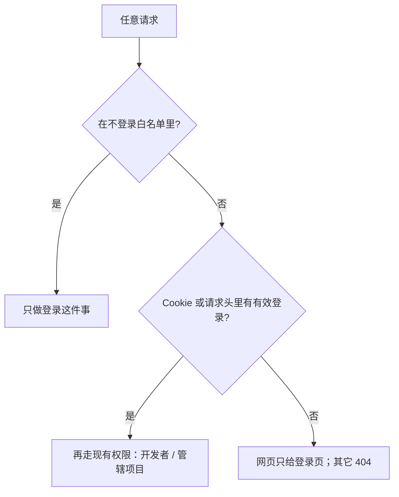

# Design: 不登录，管理台什么都不给

上一版用「黑名单 + 若干公开目录」拦不住：漏一条路径就能下到源码或花名册。本版改成 **一道总门，默认拒绝**。

## 1. 总门（所有请求先过这一关）

在 `do_GET` / `do_POST` / `do_PUT` / `do_DELETE` **最开头**调用 `console_gate(path, method)`。后面的业务路由只有过了门才执行。

判定只有两种结果：

1. **放行**：命中下面「不登录白名单」，或已有有效登录（Cookie / `Authorization` 里的 `geo_token` 能对上会话，且花名册里有这个人）。
2. **拒绝**：其它一律不进业务代码。
   - 要网页（`/`、`/index.html`、`/admin`、`/web/**`）：只返回 `web/login.html`（登录框，不含工作台）。
   - 要接口或文件：返回 404，正文不带文件内容、不带项目数据、不带仓库路径。

废除文件末尾的 `super().do_GET()`。没有「没匹配到就去磁盘找文件」这一步。

## 2. 不登录白名单（写死，多一条都不加）

只为了能登录，没有业务数据：

| 方法 | 路径 | 返回什么 |
| :--- | :--- | :--- |
| GET | `/`、`/login.html`、`/index.html`、`/admin` | 只有 `web/login.html` |
| POST | `/api/auth/login`、`/api/v1/xiulan/login`、`/api/v1/sessions` | 登录结果 |
| GET | `/api/auth/wechat-qr`、`/api/v1/auth/wechat-qr` | 扫码登录用的二维码 |
| POST | `/api/v1/community/auth/wx-login` | 扫码登录回调 |
| POST | `/api/auth/logout` | 清掉登录（没登录也允许，避免退不出去） |

登录页自己写样式，不另开公开的 CSS、JS、图片目录。

**不在白名单、未登录一律 404 的例子（验收必测）：**

- `/.env`、`/tools/geo/server.py`、`/AGENTS.md`、`/data/rbac_members.json`
- `/web/index.html`、`/web/**`
- `/docs/`、`/llms.txt`、`/geo-admin.css`、`/assets/**`
- `/sites/**`（客户站整页）
- `/api/projects`、`/api/benchmark/**`、`/api/auth/status`（未登录不得返回仓库路径、花名册、项目列表）
- `/api/share/**`（客户报告链接也要先登录管理台才打得开；本变更不保留「凭链接免登录看报告」）

已登录之后，仍按现有花名册：员工只能看自己管辖的项目，开发者才能进成员管理。总门不替代这层。

## 3. 本机也不再自动变成已登录

现码：用浏览器打开 `http://127.0.0.1:8088` 时，`/api/auth/status` 会自动发一张开发者登录票。这等于「没登录也能看全套」。

本方案：**关掉这条自动通道**。本机、公网同一套门。你自己也要输入手机号和密码。

## 4. 客户官网不跟管理台挤在同一道门里

管理台这台进程（`8088` / `geo.baicl.cc`）不登录不给任何客户站页面。

客户要给外人看的官网，以后放到 **另一台只放网页文件的服务** 上。那台机器目录里没有 `.env`、没有 `server.py`、没有花名册。本变更先把管理台上的 `/sites/` 关上；搬站是下一步，不在这次编码里做。

## 5. 登录成功之后

1. 登录接口下发 `Set-Cookie: geo_token=...; Path=/; HttpOnly; SameSite=Lax`。
2. 浏览器再打开 `/`，总门认出 Cookie，才下发 `web/index.html`。
3. 退出登录清 Cookie，再打开 `/` 又只剩登录页。

`/api/auth/status` 未登录时只返回「还没登录」，不得带 `repo_root`、`token`、管辖项目。
