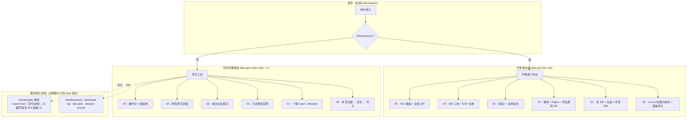

# Design: 开发者与写文同事双轨视界彻底解耦与全阶段白盒流水线复原

## 一、面向对象架构全景



---

## 二、硬约束（编码前必读）

1. **禁止**把 `data-geo-dev-only` / `data-geo-writer-only` 挂在 `.home-panel` 根容器上（与面板 `hidden` 切换打架，见前序「商业洞察」教训）。只挂在卡片、按钮、Tab、侧栏项上。
2. **阶段零是 Vue 岛**：`applyRbacUi` 扫不到打包后动态 DOM。必须把 `isDeveloper` 经 `getStep0BridgeProps()` 传入，组件内用 `v-if`；改完执行 `npm run build:step0`。
3. **写文阶段一一键 ≠ 只调 `interpret`**：`run_audit_interpret` 无 metrics 会抛「请先点①真抓」。正确顺序：无 metrics 先 `crawl`，再 `interpret`。可选前置：无阶段零摸底则友好提示，不要硬跑。
4. **界面白话**：写文按钮禁止「升维 / 零幻觉 / 白盒」等黑话。推荐：「用小毛驴写商业诊断」。
5. **有意回滚 2026-09-19 对开发者的 stub**：`copyBossAuditToIde` / `copyDiagDeepenPrompt` / `copyIdeRewritePack` / `copyWritebackCommand` 以及 step0 的 `copyCursorPrompt` 等，要从「toast 空壳」恢复为真实剪贴板/API；**仅开发者可见**。写文同事仍零 IDE 文案。
6. **限制写文同事时，不准改开发者原来的界面**：只加 `data-geo-dev-only` / `data-geo-writer-only`，或在旁边新开一张写文卡。开发者卡片标题保持「老板决策版」，不要改成「开发者白盒版」。工程师版按钮 ③④ 必须和 ①② 平级；② 那个拆开的按钮盒子要自己闭合，不能把 ③④ 塞进去。

---

## 三、分阶段 DOM / 行为规范

### 1. 阶段 00（豆包摸底）

| 角色 | 行为 |
| :--- | :--- |
| 开发者 | 恢复 Cursor 出题、反重力问答/落盘相关卡片与真实复制函数 |
| 写文 | 现有 ProbeStep1/2/3 手工工位不变 |

实现：`bridge.isDeveloper` + `v-if`；不要依赖 HTML 静态 `data-geo-dev-only` 单独收口。

### 2. 阶段 01（现状诊断）

| 角色 | 行为 |
| :--- | :--- |
| 开发者 | 恢复老板版/工程师版 4 步；③④ 恢复真实 `/diag/...` 复制；挂 `data-geo-dev-only` |
| 写文 | 隐藏工程师 Tab（`#tab-audit-top-tech`）与 4 步白盒卡；新增主按钮卡片 `data-geo-writer-only` |

写文主流程伪代码：

```
async function runWriterStep1AiGenerate(e) {
  // 锁：与 runStep1Audit 同一把 isAuditRunning，防连点
  // 1) 确认已选项目；确认阶段零有可用摸底（没有就提示去做阶段零）
  // 2) 若无 audit_metrics → POST mode=crawl
  // 3) POST mode=interpret（调小毛驴，重写老板版/技术版报告）
  // 4) 刷新老板版预览；不强制切工程师 Tab
}
```

说明：不必强制再跑 `boss_direct`；`interpret` 已带 LLM 叙事并重写报告。耗时可能大于 8 秒，文案用「正在写诊断，请稍等」，不要写死「5~8 秒」。

`switchAuditTopTab` 会整段替换页签按钮的 `className`，把 `applyRbacUi` 加上的 `hidden` 冲掉。写文同事一键成功后会调用 `switchAuditTopTab('boss')`，工程师页签会重新出现，点进去就是开发者的四步和 IDE 按钮。函数末尾必须再跑一次 `applyRbacUi()`（或对非开发者把 `#tab-audit-top-tech` 的 `hidden` 加回去）。不要改开发者点页签时的样式。

写文一键的防连点锁必须在第一个 `await`（查摸底）之前加上。没做摸底、失败、超时都在 `finally` 里放开锁。

### 3. 阶段 02 / 03（易漏安全口）

- `:910` `downloadSiteZip()` → 补 `data-geo-dev-only`（服务端 `/site/download` 已是开发者后缀，前端补齐防误触）。
- `:1101` 复制 9 因子全文 → 补 `data-geo-dev-only`。

### 4. 阶段 04（矩阵分发）

- 恢复 IDE 工地 DOM + 真实 `copyIdeRewritePack` / `copyWritebackCommand`，整块 `data-geo-dev-only`。
- 写文侧保留小毛驴网页改写 → 定稿 → 复制发布；可挂 `data-geo-writer-only` 仅当需要与开发者卡互斥时。

### 5. 阶段 05（商业验收）

- ROI 看板根节点（约 `:1555`）整块 `data-geo-dev-only`。
- 「下载全套成果 ZIP」现码已有 `data-geo-dev-only`，保留即可。
- **不**把 `/roi/calculate` 收成开发者专属（前序约定：项目交付动线仍给写文）。

---

## 四、`applyRbacUi` 收口

在现有 `data-geo-dev-only` 循环旁增加对称逻辑：

```javascript
document.querySelectorAll('[data-geo-writer-only]').forEach(function (el) {
  if (isDeveloper()) el.classList.add('hidden');
  else el.classList.remove('hidden');
});
```

注意：元素若初始无 `hidden`，开发者登录时必须被加上；写文登录时必须去掉。不要假设 HTML 预写了 `hidden`。

登录后、`tryMountStep0Island` 之后各调一次 `applyRbacUi`（或让 step0 完全靠 `v-if`，二选一写清，避免双重隐藏）。

---

## 五、测试要点

`tests/test_dual_track_perspectives.py`（名称可微调）：

1. 静态：`index.html` 中 `downloadSiteZip`、9 因子 `copyOutput`、ROI 看板根、IDE 相关恢复后的节点带 `data-geo-dev-only`。
2. 静态：打包产物 `web/assets/step0/step0.js` 在写文路径不得出现「复制给 Cursor / 贴反重力」可见文案（或开发者分支由 `isDeveloper` 守卫——断言源码 `v-if` / bridge 字段存在亦可）。
3. 路由：写文 token 访问 `/site/download`、`/acceptance/download-zip`、`/answer-rewrite/ide-pack`、`/diag/deepen-prompt` → 403；`/roi/calculate` 仍 200（若已登录且有 `report:view`）。
4. 可选：mock 无 metrics 时写文一键路径不得单独只打 `interpret`（若测前端困难，至少单测/注释锁定后端 ValueError 文案仍在）。
