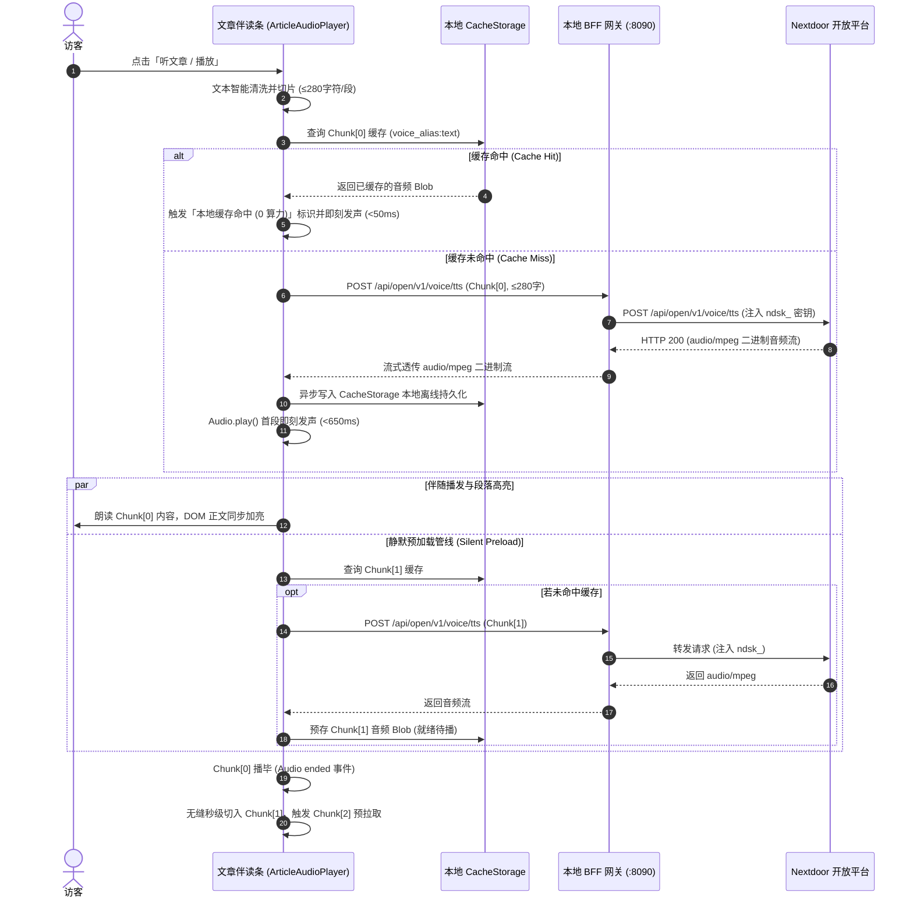

# Design: 数字人与语音合成能力包及文章伴读接入

## 1. 系统架构与时序拓扑

### 1.1 总体分层拓扑
```
[ 客户端：静态博客文章 / Vue3 单页面应用 ]
       │
       │ ① 请求朗读 (纯文本/分片索引，零 Token 鉴权)
       ▼
[ 本地/服务端 BFF 网关 (gateway/main.go) ]
       │ ├─ CORS 来源白名单校验
       │ ├─ 文本长度与恶意字符截断 (≤ 5000 字符)
       │ └─ 服务端环境变量自动注入 NEXTDOOR_VOICE_KEY (ndsk_ 严密隔离)
       │
       │ ② 转发并附带机器密钥 (Authorization: Bearer ndsk_...)
       ▼
[ Nextdoor 开放平台统一语音中台 (https://nextdoor.baicl.cc) ]
       │
       │ ③ 响应：短文本直接返回 audio/mpeg 二进制流；长文本返回异步 task_id
       ▼
[ 网关透传至客户端 ]
       │
       │ ④ 客户端接收：
       │    ├─ audio/mpeg -> 创建 Object URL -> 存入 CacheStorage -> HTML5 Audio 即刻发声
       │    └─ application/json -> 启动自动轮询 pipeline -> 获取 audio_url -> 发声
       ▼
[ 静默预加载管道：播发当前段落时，后台异步请求下一段落并写入缓存 ]
```

### 1.2 伴读核心时序流 (双模智能驱动 + 管道预加载)


---

## 2. 核心 API 接口契约规范 (6 大核心接口)

### 2.1 全局契约铁律
1. **雪花 ID 绝对字符串化 (Snowflake ID as string)**：
   所有业务与任务 ID（如 `task_id`, `voice_id`, `agent_id`）必须以 `string` 序列化与反序列化，严禁在前端或网关转为 Number（JavaScript Number 超过 $2^{53}-1$ 必发生精度截断）。
2. **统一信封错误判定**：
   JSON 接口严格遵循 `{ "code": number, "msg": string, "data": T }`，业务层以 `response.code === 0` 判定成功；非 0 统一抛出 `VoiceApiError`。
3. **前端零凭证模式**：
   前端默认不配置也不发送 `ndsk_` 机器密钥或 JWT，由网关在转发时统一注入。
4. **开放语音路由鉴权铁律（`/api/open/v1/voice/*`）**（Cursor 2026-09-26 审查订正）：
   - 网关**只**注入服务端 `VoiceKey`（`NEXTDOOR_VOICE_KEY`），**必须剥离**客户端传入的 `Authorization` / `X-Api-Key`；
   - 未配置 `VoiceKey` 时返回明确 401，**不得**静默回落到 `JWTToken` 或透传前端凭证；
   - TTS POST 必须校验 `text` 长度，单次 **≤5000 字符**，超限直接拒绝，禁止转发上游；
   - CORS 只能约束浏览器；脚本直打须另有 IP 限流，或在威胁表中明确降级为二期（禁止「表上有、代码无」）。

---

### 2.2 接口 1: [POST] `/api/open/v1/voice/tts` — 文本转语音 (双模直出/降级)
* **鉴权方式**：`ndsk_` 机器密钥（由网关代理注入）
* **请求头**：
  * `Content-Type: application/json`
  * `Accept: audio/mpeg, application/json`
  * `vio-source-client: <client_id>`
* **请求体 (OpenTTSRequest)**：
  ```json
  {
    "text": "这是一段待朗读的测试文本，字数在280字以内。",
    "voice_alias": "standard_female_warm",
    "speed": 1.0,
    "pitch": 1.0,
    "format": "mp3",
    "trace_id": "optional-trace-uuid"
  }
  ```
* **响应分支 A (≤300字同步直出)**：
  * `Content-Type: audio/mpeg`
  * Body: 二进制音频流数据（Client 自动包装为 `Blob` 并生成 `URL.createObjectURL`）
* **响应分支 B (>300字或超时异步降级)**：
  * `Content-Type: application/json`
  * Body:
    ```json
    {
      "code": 0,
      "msg": "success",
      "data": {
        "task_id": "1839201948572910293",
        "status": "queued",
        "deducted_points": 12,
        "created_at": "2026-09-26T14:00:00Z"
      }
    }
    ```

---

### 2.3 接口 2: [GET] `/api/open/v1/voice/tasks/:task_id` — 查询异步任务状态
* **路径参数**：`:task_id` (雪花 ID 字符串)
* **响应体 (VoiceTaskResultData)**：
  ```json
  {
    "code": 0,
    "msg": "success",
    "data": {
      "task_id": "1839201948572910293",
      "status": "done",
      "progress": 100,
      "audio_url": "https://cdn.baicl.cc/voice/20260926/xxx.mp3",
      "duration_seconds": 38.5,
      "character_count": 312,
      "error_message": "",
      "finished_at": "2026-09-26T14:00:05Z"
    }
  }
  ```
* **状态机流转**：`queued` (排队中) -> `processing` (合成中) -> `done` (完成) / `failed` (失败)。

---

### 2.4 接口 3: [GET] `/api/open/v1/voice/voices` — 获取标准语义音色列表
* **响应体 (SemanticVoiceItem[])**：
  ```json
  {
    "code": 0,
    "msg": "success",
    "data": [
      {
        "voice_alias": "standard_female_warm",
        "name": "温婉知性 · 佳悦",
        "gender": "female",
        "locale": "zh-CN",
        "scenario": "深度博客伴读、品牌官方解答",
        "sample_audio_url": "https://cdn.baicl.cc/samples/warm.mp3",
        "sample_text": "欢迎倾听这篇深度技术与商业洞察。"
      },
      {
        "voice_alias": "standard_male_magnetic",
        "name": "磁性沉稳 · 晨阳",
        "gender": "male",
        "locale": "zh-CN",
        "scenario": "行业白皮书解说、专业研报",
        "sample_audio_url": "https://cdn.baicl.cc/samples/magnetic.mp3",
        "sample_text": "在生成式引擎优化领域，事实是最高准则。"
      }
    ]
  }
  ```

---

### 2.5 接口 4: [POST] `/api/voices/synthesize` — 专属克隆声音长任务合成 (F5-TTS)
* **鉴权方式**：`Authorization: Bearer <JWT>`
* **请求体**：
  ```json
  {
    "voice_id": "1839201948572910111",
    "text": "这是由我方录制复刻的专属声音合成出的语音。",
    "speed": 1.0,
    "remove_silence": true
  }
  ```
* **响应体**：
  ```json
  {
    "code": 0,
    "msg": "success",
    "data": {
      "task_id": "1839201948572910888",
      "status": "queued",
      "consumed_credits": 50
    }
  }
  ```

---

### 2.6 接口 5: [POST] `/api/audios/transcriptions` — 语音转文字听写 (ASR)
* **鉴权方式**：`Authorization: Bearer <JWT>`
* **请求格式**：`multipart/form-data`
  * `file`: 二进制音频文件 (wav / mp3 / m4a)
  * `language`: 可选，如 `zh` 或 `en`
  * `word_timestamps`: 可选，布尔值
* **响应体**：
  ```json
  {
    "code": 0,
    "msg": "success",
    "data": {
      "text": "生成式引擎优化正在成为数字商业的基础设施。",
      "duration_seconds": 4.2,
      "language": "zh",
      "words": [
        { "word": "生成式", "start_ms": 0, "end_ms": 650 },
        { "word": "引擎", "start_ms": 650, "end_ms": 1100 }
      ]
    }
  }
  ```

---

### 2.7 接口 6: [POST] `/api/v1/xiulan/me/avatar/voice` — 用户专属音色克隆与绑定
* **鉴权方式**：`Authorization: Bearer <JWT>`
* **请求格式**：`multipart/form-data`
  * `sample_file`: 10~30 秒无底噪人声音频样本
  * `voice_name`: 专属音色名称 (如 "CEO 专属定制原声")
  * `reference_text`: 音频对应的标准字文案
  * `agent_id`: 可选，绑定的智能体 ID
* **响应体**：
  ```json
  {
    "code": 0,
    "msg": "success",
    "data": {
      "voice_id": "1839201948572910999",
      "voice_name": "CEO 专属定制原声",
      "bound_agent_id": "1839201948572910001",
      "preview_audio_url": "https://cdn.baicl.cc/voice/preview.mp3",
      "status": "active"
    }
  }
  ```

---

## 3. 伴读分片算法与音频管线设计

### 3.1 文本清洗与自然断句切片管道 (Text Normalization Pipeline)
为了确保 100% 走通上游 ≤300 字符的毫秒级同步直出通道，切片器将单片安全上限锁定在 **280 字符**：

```
[原始文章 Markdown / 纯文本]
       │
       ▼ ① 正则净化 (Strip Noise)
  - 移除多行代码块: /```[\s\S]*?```/g
  - 提取超链接纯文本: /\[([^\]]+)\]\([^\)]+\)/g -> "$1"
  - 移除 Markdown 杂音符号 (#, *, >, _, ` 等)
       │
       ▼ ② 自然语言句子边界捕获
  - 中英文断句正则: /([^。！？!?;；\n]+[。！？!?;；\n]+|[^。！？!?;；\n]+$)/g
       │
       ▼ ③ 长度合并与超长句保全硬切
  - 累加断句，当累加长度 <= 280 字符时合流在当前 Chunk
  - 超过 280 字符时结算当前分片并开启新分片
  - 若遇极长无标点段落 (>280 字符)，按 280 字符强制安全硬截断
       │
       ▼
[标准 TextChunk[] 数组] (每个元素严格携带 index, text, charCount)
```

### 3.2 离线存储与缓存协议 (CacheStorage Protocol)
* **存储引擎**：优先采用浏览器原生的 `caches` (CacheStorage API)，不支持的环境降级为运行时 `Map<string, string>` 内存二级缓存。
* **命名空间**：`geo-article-voice-cache-v1`
* **Request 虚拟 URL**：`https://voice-cache.local/${encodeURIComponent(voice_alias + ":" + text.trim())}`
* **命中策略**：
  1. 调用 `resolveChunkAudioUrl(chunk)`；
  2. 优先命中 CacheStorage，提取 `match.blob()` 并转化为内存 Object URL；
  3. 未命中则向网关发起 Fetch 请求；请求成功后，将生成的 `Response(blob)` 写入 CacheStorage 持久化存储。

### 3.3 音频上下文与生命周期管理 (Audio Lifecycle)
* **底层选型**：使用轻量级 `HTML5 Audio` 实例而非繁重的 Web Audio AudioContext，保证跨端移动端 Safari / Chrome 自动播放策略兼容；
* **资源回收**：
  * 切歌或停止时，调用 `audioElement.pause()` 并重置 `src = ''`；
  * `destroy()` 时调用 `URL.revokeObjectURL()` 释放内存 Blob URL，杜绝单页应用多篇文章切换时的内存泄漏。

---

## 4. UI 视觉与站点 DOM 平衡规范

### 4.1 对齐企业级排版规范 (`docs/specs/article-template-standard.md`)
1. **0 Emoji 铁律**：严禁使用任何彩色表情符号。所有指示符采用 Tailwind 描边图标（SVG），状态使用徽章标签（如 `AI 语音伴读`、`本地缓存命中`）。
2. **色彩令牌**：
   * 主品牌色：`--geo-primary: #7c5bf5`
   * 主色悬浮：`--geo-primary-hover: #6b4ae6`
   * 激活微底色：`--geo-primary-50: #f5f3ff`
   * 边框规范：`border-slate-200/80` 与 `rounded-xl`
3. **DOM 平衡与目录保护**：
   * 必须确保伴读卡片的每一个 `<div>` 成对闭合，严禁悬空闭合标签；
   * 卡片必须嵌套在左侧内容栏（`content-area`）的头部，严禁溢出到右侧 `280px` 的 `.toc-card` 目录容器中；
   * 外层注入 `data-crawler-ignore="true"`，防止 `Crawl4AI` 与 `Firecrawl` 爬虫提取到播放器控制文字。
