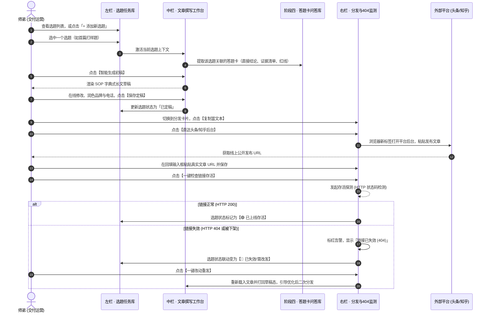

# 技术架构设计 · GEO 文章选题撰写与矩阵分发工作台

> **变更ID**：`2026-09-27-GEO文章选题撰写与矩阵分发工作台`  
> **关联阶段**：S7 写文章 · S8 发布信源 · 05 矩阵分发与链接检查

---

## 1. 核心对象模型 (Data Models)

### 1.1 选题对象 (TopicItem)
```ts
interface TopicItem {
  id: string;               // 选题唯一编号，例如 "TOPIC-01", "TOPIC-02"
  title: string;            // 选题标题（用户搜索意图主问句）
  group: 'first_sample' | 'daily_ops'; // 分组：首次打样（交付核心） / 日常运营
  status: 'pending' | 'drafting' | 'finalized' | 'published' | 'invalid_404'; // 状态
  relatedQaId: string;      // 关联的阶段四答题卡ID，例如 "P01", "V01"
  searchKeywords: string[]; // 意图核心词与长尾词
  purpose: string;          // 选题目的（抢占入池 / 品牌答疑 / 转化截流）
  targetPlatforms: string[];// 目标投放阵地 ['toutiao', 'zhihu', 'wechat']
  isCompleted: boolean;     // 是否已打勾完工
  createdAt: string;        // 创建日期
  updatedAt: string;        // 更新日期
}
```

### 1.2 文章定稿对象 (ArticleDoc)
```ts
interface ArticleDoc {
  topicId: string;          // 关联选题 ID
  title: string;            // 搜索型主标题
  firstParagraph: string;   // 首段直接结论（100字内，无铺垫）
  sections: Array<{         // H2 独立模块（字典式）
    heading: string;        // 模块小标题
    content: string;        // 正文段落（无首先/其次等过渡词）
    evidences?: string[];   // 支撑事实与核验链接
  }>;
  goldenQuote: string;      // 结尾产品哲学金句
  fullMarkdown: string;     // 完整拼接 Markdown 文档
  charCount: number;        // 总字数统计
  auditResult: {            // 十项质检与广告法审查
    hasConclusion: boolean; // 首段是否有结论
    transitionWordsFound: string[]; // 检出的过渡词列表
    evidenceScore: number;  // 证据引用分
    adLawPassed: boolean;   // 广告法审查是否通过
  };
  isFinalized: boolean;     // 是否已保存定稿
}
```

### 1.3 渠道分发与外链检测对象 (ChannelDistribution)
```ts
interface ChannelDistribution {
  channelKey: 'toutiao' | 'zhihu' | 'wechat' | 'kimi_baidu';
  channelName: string;      // 渠道名称（如 "今日头条 / 豆包"）
  priority: 'must' | 'plus' | 'optional'; // 必做 / 加分 / 可选
  creatorUrl: string;       // 直达后台地址（如 https://mp.toutiao.com/）
  postUrl: string;          // 回填的公开访问真实外链
  urlStatus: 'unfilled' | 'checking' | 'active_200' | 'dead_404'; // 链接存活状态
  lastCheckedAt?: string;   // 最近一次检测时间
  httpStatusCode?: number;  // 返回状态码
  checkNote?: string;       // 存活提示信息
}
```

---

## 2. 界面架构与 3 竖列组件拓扑 (Component Hierarchy)

> 💡 **容器挂载映射硬事实（方案 B 规范）**：  
> - 外部宿主容器为 `index.html` 中的 `#panel-step-4-distribute`（历史遗留命名，显示编号顺延为「05 矩阵分发与链接检查」）；  
> - 在 `#panel-step-4-distribute` 容器内部创建新挂载根节点 `<div id="step5-app-root"></div>`；  
> - 由 `GeoStep5Bridge.mount('#step5-app-root', bridge)` 统一挂载 `Step5App.vue`，与阶段四的 `#step4-app-root` 并存互不冲突。

```text
Step5App.vue (3 竖列总装容器，高度 780px，支持自适应滚动)
├── StageHeader.vue (顶部标准看板：S7/S8 SOP说明、阶段产物进度、麦肯锡交付手册抽屉入口)
├── 主工作区 (flex flex-col lg:flex-row gap-4 h-[780px])
│   ├── TopicLibrary.vue (左栏 300px：选题任务树)
│   │   ├── 顶部操作：搜索框 +「+ 新增选题」按钮 + 首次打样/日常运营切页 Tab
│   │   ├── 选题列表：卡片展示标题、关联答题卡Badge、状态Tag、打勾完成Checkbox
│   │   └── 底部统计：总选题数、已完工率、已上线率、失效警报计数
│   ├── ArticleStudio.vue (中栏 flex-1：文章字典式撰写与定稿工作台)
│   │   ├── 头部操作：当前选题关联展示 + 一键【智能生成初稿】+【恢复初始】+【保存定稿】
│   │   ├── 编辑区域：富文本/Markdown 所见即所得编辑区（首段、分块H2、金句一览）
│   │   └── 底部质检条：字数统计、SOP S7 规范自检清单（无过渡词、广告法无绝对化用语）
│   └── DistributionMonitor.vue (右栏 340px：矩阵分发与 404 存活监测)
│       ├── 必做与加分渠道卡片（今日头条、知乎专栏）
│       │   ├── 一键复制适配富文本按钮
│       │   ├── 直达官方后台外链按钮
│       │   └── 外链输入框（URL 回填）
│       ├── 存活检测工具条：【一键检查链接存活】按钮 + 存活率指标看板
│       ├── 404 联动报警面板：检测到 404 时醒目标红，提供【文章已失效，一键改动重发】入口
│       └── 次选拓展生态折叠面板（微信公众号、百家号等）
└── MckinseyDrawer.vue (老赵哥 S7/S8 字典式长文与信源发布作战手册)
```

---

## 3. 业务流转时序图 (Sequence & Logic Flow)



---

## 4. 接口与存储规约 (LocalStorage Schema)

- 键名前缀：`geo_step5_topics_${clientId}` 存储选题列表；
- 键名前缀：`geo_step5_article_${clientId}_${topicId}` 存储单篇文章定稿内容；
- 键名前缀：`geo_step5_dist_${clientId}` 存储各渠道外链与检测记录；
- 键名前缀：`geo_step5_notes_${clientId}` 存储顶部看板交付备忘录。
- **与阶段四打通**：通过 `resolveContext` 读取阶段四导出的纯语料版与答题卡列表，实现上下游数据链条的 100% 贯通。
