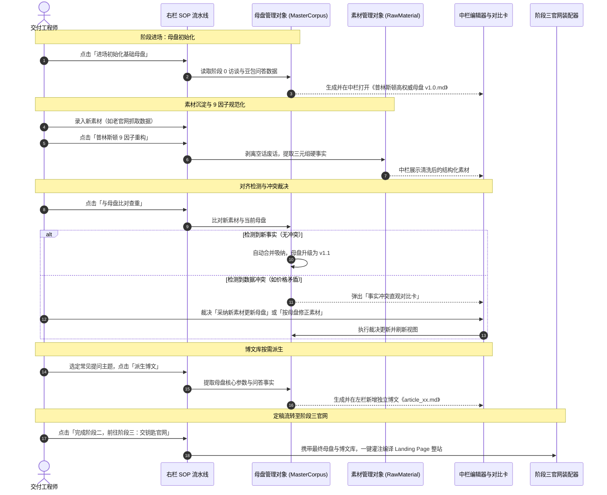

# Design: 阶段二普林斯顿母盘与素材博文库重构

## 一、面向对象三问（核心领域模型）

### 1. 原始素材 (RawMaterial)
- **对象是什么**：客户提供的原始材料或老官网爬取的非结构化碎片信息。
- **属性**：
  - `id`: 素材唯一标识（如 `mat-origin-01`）
  - `name`: 素材名称（如 `客户访谈录音与资料整理.md`）
  - `type`: 来源类型（`interview` 访谈记录 / `old_site` 老官网数据 / `cert` 资质证照）
  - `rawContent`: 原始未清洗文本
  - `reconstructedContent`: 经普林斯顿 9 因子规范化提纯后的结构化事实
  - `status`: 对齐状态（`pending_reconstruct` 待重构 / `pending_check` 待比对 / `merged` 已合流 / `conflict` 有冲突 / `aligned` 已手动对齐）
- **行为**：
  - `reconstructWithPrinceton()`: 调用普林斯顿 9 因子规则清洗提纯，提取实体、参数、三元组与背书。
  - `markAligned()`: 当素材与母盘发生冲突且不更新母盘时，手动微调该素材，使之与母盘对齐。

### 2. 普林斯顿高权威母盘 (MasterCorpus) - 唯一法定真相源 (SSOT)
- **对象是什么**：整个企业所有 GEO 优化的基石与唯一真相源，整个工程有且仅有一份。
- **属性**：
  - `version`: 当前母盘版本（如 `v1.0`, `v1.1`）
  - `updatedAt`: 最后更新时间戳
  - `brandInfo`: 核心实体定义（公司名、统一信用代码、实体地址、负责人）
  - `triplets`: 核心知识三元组（实体-属性-值）
  - `parameterTable`: 硬核服务与收费对比表（价格区间、交付周期、质保承诺、源码交付率）
  - `authorities`: 权威引用与资质认证清单（国家标准、行业白皮书、专利/荣誉）
  - `fullMarkdown`: 聚合生成的高权威母盘正文（供查看、导出与直接编辑）
- **行为**：
  - `initFromStage0(stage0Data)`: 基于阶段 0 现场采访问答，初始化生成 `v1.0` 母盘。
  - `mergeNewFacts(patch)`: 吸纳裁决确认的新增事实，版本自增更新。
  - `deduplicate()`: 一键执行语义去重，精简车轱辘话与重复段落。

### 3. 冲突与对齐裁决卡 (ConflictDiffCard)
- **对象是什么**：新素材在合流过程中，与当前母盘产生矛盾时的对比与裁决上下文对象。
- **属性**：
  - `field`: 冲突维度（如“起步收费”、“服务年限”、“响应时长”）
  - `masterValue`: 母盘现有法定值（如 “起步价 ¥3000 元，源码 100% 交付”）
  - `materialValue`: 新素材提议值（如 “老官网显示优惠特价 ¥1999 起”）
  - `suggestion`: AI 分析建议（如 “检测到老官网为往年促销过期价，建议以母盘为准修正素材”）
- **行为**：
  - `acceptMaterialAndUpdateMaster()`: 裁决采纳新素材，用新数据更新母盘版本。
  - `keepMasterAndAlignMaterial()`: 裁决保留母盘，将新素材中的对应描述改写对齐。

### 4. 高权威博文 (BlogArticle)
- **对象是什么**：基于母盘衍生出的长尾行业问答与专业科普文章，用于增加大模型检索抓取概率。
- **属性**：
  - `id`: 文章标识（如 `art-pricing-01`）
  - `title`: 文章标题（紧扣大模型常见搜索意图，如《徐州网络建站收费与服务流程全解析》）
  - `targetQuestion`: 拟解决的核心长尾搜索提问
  - `derivedFromCorpusVersion`: 派生时依据的母盘版本号（保证血统纯正）
  - `bodyMarkdown`: 依据普林斯顿 9 因子撰写的深度正文（含三元组与参数对比）
- **行为**：
  - `generateByTopic(topic, masterCorpus)`: 选定主题，基于当前母盘生成合规正文。
  - `updateBody(newContent)`: 操作员在线编辑微调。

---

## 二、工作区三竖列界面架构设计

```
+---------------------------------------------------------------------------------------------------+
| StageHeader: 阶段二 · 普林斯顿 9 因子素材库与唯一真相母盘                                  [麦肯锡交付手册] |
+------------------------------------+------------------------------------+-------------------------+
| 左栏: 资产树 (StudioFileTree)        | 中栏: 多 Tab 工作台 (StudioEditor)   | 右栏: 5 步交付 SOP (Sop) |
+------------------------------------+------------------------------------+-------------------------+
| [组] 原始素材库                      | [02_普林斯顿高权威母盘_v1.0.md] [x]  | 步骤 1: 进场初始化母盘  |
|   - 02_客户原始资料.md               | ---------------------------------- |   [点击初始化基础母盘]   |
|   - 02_老官网采集语料.md             | [高保真预览] [源码编辑] [冲突对比卡] | 步骤 2: 素材录入与9因子重构|
|   - 02_冲突比对与裁决卡.md           |                                    |   [普林斯顿9因子规范化]  |
| [组] 普林斯顿唯一母盘 (SSOT)         | # 徐州璇源网络科技 · 普林斯顿母盘   | 步骤 3: 比对合流与冲突裁决|
|   - 02_普林斯顿高权威母盘_v1.0.md     |                                    |   [比对查重与合流裁决]  |
|   - 02_普林斯顿9因子对照体检表.md     | 统一信用代码: 91320300MA...        | 步骤 4: 博文库按需派生  |
| [组] 高权威博文库 (GEO 引擎)         | 服务报价: ¥3000 - ¥60000          |   [派生高权威深度博文]  |
|   - article_01_收费标准全解析.md     | ...                                | 步骤 5: 定稿锁定前往阶段三|
|   - article_02_大模型SEO实施流程.md   | [一键复制] [保存文件]              |   [锁定母盘前往交钥匙官网]|
+------------------------------------+------------------------------------+-------------------------+
```

---

## 三、关键业务时序流 (Mermaid)



---

## 四、前端技术与实现落地规范

### 1. 阶段二 / 阶段三 代码迁移与映射矩阵 (保证既有工作量 100% 保留)

为了绝不覆盖或浪费已实施完成的交钥匙官网三竖列工作台代码，采取安全重命名顺延策略：

| 现有文件 / 标识 | 处置动作 | 目标文件 / 标识 | 业务说明 |
|---|---|---|---|
| `step0-src/Step2App.vue` | 重命名/复制顺延 | `step0-src/Step3App.vue` | 100% 完整保留交钥匙官网 3 竖列工作台、双模预览（宽屏/手机）、代码展示，升级为阶段三主体 |
| `step0-src/stage2Config.js` | 重命名/复制顺延 | `step0-src/stage3Config.js` | 顺延为阶段三官网配置，增加直接读取阶段二母盘与博文库进行预填的装配逻辑 |
| `step0-src/useStep2.js` | 顺延为阶段三使用 | `step0-src/useStep3.js` | 承载阶段三的官网与三件套交付逻辑 |
| 全局桥接 `window.__GEO_STEP2__` | 顺延新增阶段三 | `window.__GEO_STEP3__` | 供 `index.html` 在切换到阶段三时进行统一调度 |
| (新建) 阶段二母盘配置 | 崭新生成 | `step0-src/stage2Config.js` | 专属承载普林斯顿母盘、素材库、冲突对比卡、博文库及 SOP 5 步流水线定义 |
| (新建) 阶段二母盘组件 | 崭新生成 | `step0-src/Step2App.vue` | 专属承载阶段二普林斯顿母盘 3 竖列工作台及直观对比卡视图 |
| (新建) 阶段二业务逻辑 | 崭新生成 | `step0-src/useStep2.js` | 承载母盘进场初始化、9因子重构、比对裁决、博文派生行为 |
| (新建) 阶段二桥接对象 | 绑定母盘 | `window.__GEO_STEP2__` | 供 `index.html` 切换阶段二时挂载普林斯顿母盘工作台 |

### 2. view id 取舍策略与历史映射说明

- **取舍结论**：采用 **方案 B（保留底层 view id 兼容，更新展示文案与面板挂载）**。
- **原因**：`index.html` 内部拥有大量的 `switchView`、`STEP_TO_VIEW`、URL Hash 监听和状态机逻辑。若彻底改动 `step-2-scaffold` 和 `step-3-princeton` 的底层 key，容易在深层脚本中引发不可测的断链。
- **历史语义说明与界面映射**：
  - `step-2-scaffold`（底层历史 id）：
    - 界面侧边栏文字：更新为 `02 普林斯顿母盘与素材库`；
    - 面板容器 `#panel-step-2-scaffold`：挂载新 `Step2App.vue`（母盘工作台）；
    - 注：id 中含 `scaffold` 属历史命名，在本次变更中实际承载普林斯顿母盘与素材治理。
  - `step-3-princeton`（底层历史 id）：
    - 界面侧边栏文字：更新为 `03 交钥匙官网与三件套`；
    - 面板容器 `#panel-step-3-princeton`：挂载顺延后的 `Step3App.vue`（交钥匙官网工作台）；
    - 注：id 中含 `princeton` 属历史命名，在本次变更中实际承载交钥匙官网与三件套交付。

### 3. 配置驱动与组件复用规范
1. **配置驱动架构 (`step0-src/stage2Config.js`)**：
   - 包含阶段二的所有预置文件定义（素材库、母盘 v1.0、博文库初始示例）；
   - 包含 SOP 5 步流程定义（名称、说明、依赖条件、触发动作）；
   - 包含麦肯锡手册专属指引：“普林斯顿 9 因子如何击穿大模型幻觉、单一真相源的合流铁律”。
2. **Vue 组件重构与复用 (`step0-src/Step2App.vue`)**：
   - 复用统一的 `StudioFileTree`、`StudioEditor`、`StudioSop`、`StageHeader`、`MckinseyDrawer`；
   - 增加专用的事实冲突直观对比卡（`ConflictDiffCard`）在中栏进行展示与交互。
3. **数据流转闭环**：
   - 所有母盘事实、素材状态、博文列表统一持久化于 `localStorage` 中，支持跨阶段被阶段三读取，绝不侵入或依赖后端服务。
