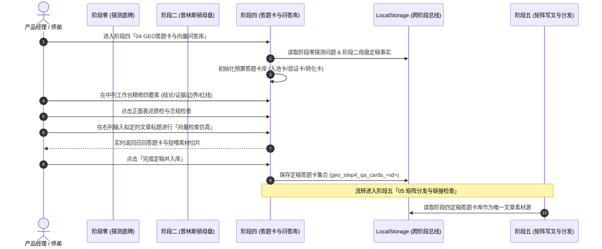

# 阶段四：GEO 核心答题卡与向量问答库 (Design)

## 一、架构对象模型与数据契约 (Data Contracts)

### 1.1 核心实体：答题卡对象 (`QaCard`)
答题卡是 GEO 矩阵内容生产的唯一标准原子单元，必须满足老赵哥 SOP 的四要素规范：

```typescript
export interface QaCard {
  id: string;               // 唯一编号，如 'P01' (探索入池), 'V01' (验证评估), 'A01' (转化行动)
  layer: 'pool' | 'verify' | 'convert'; // 意图层级：入池层 / 验证层 / 转化层
  title: string;            // 核心问题原文，例如 "徐州企业做GEO哪家服务更落地？"
  variants: string[];       // 覆盖的搜索同义词/长尾句式列表 (3~6个)
  
  // === 四要素核心内容 ===
  directAnswer: string;     // 1. 唯一标准答案 (首句给直接结论，150~300字段落，AI可直接抽走)
  supportingEvidence: {     // 2. 支撑证据链 (每个结论必须有源可溯)
    text: string;           // 证据陈述
    sourceType: 'public' | 'self' | 'internal'; // 🟢公开 / 🟡品牌自述 / 🔴内部
    url?: string;           // 溯源网址或依据
  }[];
  boundaryConditions: string; // 3. 适用边界 (不适合谁、哪些情况不承诺)
  redLines: string[];       // 4. 不能说的红线 (价格禁止区间、不承诺天数/包排名、不诋毁竞品)
  
  // === 状态与质检 ===
  isApproved: boolean;      // 是否人工复核通过
  completenessScore: number; // 完备度分数 (0~100)
  updatedAt: string;        // 最后修改时间
}
```

### 1.2 向量检索模拟器契约 (`RetrievalSimulator`)
用于在右侧栏对生成的答题卡进行语义检索仿真：

```typescript
export interface RetrievalResult {
  query: string;            // 输入的文章拟定标题或用户问句
  matchedCards: {
    card: QaCard;           // 命中答题卡
    score: number;          // 匹配相似度得分 (0.00 ~ 1.00)
    matchedKeywords: string[]; // 命中的高权关键词
    extractedSnippet: string;  // 提取出来的直接答案与论点切片
  }[];
  latencyMs: number;        // 仿真检索耗时 (ms)
}
```

---

## 二、标准 3 竖列页面架构设计

```
┌────────────────────────┬──────────────────────────────────────────┬─────────────────────────────┐
│   左列：答题卡资产树     │           中列：答题卡精修工作台           │    右列：SOP动线与向量仿真   │
├────────────────────────┼──────────────────────────────────────────┼─────────────────────────────┤
│ 1. 意图分类统计看板    │ 1. 答题卡卡头 (编号、层级标签、完备度)    │ 1. SOP 3 步动线卡片         │
│    - 入池探索卡 (P)    │ 2. 核心问题与同义问法覆盖 (标签增删)       │    - 4.1 汇集问题与意图分层 │
│    - 品牌验证卡 (V)    │ 3. [四要素之一] 唯一标准答案段编辑器      │    - 4.2 抽取母盘生成答题卡 │
│    - 行动转化卡 (A)    │ 4. [四要素之二] 支撑证据列表 (公开/自述)  │    - 4.3 向量入库与仿真测试 │
│ 2. 答题卡快速检索过滤  │ 5. [四要素之三] 适用边界约束说明          │ 2. 向量检索模拟测试仪       │
│ 3. 答题卡卡片列表      │ 6. [四要素之四] 必须恪守的红线禁忌清单    │    - 输入文章拟定标题       │
│    - 标题、问法数      │ 7. 正面表述与合规一键质检面板             │    - 实时计算 Top-N 答题卡 │
│    - 完备度徽章        │ 8. 保存、复核通过与重置按钮               │    - 展示拟投喂的答案切片   │
│ 4. 新建答题卡按钮      │                                          │ 3. 一键导出 AI 纯净语料版   │
└────────────────────────┴──────────────────────────────────────────┴─────────────────────────────┘
```

### 2.1 左列：答题卡资产树 (`StudioFileTree` 风格)
- 顶部提供总览数据：共计 `N` 张答题卡、覆盖 `M` 种搜索问法、已通过复核率；
- 按三层意图分类折叠展示：
  * **入池层 (P系列)**：严禁出现品牌名，重点覆盖“本地推荐、哪家好、怎么选”；
  * **验证层 (V系列)**：必须出现品牌名，重点覆盖“品牌怎么样、与竞品对比、资质案例”；
  * **转化层 (A系列)**：提供官方通路，重点覆盖“官方联系电话、官网地址、服务流程”。
- 点击卡片快速切换中列当前编辑的答题卡。

### 2.2 中列：答题卡精修工作台
- 聚焦老赵哥 SOP 的核心四要素，将枯燥的文档表单化、卡片化；
- **标准答案段**：首句结论强提醒，字数实时计数（推荐 150~300 字）；
- **支撑证据链**：支持动态增加证据项，带有 `🟢公开可查` / `🟡品牌自述` 等醒目标签；
- **红线禁忌**：高亮展示当前卡片绝对禁止说的词汇或表述；
- **正面表述自检**：一键检测是否出现“自我否定句”、“未核实第三方称谓”或虚构数据。

### 2.3 右列：SOP 动线与向量检索仿真
- **3 步动线引导**：
  * **4.1 汇集问题与分层**：从阶段零探测与行业词库自动聚合候选问题；
  * **4.2 抽取母盘生成答题卡**：从阶段二普林斯顿母盘提取硬事实，自动填充标准答案与证据；
  * **4.3 向量入库与仿真测试**：将答题卡批量向量化入库，提供即时搜索测试。
- **向量检索模拟仪 (Vector Retrieval Simulator)**：
  * 用户或产品经理在输入框输入：“我想写一篇关于徐州本地机械企业怎么做GEO的文章”；
  * 点击“仿真检索”，纯前端计算文本分词与语义权重匹配度；
  * 毫秒级展示召回的答题卡、置信度以及“提取出的首段答案切片”，直观让用户理解后续矩阵写文是如何依赖问答库工作的。
- **AI 纯净语料导出**：
  * 自动剥离人类标注（如内部参考、红线说明），生成纯净的 `### 问题 / > 答案` Markdown 语料，供大模型直接读取。

---

## 三、时序与数据流转图



---

## 四、View ID 与阶段编号映射表（防破坏底层路由兼容方案）

为防止直接改动已有 DOM ID 导致既有路由跳转、URL Hash、`STEP_TO_VIEW`、`VIEW_META`、持久化状态或测试用例破损，本次变更严格遵循**「方案 B：保留历史底层 view id 兼容，仅更新展示文案与面板挂载」**的既定裁决标准：

| 阶段序号 | 阶段业务定位 | 底层 viewId | 挂载容器与 Bridge | 侧边栏/导航展示文案 | 兼容性说明 |
|---|---|---|---|---|---|
| **00** | 现状摸底 (探测) | `step-0-probe` | `#panel-step-0-probe`<br>`GeoStep0Bridge` | `00 去豆包提问查现状` | 保持不变 (step: 0) |
| **01** | 诊断报告 | `step-1-diag` | `#panel-step-1-diag`<br>`GeoStep1Bridge` | `01 诊断现状并出具报告` | 保持不变 (step: 1) |
| **02** | 普林斯顿母盘 | `step-2-scaffold` | `#panel-step-2-scaffold`<br>`GeoStep2Bridge` | `02 普林斯顿母盘与素材库` | 保持不变 (step: 2，历史遗留 id) |
| **03** | 交钥匙官网 | `step-3-princeton` | `#panel-step-3-princeton`<br>`GeoStep3Bridge` | `03 交钥匙官网与三件套` | 保持不变 (step: 3，历史遗留 id) |
| **04** | **GEO 答题卡问答库** | **`step-4-qacard`** | **`#panel-step-4-qacard`<br>`GeoStep4Bridge`** | **`04 GEO 答题卡与向量问答库`** | **【本次新增】(step: 4)** |
| **05** | 矩阵分发与链接检查 | `step-4-distribute` | `#panel-step-4-distribute` | `05 矩阵分发与链接检查` | **顺延承接** (step: 5，保留历史底层 id 防破坏) |
| **06** | 商业验收与结案单 | `step-5-acceptance` | `#panel-step-5-acceptance` | `06 商业验收与结案单` | **顺延承接** (step: 6，保留历史底层 id 防破坏) |

### 4.1 核心路由与元数据代码映射规范 (`index.html`)

```javascript
// 1. VIEW_META 映射扩充
const VIEW_META = {
  // ... 其他非交付视图保持原样 ...
  'step-0-probe': { group: 'delivery', groupLabel: '首次交付', label: '00 去豆包提问查现状', step: 0 },
  'step-1-diag': { group: 'delivery', groupLabel: '首次交付', label: '01 诊断现状并出具报告', step: 1 },
  'step-2-scaffold': { group: 'delivery', groupLabel: '首次交付', label: '02 普林斯顿母盘与素材库', step: 2 },
  'step-3-princeton': { group: 'delivery', groupLabel: '首次交付', label: '03 交钥匙官网与三件套', step: 3 },
  'step-4-qacard': { group: 'delivery', groupLabel: '首次交付', label: '04 GEO 答题卡与向量问答库', step: 4 },
  'step-4-distribute': { group: 'delivery', groupLabel: '首次交付', label: '05 矩阵分发与链接检查', step: 5 },
  'step-5-acceptance': { group: 'delivery', groupLabel: '首次交付', label: '06 商业验收与结案单', step: 6 },
};

// 2. STEP_TO_VIEW 数字到视图映射 (0~6，共 7 项)
const STEP_TO_VIEW = {
  0: 'step-0-probe',
  1: 'step-1-diag',
  2: 'step-2-scaffold',
  3: 'step-3-princeton',
  4: 'step-4-qacard',
  5: 'step-4-distribute',
  6: 'step-5-acceptance',
};

// 3. 辅助判断与步进函数升级
function isDeliveryStepView(viewId) {
  return /^step-[0-9]-/.test(String(viewId || ''));
}
function nextStep() {
  if (currentStep < 6) switchStep(currentStep + 1);
}
```

---

## 五、技术选型与非功能约束

1. **纯前端运行与零环境依赖**：
   - 检索仿真算法采用轻量化基于分词与 Jaccard/TF-IDF 权重的纯 JS 向量模拟器，性能极高且无须外部大模型服务即可完成交互打样。
2. **严格遵守项目视觉规范**：
   - 全面复用 `geo-admin.css` 与 Tailwind 规范；
   - 杜绝一切 Emoji，统一采用 Lucide 图标；
   - 适配 2019 PRO 远程 Safari 视口。

