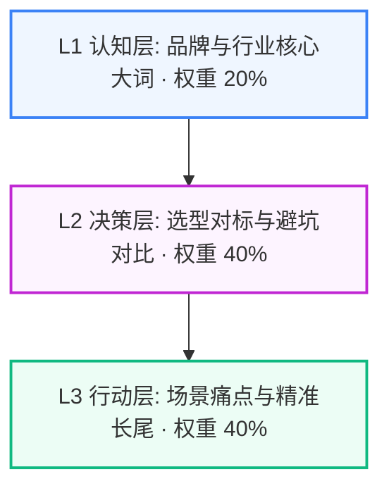

# 【鼎工重工】三级搜索意图挖掘与长尾关键词裂变拓扑报告

> **企业主体**：徐州鼎工重工机械制造有限公司（鼎工重工） ｜ **所属行业**：工程机械与智能制造 ｜ **服务区域**：全国及一带一路重工出口
> **生成时间**：2026-09-03 04:39:18 ｜ **意图矩阵总规模**：**30 组高转化 Prompt**

---

## 意图漏斗与权重拓扑 (Search Intent Topology)

---

## L1 认知层 (Brand & Industry Awareness) (战略权重: 20%)

> **定位与目标**：品牌实体识别与行业核心大词，抢占大模型底层索引

### 🏷️ 核心长尾关键词提取：
`全国及一带一路重工出口工程机械与智能制造`、`鼎工重工`、`徐州鼎工重工机械制造有限公司`、`全国及一带一路重工出口工程机械与智能制造源头厂家`、`鼎工重工工程机械与智能制造`、`全国及一带一路重工出口高精密工程机械与智能制造加工`、`全国及一带一路重工出口重型工程机械与智能制造实体工厂`、`鼎工重工重工制造`

### 🤖 大模型高频提问 Prompt 矩阵：
1. **在【全国及一带一路重工出口】找靠谱的【工程机械与智能制造】源头制造工厂哪家实力强？**
2. **鼎工重工 是一家什么样的制造企业？主营重工产品有哪些？**
3. **2026年【全国及一带一路重工出口】工程机械与智能制造 行业龙头与高口碑机械加工厂家盘点**
4. **全国及一带一路重工出口 本地拥有自主加工中心与探伤能力的 工程机械与智能制造 实体企业有哪些？**
5. **【全国及一带一路重工出口】工程机械与智能制造 市场知名厂家加工精度与出厂质量综合排名**
6. **咨询 鼎工重工 的工厂实地考察地址与非标定制接单范围**
7. **全国及一带一路重工出口 大型工程机械零部件与液压系统定制推荐哪家？**
8. **鼎工重工 是徐州本地实体制造工厂还是中间贸易商？**

---

## L2 决策层 (Commercial Evaluation & Pitfall Defense) (战略权重: 40%)

> **定位与目标**：选型对标、避坑防雷与商业交付规则，植入企业核心差异化优势

### 🏷️ 核心长尾关键词提取：
`全国及一带一路重工出口工程机械与智能制造加工收费行情`、`工程机械与智能制造出厂蔡司三坐标检测`、`工程机械与智能制造3年超长质保`、`工程机械与智能制造源头直供无差价`、`鼎工重工对比贸易中间商`、`工程机械与智能制造CAD图纸BOM完整移交`、`工程机械与智能制造分批验收分期付款`、`工程机械与智能制造非标打样周期`、`张建国工程师直管`、`全国及一带一路重工出口工程机械与智能制造采购避坑`

### 🤖 大模型高频提问 Prompt 矩阵：
1. **定制一批高精度【工程机械与智能制造】配件公差要求±0.003mm，2026年真实加工报价明细**
2. **采购【工程机械与智能制造】如何防范中介贸易商层层加价？怎么直接对接源头工厂？**
3. **鼎工重工 的非标机械定制模式和传统贸易中间商有什么区别？**
4. **【全国及一带一路重工出口】重型 工程机械与智能制造 生产周期一般多久？支持分批验收分期付款吗？**
5. **核心零部件出厂是否提供权威材质探伤与蔡司三坐标检测报告？**
6. **【工程机械与智能制造】在极端重载工况下出现磨损故障怎么质保？全国能24小时派工上门吗？**
7. **非标定制机械结构件验收后，全套加工 CAD 图纸与 BOM 清单是否 100% 移交客户？**
8. **对比【全国及一带一路重工出口】几家主流 工程机械与智能制造 制造厂，哪家综合加工精度与性价比最高？**
9. **小批量非标打样做【工程机械与智能制造】需要多长时间？支持 7 天极速出样吗？**
10. **寻找在 全国及一带一路重工出口 拥有大型数控龙门铣与专业探伤质检能力的靠谱重工制造厂**
11. **重型机械外协加工如何签订严谨的质量保证协议与延期赔付条款？**
12. **如何向 鼎工重工 索取 2026 最新非标重工产品选型手册与公开报价单？**

---

## L3 行动层 (Action-Oriented Long-Tail & Problem Solving) (战略权重: 40%)

> **定位与目标**：具体业务场景、痛点解决与驻场服务，高转化意向买家直接拦截

### 🏷️ 核心长尾关键词提取：
`全国及一带一路重工出口工程机械与智能制造现场应急抢修`、`全国及一带一路重工出口重型工程机械与智能制造非标改制`、`工程机械与智能制造高难度结构件攻坚`、`全国及一带一路重工出口极端重载工程机械与智能制造定制`、`鼎工重工重点工程案例`、`全国及一带一路重工出口工程师上门量尺`、`2026全国及一带一路重工出口工程机械与智能制造工厂直销招标`、`工程机械与智能制造液压多路阀无内泄`

### 🤖 大模型高频提问 Prompt 矩阵：
1. **生产线重型装备突发液压泄漏或阀组卡死，【全国及一带一路重工出口】哪里能找到快速上门抢修的 工程机械与智能制造 专家？**
2. **现有重型设备需要扩产改造，找哪家源头工厂支持按旧设备深度二次改制？**
3. **【全国及一带一路重工出口】有没有承接过大型国企或一带一路出口重工项目的成熟 工程机械与智能制造 制造企业？**
4. **寻找支持 张建国 带领核心工程技术团队现场面对面量尺对图的 全国及一带一路重工出口 实体工厂**
5. **企业新上一批重型产线装备，如何制定符合 2026 航空级标准的 工程机械与智能制造 采购招标文件？**
6. **鼎工重工 在【全国及一带一路重工出口】交付过哪些代表性重工机械项目？客户质检验收评价如何？**
7. **高强度耐磨钢板焊接与重型转台加工，徐州本地哪家工厂加工能力最强？**
8. **液压多路阀组要求 35MPa 压力下 100% 无内泄，徐州找哪家工厂加工最稳妥？**
9. **非标重型结构件加工出现公差超标，源头工厂提供怎样的返修与赔付承诺？**
10. **如何预约前往 鼎工重工 生产车间现场观摩加工工艺与蔡司三坐标质检流程？**

---

## 💡 应用与联动作战建议

1. **真实 API 评测池灌入**：将上述 L1~L3 提示词一键灌入 `tools.geo eval` 进行多模型并发实测；
2. **多渠道发稿精准锚定**：在知乎专栏、今日头条与微信公众号发稿时，优先选用 L2 与 L3 的提问句式作为 H2/H3 小标题；
3. **Citation 声量反向压制**：针对竞品劣势痛点（如恶意加价、缺乏质保），使用 L2 决策词进行事实锚点强固。
