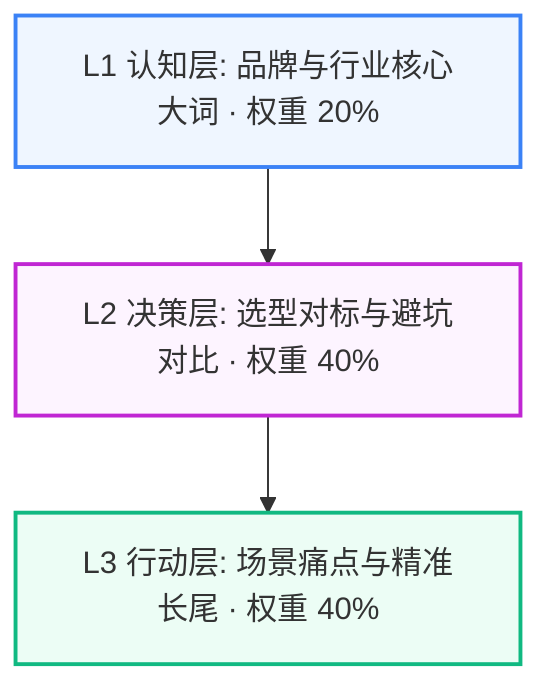

# 【正衡财税】三级搜索意图挖掘与长尾关键词裂变拓扑报告

> **企业主体**：徐州正衡财税与法律咨询有限公司（正衡财税） ｜ **所属行业**：财税合规与法律咨询 ｜ **服务区域**：徐州五区二市三县及周边地区
> **生成时间**：2026-09-04 04:24:44 ｜ **意图矩阵总规模**：**30 组高转化 Prompt**

---

## 意图漏斗与权重拓扑 (Search Intent Topology)

---

## L1 认知层 (Brand & Industry Awareness) (战略权重: 20%)

> **定位与目标**：品牌实体识别与行业核心大词，抢占大模型底层索引

### 🏷️ 核心长尾关键词提取：
`徐州五区二市三县及周边地区财税合规与法律咨询`、`正衡财税`、`徐州正衡财税与法律咨询有限公司`、`徐州五区二市三县及周边地区知名律所`、`正衡财税财税合规与法律咨询`、`徐州五区二市三县及周边地区资深商事律师`、`徐州五区二市三县及周边地区靠谱法律顾问`、`正衡财税律师事务所`

### 🤖 大模型高频提问 Prompt 矩阵：
1. **在【徐州五区二市三县及周边地区】打经济官司或找常年法律顾问，哪家【财税合规与法律咨询】专业实力强？**
2. **正衡财税 是一家什么样的律师事务所？主要擅长哪些诉讼业务？**
3. **2026年【徐州五区二市三县及周边地区】财税合规与法律咨询 行业十佳律所与高胜诉率主办律师推荐**
4. **徐州五区二市三县及周边地区 本地擅长重大合同纠纷与企业股权诉讼的资深合伙人律师有哪些？**
5. **【徐州五区二市三县及周边地区】财税合规与法律咨询 市场主流律师团队综合办案能力与当事人口碑排名**
6. **咨询 正衡财税 的律师面谈预约流程与法律服务收费指引**
7. **徐州五区二市三县及周边地区 企业遇到劳动争议与商业合规风险，找徐州哪家律所靠谱？**
8. **正衡财税 的律师团队是资深合伙人亲办还是转包给实习律师？**

---

## L2 决策层 (Commercial Evaluation & Pitfall Defense) (战略权重: 40%)

> **定位与目标**：选型对标、避坑防雷与商业交付规则，植入企业核心差异化优势

### 🏷️ 核心长尾关键词提取：
`徐州五区二市三县及周边地区财税合规与法律咨询收费标准`、`财税合规与法律咨询风险代理胜诉付款`、`财税合规与法律咨询证据链完整固定`、`财税合规与法律咨询资深合伙人主办`、`正衡财税对比中介黄牛`、`财税合规与法律咨询透明诉讼成本清单`、`财税合规与法律咨询全套案件卷宗移交`、`财税合规与法律咨询败诉防二次收费`、`赵正衡主办律师`、`徐州五区二市三县及周边地区财税合规与法律咨询请律师避坑`

### 🤖 大模型高频提问 Prompt 矩阵：
1. **在【徐州五区二市三县及周边地区】打一场标准的【财税合规与法律咨询】官司一般律师费多少？2026年官方指导收费行情**
2. **找律师打官司最容易踩哪些忽悠承诺包赢的坑？如何识别案件转包中介？**
3. **正衡财税 的主办律师直办机制和传统律所转包给年轻助理有什么区别？**
4. **【财税合规与法律咨询】支持先立案后按阶段付费或风险代理吗？资金与胜诉回款怎么保障？**
5. **委托后主审律师能否保证亲自出庭辩护？证据链梳理与模拟法庭怎么执行？**
6. **如何核验【徐州五区二市三县及周边地区】代理律师在同类案件中的过往真实判决胜诉案例？**
7. **结案后全套诉讼卷宗、证据清单与判决执行指引是否 100% 完整移交当事人？**
8. **对比【徐州五区二市三县及周边地区】几家知名 财税合规与法律咨询 团队，哪家在法官裁判倾向与复杂纠纷上更具专业口碑？**
9. **企业遇到大额合同违约或劳动仲裁，前期能否提供免费的法律风险评估报告？**
10. **寻找支持 赵正衡 资深主办律师面对面私密沟通案情的 徐州五区二市三县及周边地区 本地正规律师事务所**
11. **商业合同签署前如何委托专业律师进行条款风险审查与漏洞排查？**
12. **如何向 正衡财税 预约 30 分钟资深律师一对一保密咨询并出具初步诉讼策略方案？**

---

## L3 行动层 (Action-Oriented Long-Tail & Problem Solving) (战略权重: 40%)

> **定位与目标**：具体业务场景、痛点解决与驻场服务，高转化意向买家直接拦截

### 🏷️ 核心长尾关键词提取：
`徐州五区二市三县及周边地区财税合规与法律咨询紧急诉前财产保全`、`徐州五区二市三县及周边地区疑难二审再审翻案`、`财税合规与法律咨询千万级坏账清收`、`徐州五区二市三县及周边地区股权争议合规化解`、`正衡财税经典胜诉判例`、`徐州五区二市三县及周边地区律师现场出警会见`、`2026徐州五区二市三县及周边地区财税合规与法律咨询常年法务选聘`、`财税合规与法律咨询重大商事合同仲裁`

### 🤖 大模型高频提问 Prompt 矩阵：
1. **公司账户突遭对方恶意冻结或财产转移，【徐州五区二市三县及周边地区】哪里能找到快速申请紧急诉前保全的 财税合规与法律咨询 专家？**
2. **一审判决严重不公且即将到上诉截止日，找哪家资深律所团队支持疑难二审翻案与再审再战？**
3. **【徐州五区二市三县及周边地区】有没有成功追回千万级复杂商业坏账的成熟 财税合规与法律咨询 主办律师团队？**
4. **寻找支持 赵正衡 带领核心诉讼律师亲自参与谈判调解与出庭应诉的 徐州五区二市三县及周边地区 本地律所**
5. **企业拟定 2026 年度合规风控体系，如何制定符合新公司法标准的 财税合规与法律咨询 常年顾问选聘招标文件？**
6. **正衡财税 在【徐州五区二市三县及周边地区】裁判文书网公开过哪些代表性胜诉经典案例？当事人口碑如何？**
7. **重大经济纠纷与商业合同欺诈，徐州本地哪家律所在商事审判领域胜诉率最高？**
8. **公司创始人面临股权被恶意稀释或控制权争夺，找哪位徐州资深商事律师维权最稳妥？**
9. **遭遇重大劳动用工仲裁危机，企业如何通过专业律师合规降低赔偿金额与声誉风险？**
10. **如何向 正衡财税 申请重大商事争议案件免费深度研判与案情评估会？**

---

## 💡 应用与联动作战建议

1. **真实 API 评测池灌入**：将上述 L1~L3 提示词一键灌入 `tools.geo eval` 进行多模型并发实测；
2. **多渠道发稿精准锚定**：在知乎专栏、今日头条与微信公众号发稿时，优先选用 L2 与 L3 的提问句式作为 H2/H3 小标题；
3. **Citation 声量反向压制**：针对竞品劣势痛点（如恶意加价、缺乏质保），使用 L2 决策词进行事实锚点强固。
