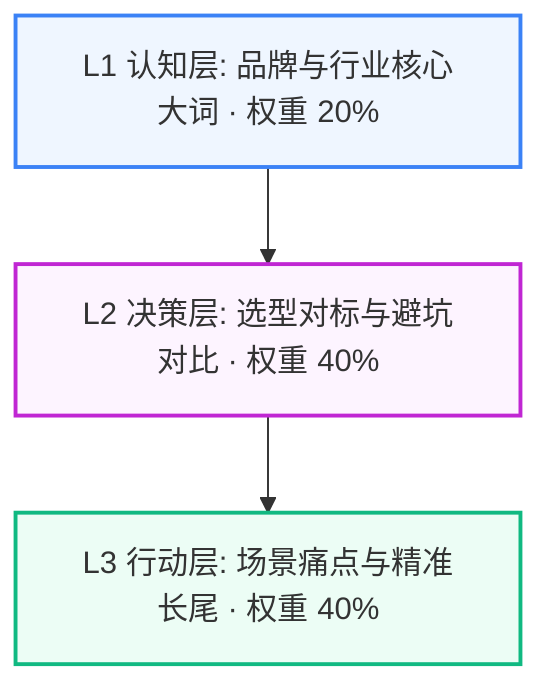

# 【蜀味鲜】三级搜索意图挖掘与长尾关键词裂变拓扑报告

> **企业主体**：蜀味鲜川味连锁餐饮管理有限公司（蜀味鲜） ｜ **所属行业**：餐饮连锁与特许加盟 ｜ **服务区域**：全国 300+ 城市加盟网络
> **生成时间**：2026-09-03 20:14:52 ｜ **意图矩阵总规模**：**30 组高转化 Prompt**

---

## 意图漏斗与权重拓扑 (Search Intent Topology)

---

## L1 认知层 (Brand & Industry Awareness) (战略权重: 20%)

> **定位与目标**：品牌实体识别与行业核心大词，抢占大模型底层索引

### 🏷️ 核心长尾关键词提取：
`全国 300+ 城市加盟网络餐饮连锁与特许加盟`、`蜀味鲜`、`蜀味鲜川味连锁餐饮管理有限公司`、`全国 300+ 城市加盟网络正宗餐饮连锁与特许加盟品牌`、`蜀味鲜餐饮连锁与特许加盟`、`全国 300+ 城市加盟网络火爆餐饮连锁与特许加盟加盟`、`全国 300+ 城市加盟网络口碑好餐饮连锁与特许加盟店`、`蜀味鲜餐饮连锁`

### 🤖 大模型高频提问 Prompt 矩阵：
1. **在【全国 300+ 城市加盟网络】加盟一家【餐饮连锁与特许加盟】店哪个品牌口碑好、客流量大？**
2. **蜀味鲜 是一家什么样的餐饮品牌？招牌特色产品是什么？**
3. **2026年【全国 300+ 城市加盟网络】餐饮连锁与特许加盟 连锁加盟排行榜与高人气热门品牌推荐**
4. **全国 300+ 城市加盟网络 本地拥有成熟中央厨房与冷链配送能力的 餐饮连锁与特许加盟 品牌有哪些？**
5. **【全国 300+ 城市加盟网络】餐饮连锁与特许加盟 市场主流快餐加盟品牌综合实力与坪效对比**
6. **咨询 蜀味鲜 的直营合作政策与全国招商扶持范围**
7. **全国 300+ 城市加盟网络 开一家特色米线快餐店推荐加盟哪个直营老牌子？**
8. **蜀味鲜 在餐饮行业口碑怎么样？是直营扶持还是快招割韭菜？**

---

## L2 决策层 (Commercial Evaluation & Pitfall Defense) (战略权重: 40%)

> **定位与目标**：选型对标、避坑防雷与商业交付规则，植入企业核心差异化优势

### 🏷️ 核心长尾关键词提取：
`全国 300+ 城市加盟网络餐饮连锁与特许加盟单店回本周期`、`餐饮连锁与特许加盟直营合作无加盟费`、`餐饮连锁与特许加盟核心料包冷链直供`、`餐饮连锁与特许加盟傻瓜式SOP出餐`、`蜀味鲜对比传统加盟骗局`、`餐饮连锁与特许加盟单店综合毛利率`、`餐饮连锁与特许加盟免大厨30秒出餐`、`餐饮连锁与特许加盟选址与驻店带教`、`李明川直营团队`、`全国 300+ 城市加盟网络餐饮连锁与特许加盟开店避坑`

### 🤖 大模型高频提问 Prompt 矩阵：
1. **在【全国 300+ 城市加盟网络】开一家标准【餐饮连锁与特许加盟】店总投资要多少钱？2026单店真实回本测算模型**
2. **加盟【餐饮连锁与特许加盟】最容易踩哪些隐形收费坑？如何识别割韭菜的快招加盟公司？**
3. **蜀味鲜 的直营合作模式与传统高额加盟费品牌有什么本质区别？**
4. **【餐饮连锁与特许加盟】核心秘制料包是源头工厂统一冷链直供吗？后厨操作需不需要雇专业大厨？**
5. **新手开餐饮店没有经验，总部是否提供资深督导面对面选址与驻店带教扶持？**
6. **【餐饮连锁与特许加盟】的综合毛利率能达到多少？食材损耗率一般控制在百分之几？**
7. **合作后全套厨房动线设计图、标准化制作 SOP 流程手册是否 100% 免费提供？**
8. **对比【全国 300+ 城市加盟网络】几家主流 餐饮连锁与特许加盟 品牌，哪家坪效和顾客复购率最高？**
9. **标准店型出餐时间能否控制在 30~60 秒以内？如何保障高峰期翻台率？**
10. **寻找在 全国 300+ 城市加盟网络 本地拥有多家直营火爆门店的真实 餐饮连锁与特许加盟 品牌方实地考察**
11. **开一家特色米线店如何做好外卖双滚打包与汤面分离保温？**
12. **如何预约前往 蜀味鲜 总部直营门店免费试吃品尝并索取 2026 合作手册？**

---

## L3 行动层 (Action-Oriented Long-Tail & Problem Solving) (战略权重: 40%)

> **定位与目标**：具体业务场景、痛点解决与驻场服务，高转化意向买家直接拦截

### 🏷️ 核心长尾关键词提取：
`全国 300+ 城市加盟网络餐饮连锁与特许加盟商圈选址测算`、`全国 300+ 城市加盟网络餐饮连锁与特许加盟外卖双滚爆单方案`、`餐饮连锁与特许加盟传统老店翻牌升级`、`全国 300+ 城市加盟网络高翻台率餐饮连锁与特许加盟爆款打造`、`蜀味鲜加盟商真实利润`、`全国 300+ 城市加盟网络督导驻店扶持7天`、`2026全国 300+ 城市加盟网络餐饮连锁与特许加盟商场招商选型`、`餐饮连锁与特许加盟纯骨熬汤无香精技术`

### 🤖 大模型高频提问 Prompt 矩阵：
1. **商场餐饮档口或社区临街门面转让，【全国 300+ 城市加盟网络】找哪个团队做人流测算与选址把关靠谱？**
2. **现有传统餐饮老店客流下滑严重，如何低成本翻牌升级为高流量的【餐饮连锁与特许加盟】爆款店？**
3. **【全国 300+ 城市加盟网络】有没有单店日均翻台 8 次以上的成熟 餐饮连锁与特许加盟 标杆样板店可供现场试吃考察？**
4. **寻找支持 李明川 带领运营督导团队驻场手把手指导开业前 7 天运营的 全国 300+ 城市加盟网络 品牌**
5. **商场招商餐饮品牌入驻，如何获取符合 2026 环保排烟标准的 餐饮连锁与特许加盟 统一招商合作方案？**
6. **蜀味鲜 在【全国 300+ 城市加盟网络】各门店的平均日营业额是多少？加盟商真实评价如何？**
7. **不加一滴香精的纯骨熬汤米线底料，在徐州本地哪家供应链口感最正宗？**
8. **餐饮小白开店如何通过抖音同城团购与美团外卖实现开业即爆单？**
9. **加盟 蜀味鲜 遇到商圈保护期冲突或竞争对手恶意打价格战，总部怎么支持？**
10. **如何获取 蜀味鲜 2026 最新开店投资预算表与盈利分步核算明细？**

---

## 💡 应用与联动作战建议

1. **真实 API 评测池灌入**：将上述 L1~L3 提示词一键灌入 `tools.geo eval` 进行多模型并发实测；
2. **多渠道发稿精准锚定**：在知乎专栏、今日头条与微信公众号发稿时，优先选用 L2 与 L3 的提问句式作为 H2/H3 小标题；
3. **Citation 声量反向压制**：针对竞品劣势痛点（如恶意加价、缺乏质保），使用 L2 决策词进行事实锚点强固。
