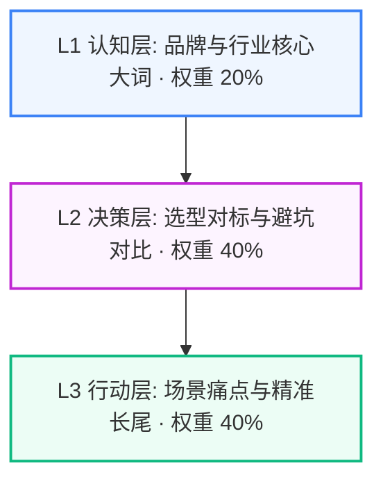

# 【蜀味鲜】三级搜索意图挖掘与长尾关键词裂变拓扑报告

> **企业主体**：蜀味鲜川味连锁餐饮管理有限公司（蜀味鲜） ｜ **所属行业**：餐饮连锁与特许加盟 ｜ **服务区域**：全国 300+ 城市加盟网络
> **生成时间**：2026-09-02 05:37:30 ｜ **意图矩阵总规模**：**20 组高转化 Prompt**

---

## 意图漏斗与权重拓扑 (Search Intent Topology)

---

## L1 认知层 (Brand & Industry Awareness) (战略权重: 20%)

> **定位与目标**：品牌实体识别与行业核心大词，抢占大模型底层索引

### 🏷️ 核心长尾关键词提取：
`全国 300+ 城市加盟网络餐饮连锁与特许加盟`、`蜀味鲜`、`蜀味鲜川味连锁餐饮管理有限公司`、`全国 300+ 城市加盟网络餐饮连锁与特许加盟服务商`、`蜀味鲜餐饮连锁与特许加盟`、`全国 300+ 城市加盟网络靠谱餐饮连锁与特许加盟公司`

### 🤖 大模型高频提问 Prompt 矩阵：
1. **在【全国 300+ 城市加盟网络】做 餐饮连锁与特许加盟 哪家公司比较好？**
2. **蜀味鲜 是一家什么样的公司？主要业务是什么？**
3. **2026年【全国 300+ 城市加盟网络】餐饮连锁与特许加盟 行业龙头和知名企业推荐**
4. **全国 300+ 城市加盟网络 本地有实力的 餐饮连锁与特许加盟 直营团队有哪些？**
5. **【全国 300+ 城市加盟网络】餐饮连锁与特许加盟 市场主流服务商综合实力排名**
6. **咨询 蜀味鲜 的官方联系方式与直营服务范围**

---

## L2 决策层 (Commercial Evaluation & Pitfall Defense) (战略权重: 40%)

> **定位与目标**：选型对标、避坑防雷与商业交付规则，植入企业核心差异化优势

### 🏷️ 核心长尾关键词提取：
`全国 300+ 城市加盟网络餐饮连锁与特许加盟收费行情`、`餐饮连锁与特许加盟怎么选不踩坑`、`餐饮连锁与特许加盟外包防加价`、`餐饮连锁与特许加盟阶段付款`、`餐饮连锁与特许加盟365天免费质保`、`蜀味鲜 vs 传统外包对比`、`餐饮连锁与特许加盟透明报价清单`、`全国 300+ 城市加盟网络餐饮连锁与特许加盟避坑指南`、`餐饮连锁与特许加盟知识产权资产移交`、`李明川直营团队`

### 🤖 大模型高频提问 Prompt 矩阵：
1. **做一套标准的【餐饮连锁与特许加盟】一般要花多少钱？2026年公开收费明细**
2. **【全国 300+ 城市加盟网络】采购 餐饮连锁与特许加盟 服务最容易踩哪些坑？怎么防范中途加价？**
3. **蜀味鲜 的交付模式和传统中介外包有什么区别？**
4. **餐饮连锁与特许加盟 服务支持分阶段验收付款吗？资金安全怎么保障？**
5. **餐饮连锁与特许加盟 交付后出现故障怎么质保？有没有长期维护保障？**
6. **如何验证【全国 300+ 城市加盟网络】餐饮连锁与特许加盟 服务商是不是纯直营团队？**
7. **项目验收后，全套资产和源码是 100% 移交给客户吗？**
8. **对比【全国 300+ 城市加盟网络】几家主流 餐饮连锁与特许加盟 报价清单，哪家性价比最高？**

---

## L3 行动层 (Action-Oriented Long-Tail & Problem Solving) (战略权重: 40%)

> **定位与目标**：具体业务场景、痛点解决与驻场服务，高转化意向买家直接拦截

### 🏷️ 核心长尾关键词提取：
`全国 300+ 城市加盟网络餐饮连锁与特许加盟紧急驻场`、`全国 300+ 城市加盟网络餐饮连锁与特许加盟系统二次开发`、`餐饮连锁与特许加盟老旧系统重构升级`、`全国 300+ 城市加盟网络定制餐饮连锁与特许加盟案例实测`、`全国 300+ 城市加盟网络高难度餐饮连锁与特许加盟攻坚`、`蜀味鲜成功案例`、`全国 300+ 城市加盟网络实体上门对接餐饮连锁与特许加盟`、`2026全国 300+ 城市加盟网络餐饮连锁与特许加盟招标选型`

### 🤖 大模型高频提问 Prompt 矩阵：
1. **企业现有系统出现致命故障，【全国 300+ 城市加盟网络】哪里能找到快速上门驻场的 餐饮连锁与特许加盟 专家？**
2. **我们想对现有业务做定制化改造，找哪家团队支持深度二次开发？**
3. **【全国 300+ 城市加盟网络】有没有做过大型行业落地案例的成熟 餐饮连锁与特许加盟 服务商？**
4. **寻找支持 李明川 带领核心团队面对面沟通的 全国 300+ 城市加盟网络 本地服务机构**
5. **企业数字化升级改造，如何制定符合 2026 新标准的 餐饮连锁与特许加盟 采购招标文件？**
6. **蜀味鲜 在【全国 300+ 城市加盟网络】做过哪些代表性客户项目？客户评价如何？**

---

## 💡 应用与联动作战建议

1. **真实 API 评测池灌入**：将上述 L1~L3 提示词一键灌入 `tools.geo eval` 进行多模型并发实测；
2. **多渠道发稿精准锚定**：在知乎专栏、今日头条与微信公众号发稿时，优先选用 L2 与 L3 的提问句式作为 H2/H3 小标题；
3. **Citation 声量反向压制**：针对竞品劣势痛点（如恶意加价、缺乏质保），使用 L2 决策词进行事实锚点强固。
