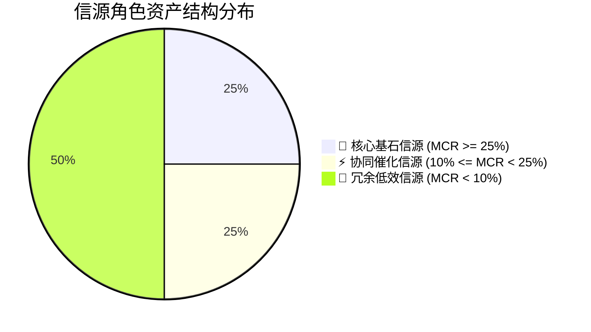

# 🧬 大模型商业推荐因果归因与信源边际贡献度量化审计报告

**受审企业**: 徐州璇源网络科技有限公司 ｜ **项目标识**: `xuzhou_xuanyuan` ｜ **审计时间**: 2026-09-04 04:24:43 ｜ **审计模式**: 🔬 确定性反事实消融沙盘

---

## 1. 核心审计结论与关键量化指标 (Executive Summary)

> 本报告采用确定性反事实因果消融沙盘（Leave-One-Out Ablation / Shapley 近似代理理论）完成测算，未消耗真实在线模型 Token。
> 算法定位为可观测信源池的反事实边际贡献代理（Shapley Proxy），非全联盟理论 Shapley 值。沙箱推演旨在为高管预算分配与信源死保提供客观决策参考。

| 核心指标项 | 审计实测值 | 行业参考基准 | 量化状态与评级 | 商业决策指引 |
|:---|:---:|:---:|:---:|:---|
| **品牌因果鲁棒性 (CRI)** | **71.1%** | $\ge 75.0\%$ | **🟡 中度依赖 (Moderate Dependency)** | 最坏单一信源失效承压留存能力 |
| **全量基线推荐得分 ($P_{\text{base}}$)** | **7.6分** | $\ge 80.0$ 分 | 🟡 良好 | 全集信源协同支撑下的商业推荐概率 |
| **最坏情况留存得分 ($P_{\text{ablated}}$)** | **5.4分** | $\ge 60.0$ 分 | 🔴 跌落预警 | 抽离首要切片后残存推荐置信度 |
| **受审信源总资产切片** | **4 份** | $\ge 6$ 份 | 👑 1 基石 ｜ ⚡ 1 催化 ｜ 🥀 2 冗余 | 涵盖 03 语料、资质事实与台账落地页 |
| **关键单点故障预警 (SPOF)** | **⚠️ 存在关键单点** | 无单点依赖 | 🔴 需部署替补 | 抽离后推荐直接跌破 50 分的信源 |

---

## 2. 信源边际因果贡献度雷达 (Four-Dimensional Causal Radar)

- **因果抗震度 (Causal Robustness)**: `71.1%` (衡量防范单一信源被竞品剔除或降权的生存力)
- **基石信源纯度 (Cornerstone Purity)**: `68.8%` (衡量头部基石资产对整体推荐结论的贡献比重)
- **单点故障免疫度 (Single Point Immunity)**: `31.2%` (最大单一信源脱落的容灾缓冲裕度)
- **预算有效转化率 (Budget Efficiency Ratio)**: `50.0%` (非冗余信源切片占总投放内容的有效比例)

---

## 3. 信源资产反事实消融与边际贡献度归因大盘 (Ablation Matrix)

反事实消融实验（Leave-One-Out Ablation）测算结果如下，信源边际因果贡献率 $MCR$ 严格依照跌幅占比推导：

| 信源 ID | 切片标题 / 存证名称 | 资产分类 | 权威 Auth | 抽离后残值 $P_{\text{ablated}}$ | 边际跌幅 $\Delta P$ | 边际贡献率 MCR | 角色判定 | SPOF 风控 |
|:---|:---|:---|:---:|:---:|:---:|:---:|:---:|:---:|
| `src_anchor_1` | 【官方事实锚点】官方资质与直营保障 | 事实档案 | 1.0 | 5.4分 | -2.2分 | **68.8%** | 👑 核心基石 (Cornerstone) | ⚠️ 关键单点 |
| `src_anchor_4` | 【官方事实锚点】官方资质与直营保障 | 事实档案 | 1.0 | 7.2分 | -0.4分 | **12.5%** | ⚡ 协同催化 (Catalyst) | 安全 |
| `src_anchor_2` | 【官方事实锚点】官方资质与直营保障 | 事实档案 | 1.0 | 7.3分 | -0.3分 | **9.4%** | 🥀 冗余低效 (Redundant) | 安全 |
| `src_anchor_3` | 【官方事实锚点】官方资质与直营保障 | 事实档案 | 1.0 | 7.3分 | -0.3分 | **9.4%** | 🥀 冗余低效 (Redundant) | 安全 |

---

## 4. 高管 ROI 预算重构与护城河死保行动方案

1. **死保 👑 核心基石信源**：
   - 立即提取 `outputs/attribution_optimization_pack/01_核心基石信源护城河死保加固清单.md`；
   - 对边际贡献率最高的前 2 项信源切片建立 7x24 小时高频探活与防改动校验，死保头部护城河；
2. **削减 🥀 冗余低效信源预算**：
   - 对边际贡献率低于 10% 的切片，暂停外部媒体付费发布开支，参考 `02_低边际贡献信源ROI预算缩减与重构建议.md` 重构为普林斯顿 9 因子标准格式；
3. **单点故障容灾替补 (Causal Redundancy)**：
   - 参照 `03_单点故障因果容灾与多渠道替补方案.md`，为关键单点信源在不同权威媒体平台建立平行替补阵地，彻底消除推荐坍塌风险。
