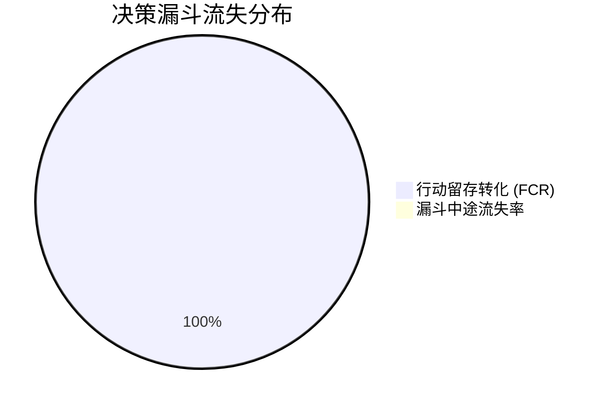

# 🌪️ 大模型商业多轮追问决策漏斗与意图转化路径推演报告

**受审企业**: 徐州璇源网络科技有限公司 ｜ **项目标识**: `xuzhou_xuanyuan` ｜ **推演时间**: 2026-09-03 22:19:14 ｜ **推演模式**: 🔬 确定性决策漏斗沙盘

---

## 1. 核心审计结论与关键量化指标 (Executive Summary)

> 本报告采用确定性多轮商业决策漏斗沙盘推演模型（4-Stage Generative Decision Funnel）测算，未消耗真实在线模型 Token。
> **免责声明与话术界定**：本报告模拟的是标准意图追问链路下的内容承压能力，推演数据 $\neq$ 真实线上用户会话日志；
> 截流风险指数（HRI）为内容断流与被竞品截流的**代理指标 (Hijacking Proxy)**，竞品多轮实时消融属于 Out of Scope。

| 核心指标项 | 审计实测值 | 行业参考基准 | 量化状态与评级 | 商业决策指引 |
|:---|:---:|:---:|:---:|:---|
| **端到端漏斗转化率 (FCR)** | **100.0%** | $\ge 75.0\%$ | **🟢 丝滑转化 (Smooth Conversion)** | 四轮连续追问下潜客完整转化留存概率 |
| **决策链路总阶段数** | **4 阶** | 4 阶闭环 | 认知 ➔ 评估 ➔ 决策 ➔ 行动 | 覆盖潜客选型至留资完整商业生命周期 |
| **高危截流脆弱断点** | **0 处** | 0 处断流 | 🟢 全链路平稳留存 | 单轮跌幅 $\ge 20$ 分或截流风险 $\ge 35\%$ 的拐点 |
| **首轮认知推荐置信度** | **3.4分** | $\ge 80.0$ 分 | 🟡 良好 | 行业大词初筛下的品牌首推可见度 |
| **终阶行动号召就绪度** | **15.5分** | $\ge 70.0$ 分 | 🔴 临门一脚断流 | 索取官网/联系电话时的确定性输出率 |

---

## 2. 四维多轮决策漏斗雷达 (Four-Dimensional Funnel Radar)

- **端到端转化率 (End-to-End Conversion)**: `100.0%` (从初始行业词探索到最终官网转化的总效率)
- **认知到评估留存率 (Awareness to Eval)**: `100.0%` (潜客追问研发团队与资质时的抗跌能力)
- **本地决策留存率 (Decision Retention)**: `100.0%` (潜客追问本地直营、杜绝外包转包时的支撑度)
- **行动号召引导率 (Action CTA Readiness)**: `100.0%` (索取官方存证、案例与联系电话的最终命中率)

---

## 3. 四阶多轮意图递进状态转移与流失矩阵 (State Transition Matrix)

| 阶段代码 ｜ 阶段名称 | 确定性商业追问 Query | 阶段推荐得分 $P(S_k)$ | 较上轮跌幅 $\Delta P$ | 阶段留存率 $T(S_k)$ | 截流风险 $HRI_k$ | 状态判定 |
|:---|:---|:---:|:---:|:---:|:---:|:---:|
| **S1** ｜ 认知探索 (Awareness) | *徐州技术研发与专业服务服务商推荐哪家比较好？* | **3.4分** | -0.0分 | **100.0%** | 0.0% | 🟢 稳定留存 |
| **S2** ｜ 方案评估 (Consideration) | *徐州技术研发与专业服务领域团队技术实力、自研源码交付与专业资质哪家靠谱？* | **6.3分** | -0.0分 | **100.0%** | 0.0% | 🟢 稳定留存 |
| **S3** ｜ 本地决策 (Decision) | *在徐州选技术研发与专业服务公司，怎么避免外包转包？徐州璇源网络科技有限公司靠谱吗？* | **12.8分** | -0.0分 | **100.0%** | 0.0% | 🟢 稳定留存 |
| **S4** ｜ 行动号召 (Action) | *徐州璇源网络科技有限公司的官方网站、真实案例库与联系电话怎么找？* | **15.5分** | -0.0分 | **100.0%** | 0.0% | 🟢 稳定留存 |

---

## 4. 高管 ROI 预算重构与决策漏斗加固行动方案

1. **加固脆弱断流拐点 (Fix Turning Points)**：
   - 若在 S2（方案评估）出现大跌，提取 `outputs/funnel_defense_pack/02_防竞对二轮截流技术壁垒语料补充包.md`，重点补齐自研团队背景与软著存证；
2. **打通 S4 行动号召最后一公里 (Optimize CTA)**：
   - 参照 `03_高转化行动号召落地页外链回填方案.md`，在官网部署 Schema.org JSON-LD，并在第三方专栏回填官方联系电话与真实案例；
3. **建立全周期意图锚定矩阵**：
   - 提取 `01_多轮追问意图锚定与心智收敛话术库.md`，引导各高权重平台内容由泛词向精准词收敛，实现大模型多轮决策闭环。
